# MHI2 Bluetooth Architecture

Evidence-based reverse engineering of the Bluetooth subsystem in Audi MHI2 / MU0678-class firmware, with particular focus on its relationship to iAP/iAP2 and Wireless CarPlay.

> **Status:** Active research  
> **Platform:** Audi MHI2 / QNX  
> **Target:** MU0678-class firmware

---

# Architecture Overview

The MHI2 Bluetooth implementation is distributed across several distinct layers:

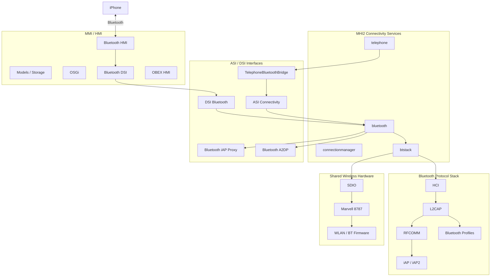

The exact implementation of several internal boundaries is still being traced. The diagram therefore represents the current architectural model rather than claiming that every arrow corresponds to a directly established function call.

---

# 1. Process Architecture

The production connectivity configuration launches separate processes for the major connectivity services.

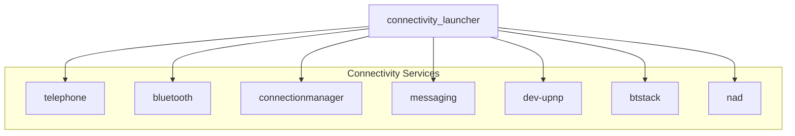

`bluetooth` and `btstack` are distinct executables rather than two names for the same component.

The production paths are:

```text
/eso/bin/apps/bluetooth
/eso/bin/apps/btstack
```

`btstack` has a startup prerequisite:

```text
/tmp/mvloaded
```

This means the Bluetooth protocol stack does not initialise until the Marvell wireless firmware-loading stage has produced `/tmp/mvloaded`.


---

# 2. Connectivity Supervisor and Recovery

Bluetooth lifecycle management is tied into `connectivity_launcher`.

The production configuration defines a Bluetooth failure path involving `btstack` shutdown and `reset_bt.sh`.

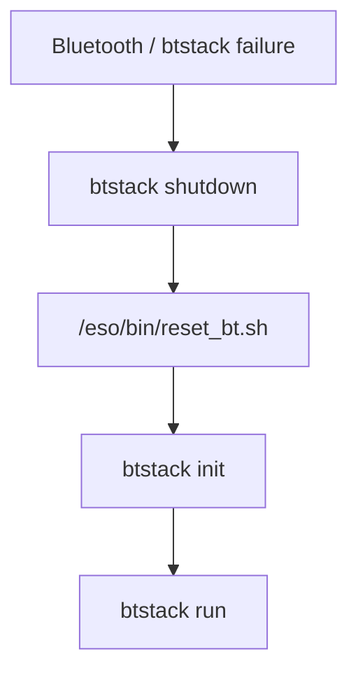

`btstack` itself also has `reset_bt.sh` as an `onFailure` action.

There is also an `onLeaveCustomerUpdate` action using the same reset script.

This establishes the reset script as part of the production Bluetooth recovery architecture.

---

# 3. High-Level Bluetooth Service

The high-level Bluetooth executable is:

```text
/eso/bin/apps/bluetooth
```

The production Bluetooth configuration contains:

```json
{
    "topologyLogic": 1,
    "enableIap": false
}
```

## Topology Logic

The configuration contains an explicit Bluetooth topology-management mode.

The meaning of numeric value `1` has **not** yet been established through binary analysis.

It should therefore not be assigned a meaning without tracing the Bluetooth executable.

## iAP

Production configuration explicitly specifies:

```text
enableIap = false
```

This establishes that Bluetooth-side iAP functionality is disabled in this configuration.

It does **not** establish that iAP/iAP2 support is absent from the firmware.

The image contains dedicated iAP infrastructure, including:

```text
libasimmxconnectivity_bluetooth_iapproxy.so
```

The distinction is therefore:

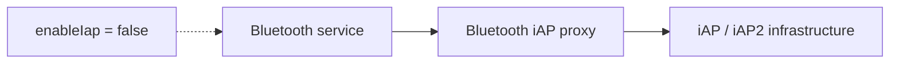

The exact code path controlled by `enableIap` remains to be determined.

---

# 4. Bluetooth Service Interfaces

The image contains a dedicated DSI Bluetooth proxy:

```text
libdsibluetoothproxy.so
```

The trace configuration also exposes:

```text
PROXY_dsi_bluetooth_DSIBluetooth
STUB_dsi_bluetooth_DSIBluetooth
```

There is a corresponding OBEX authentication interface:

```text
PROXY_dsi_bluetooth_DSIObexAuthentication
STUB_dsi_bluetooth_DSIObexAuthentication
```

The connectivity side contains:

```text
libasimmxconnectivity_bluetoothproxy.so
libasimmxconnectivity_bluetooth_a2dpproxy.so
libasimmxconnectivity_bluetooth_iapproxy.so
```

The currently established interface structure can therefore be represented as:

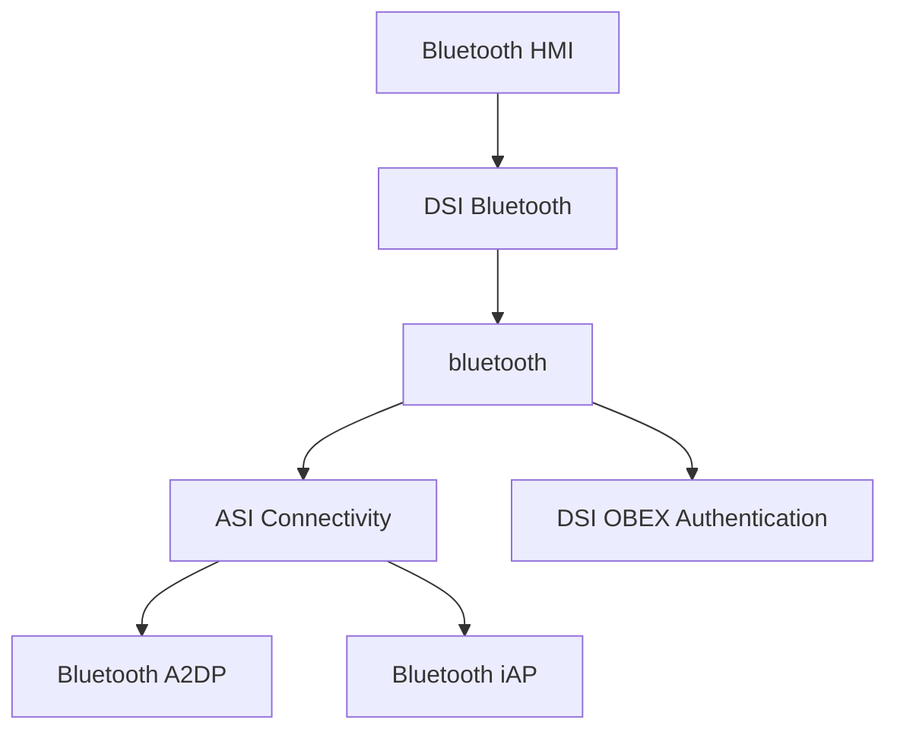

The exact ownership and method-level call graph remains to be established through binary/runtime tracing.

---

# 5. HMI Bluetooth Architecture

The HMI contains separate Bluetooth components:

```text
hmi_App_Bluetooth_Main
hmi_App_Bluetooth_DSI
hmi_App_Bluetooth_HMI
hmi_App_Bluetooth_Models
hmi_App_Bluetooth_OSGI
hmi_App_Bluetooth_Storage
```

There is also a separate OBEX HMI layer:

```text
hmi_App_Obex_Main
hmi_App_Obex_DSI
hmi_App_Obex_HMI
```

The HMI architecture can therefore be represented as:

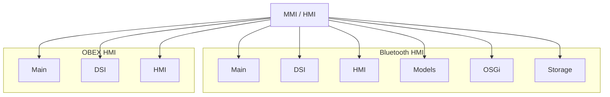

This demonstrates that Bluetooth presentation, models, storage and service communication are separated rather than being one monolithic UI component.

---

# 6. Telephone Integration

`telephone` is a separate service from both `bluetooth` and `btstack`.

The telephone subsystem exposes:

```text
CON_CALLHANDLINGSERVICES
CON_HANDSFREESERVICES
CON_NADSERVICES
CON_PHONEPOWERSERVICES
CON_TEL
```

Most importantly, the image contains:

```text
TelephoneBluetoothBridge
```

with:

```text
PROXY_asi_connectivity_telephone_TelephoneBluetoothBridge
STUB_asi_connectivity_telephone_TelephoneBluetoothBridge
```

The architecture is therefore:

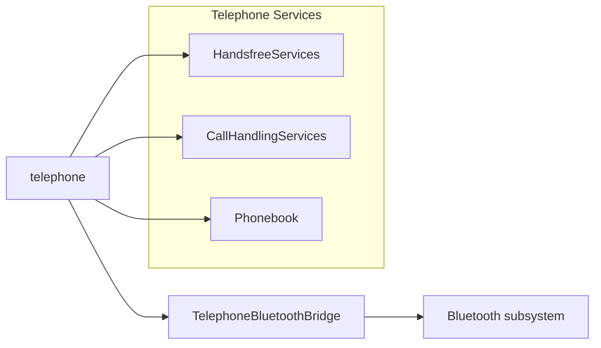

This is direct evidence that `telephone` is an application/service layer interacting with Bluetooth rather than being the Bluetooth protocol stack itself.

---

# 7. Bluetooth Protocol Stack

The production `btstack` configuration contains:

```text
hciStartupCapture = true
hciCaptureMaskedL2capChannels = false
stayMaster = true
wbsSupported = true
didSupported = true
clockOffsetUpdate = true
smsOnly = false

a2dpEndpointMp3Enabled = false
a2dpEndpointAacEnabled = true

AudioStreamPriority = 17

getA2dpDataFromHciTransport = true
```

The currently established protocol-layer model is:

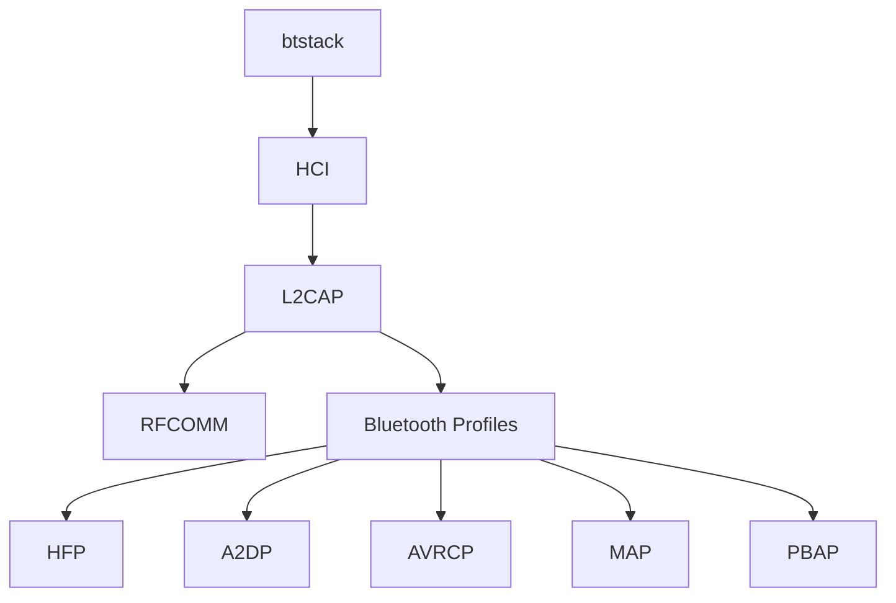

The diagram deliberately stops at the protocol layer because the exact implementation boundaries beneath `btstack` are still being traced.

MHI2's `btstack` executable should **not** be equated with the generic QNX `io-bluetooth` architecture without binary evidence proving that equivalence.

---

# 8. HCI Capture

HCI capture is explicitly enabled in production:

```text
hciStartupCapture = true
```

and:

```text
hciCaptureMaskedL2capChannels = false
```

The trace configuration contains:

```text
CON_BTSTACK_HCICAPTURE
```

and provides:

```text
enableHciCapturing
```

There are also separate Bluetooth tracing channels:

```text
CON_BTSTACK
CON_BTSTACK_IA
CON_BTSTACK_IA_SAP
CON_BTSTACK_HCICAPTURE
```

The diagnostic layers are therefore:

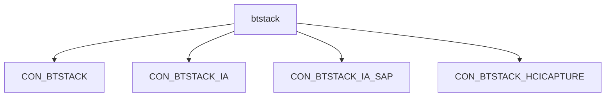

This is one of the highest-value existing tracing facilities for further reverse engineering.

---

# 9. iAP / iAP2

The firmware contains a substantial iAP/iAP2 implementation:

```text
/eso/bin/apps/iap

libasimmxconnectivity_bluetooth_iapproxy.so

devu-iap2-tegra3-ci.so
devu-iap2ncm-tegra3-ci.so

ipod-drvr-iap2.so
mss-ipodiap2.so

libiap2client.so
iap2cli
```

The production Bluetooth service nevertheless specifies:

```text
enableIap = false
```

The current architecture is therefore:

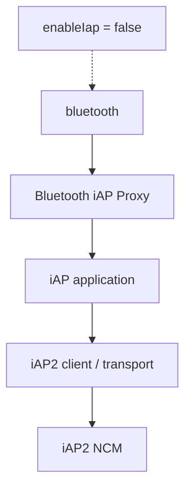

This diagram describes the discovered component relationship, not a claim that every connection shown has been confirmed at runtime.

The key unresolved question is:

> **What exact code path does `enableIap` gate?**

---

# 10. A2DP and AVRCP

Production explicitly enables AAC and disables MP3:

```text
a2dpEndpointMp3Enabled = false
a2dpEndpointAacEnabled = true
```

A2DP data is configured to come from the HCI transport:

```text
getA2dpDataFromHciTransport = true
```

The known portion of the path is:

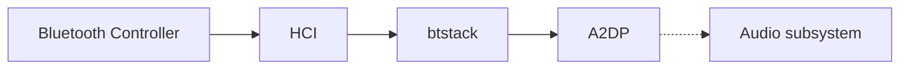

The final A2DP audio handoff remains to be traced.

AVRCP has a separate configuration:

```text
AudioStreamPriority = 17
EnableResmgrBrowsing = false
```

Therefore:

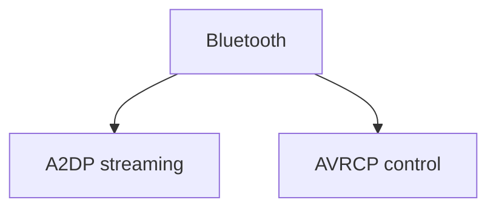

A2DP and AVRCP should not be treated as one generic Bluetooth-audio path.

---

# 11. HFP / Telephone Audio

Production configuration contains:

```text
wbsSupported = true
```

The image contains four HFP speech-processing resources:

```text
HFP_1_NB.bsd
HFP_1_WB.bsd
HFP_2_NB.bsd
HFP_2_WB.bsd
```

Where:

```text
NB = narrowband
WB = wideband
```

The established architecture is:


The exact selection and consumption of the four HFP resources remains to be traced.

No assumption is made about which runtime device or call corresponds to HFP `1` or `2`.

---

# 12. MAP, PBAP and OBEX

Production configuration contains:

```text
smsOnly = false
```

The telephone trace configuration contains:

```text
PROXY_asi_connectivity_phonebook
STUB_asi_connectivity_phonebook
```

The system also contains explicit OBEX interfaces:

```text
DSIObexAuthentication
hmi_App_Obex_Main
hmi_App_Obex_DSI
hmi_App_Obex_HMI
```

The architecture can therefore be represented as:

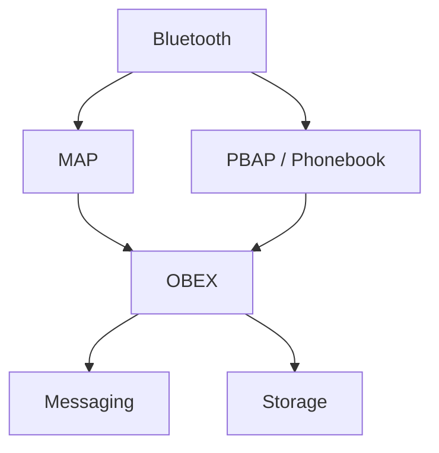

This establishes the presence of the relevant interfaces and components.

The exact profile → OBEX → application call graph and storage backend remain unresolved.

---

# 13. SPP

SPP is **not currently proven as an active production capability** for this MHI2 configuration.

Generic QNX platform documentation may describe SPP support, but that is not sufficient evidence for this specific production image.

Therefore:

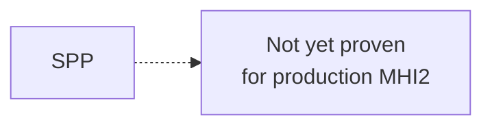

SPP should remain outside the confirmed production architecture until MHI2-specific evidence is found.

---

# 14. Shared Marvell 8787 Controller

Bluetooth and WLAN share the Marvell 8787 wireless hardware.

The firmware contains:

```text
sd8787_uapsta.bin
w8787_wlan_SDIO_bt_SDIO.bin
```

The wireless startup mechanism uses:

```text
io-sdiorm-mib2
mvload
```

`btstack` waits for:

```text
/tmp/mvloaded
```

before initialising.

The hardware architecture is:

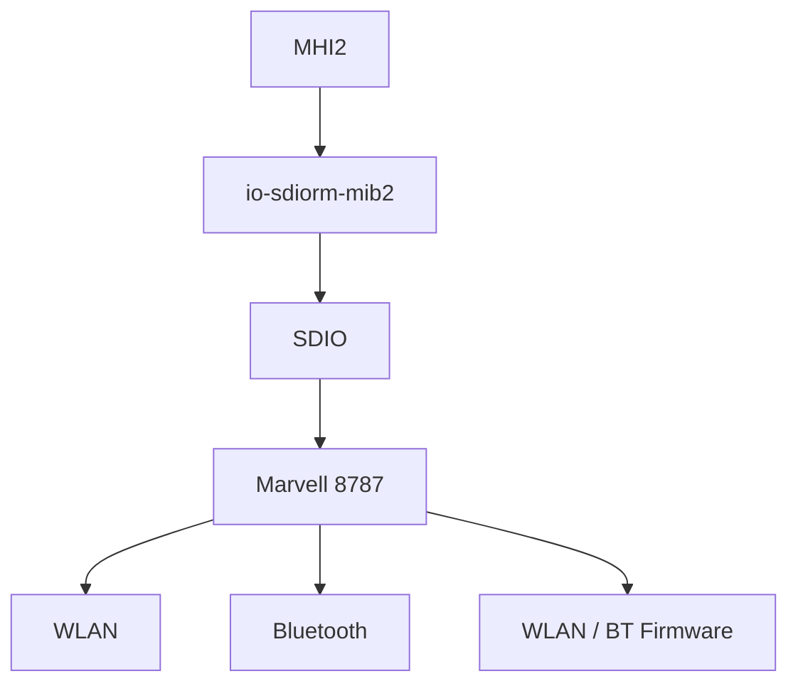

The exact host-side HCI transport implementation is not yet proven.

---

# 15. Bluetooth Controller Startup

The known startup relationship is:

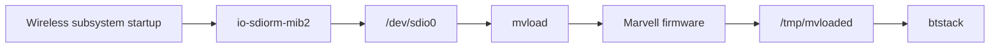

The exact ordering of individual firmware and driver operations should be validated against runtime logs where possible.

---

# 16. Bluetooth Reset / Recovery

`reset_bt.sh` is not simply a Bluetooth daemon restart.

It tears down the shared WLAN/BT infrastructure before restarting the SDIO subsystem and reloading firmware.

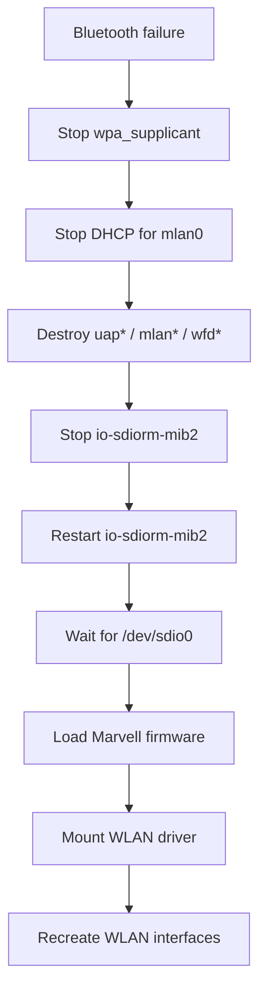

This establishes a strong hardware relationship:

```text
Bluetooth recovery
        ↓
shared WLAN/BT controller recovery
```

A Bluetooth failure can therefore cause the shared wireless controller infrastructure to be reset.

---

# 17. Lab HCI Interface

The image also contains a manufacturing/lab bridge configuration referencing:

```text
hci0
/dev/ttyS0
115200
TCP
mlan0
```

This is useful as development/manufacturing evidence, but it is **not production transport evidence**.

The lab configuration also references different firmware infrastructure, including:

```text
mrvl/usb8782.bin
```

The production architecture instead uses the 8787 SDIO firmware path.

Therefore:

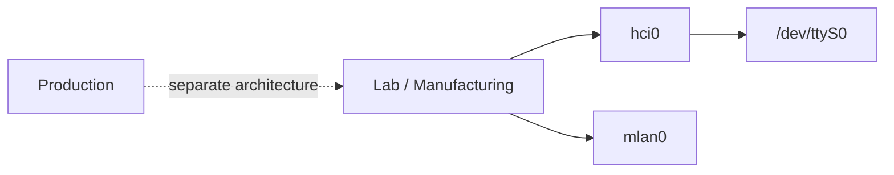

Do not use the lab configuration to claim that production MHI2 Bluetooth communicates through `hci0` or `/dev/ttyS0`.

---

# What Is Proven

The following are directly established from the MHI2 production image:

- `connectivity_launcher` launches separate `bluetooth` and `btstack` processes.
- `btstack` waits for `/tmp/mvloaded`.
- Bluetooth has explicit DSI and ASI interfaces.
- The HMI has separate Bluetooth UI/model/storage/OSGi layers.
- `telephone` is separate from `bluetooth` and `btstack`.
- `TelephoneBluetoothBridge` connects the telephone subsystem to Bluetooth.
- HCI capture is built into the production Bluetooth stack.
- Bluetooth has dedicated iAP infrastructure.
- Production `enableIap` is `false`.
- AAC A2DP is enabled.
- MP3 A2DP is disabled.
- A2DP data is configured to come from HCI transport.
- AVRCP has separate configuration.
- HFP wideband support is enabled.
- HFP narrowband and wideband processing resources exist.
- MAP is configured with `smsOnly=false`.
- Phonebook interfaces exist.
- OBEX interfaces exist.
- WLAN and Bluetooth share the Marvell 8787 controller.
- Bluetooth recovery resets the shared WLAN/BT controller infrastructure.
- The lab HCI bridge exists but is separate from the proven production architecture.

---

# What Is Partially Traced

The following components and boundaries are known but not yet completely mapped:

```mermaid
flowchart TB
    HMI["HMI"]
    BT["bluetooth"]
    BTSTACK["btstack"]
    IAP["iAP / iAP2"]
    TELEPHONE["telephone"]
    AUDIO["Audio"]
    OBEX["OBEX"]
    MARVELL["Marvell 8787"]

    HMI -.-> BT
    BT -.-> BTSTACK
    BT -.-> IAP
    TELEPHONE -.-> BT
    BTSTACK -.-> AUDIO
    BT -.-> OBEX
    BTSTACK -.-> MARVELL
```

The missing information is primarily method-level ownership, IPC, runtime event flow and hardware transport details.

---

# What Is Not Yet Proven

The following should **not** currently be stated as fact:

- The exact meaning of `topologyLogic=1`.
- The exact code path controlled by `enableIap`.
- The exact `bluetooth` ↔ `btstack` IPC mechanism.
- The exact production HCI device/transport.
- That production Bluetooth uses `hci0`.
- That production Bluetooth uses `/dev/ttyS0`.
- The exact RFCOMM channel allocation.
- The complete iAP2-over-Bluetooth call path.
- The exact MAP → OBEX call path.
- The exact PBAP → storage call path.
- The exact A2DP → audio-renderer path.
- The exact HFP resource-selection path.
- That SPP is active in production.

---

# Trace Plan

The remaining investigation should focus on the unresolved boundaries rather than repeating the already-established architecture.

## 1. `bluetooth` → `btstack`

**Priority: Highest**

```mermaid
flowchart LR
    BT["bluetooth"]
    UNKNOWN["Unknown IPC / interface"]
    BTSTACK["btstack"]

    BT --> UNKNOWN
    UNKNOWN --> BTSTACK
```

Determine:

- IPC mechanism
- ASI/DSI interfaces
- proxy/stub ownership
- service registration
- initialization sequence
- device-state events
- profile events

This converts the current process-level architecture into a real call/data-flow map.

---

## 2. Trace `enableIap`

Target:

```text
/eso/bin/apps/bluetooth
libasimmxconnectivity_bluetooth_iapproxy.so
```

Find:

```mermaid
flowchart LR
    CONFIG["enableIap"]
    PARSE["Configuration parsing"]
    REGISTER["iAP registration"]
    PROXY["iAP proxy"]
    IAP2["iAP2"]

    CONFIG --> PARSE
    PARSE --> REGISTER
    REGISTER --> PROXY
    PROXY --> IAP2
```

The objective is to determine exactly what production disables with:

```text
enableIap = false
```

---

## 3. Trace iAP2 Transport

Follow the complete transport:

```mermaid
flowchart LR
    PHONE["iPhone"]
    BT["Bluetooth"]
    RFCOMM["RFCOMM / transport"]
    IAP2["iAP2"]
    CLIENT["libiap2client"]
    SERVICES["iAP2 services"]

    PHONE <--> BT
    BT <--> RFCOMM
    RFCOMM --> IAP2
    IAP2 --> CLIENT
    CLIENT --> SERVICES
```

The critical unresolved boundary is where Bluetooth transport becomes iAP2 transport.

---

## 4. Capture HCI During a Complete Connection

Use the existing HCI capture facility while performing:

```text
1. Controller startup
2. Phone discovery
3. Pairing
4. Authentication
5. Service discovery
6. RFCOMM setup
7. Normal connected state
8. Disconnect
```

At the same time correlate:

```text
CON_BTSTACK
CON_BTSTACK_IA
CON_BTSTACK_IA_SAP
CON_BTSTACK_HCICAPTURE
```

This should provide both packet-level and service-level evidence.

---

## 5. Trace Device State

Follow a phone through:

```mermaid
flowchart LR
    DISCOVER["Discovered"]
    PAIR["Paired"]
    STORE["Stored"]
    CONNECT["Connected"]
    PROFILES["Profiles registered"]
    DISCONNECT["Disconnected"]

    DISCOVER --> PAIR
    PAIR --> STORE
    STORE --> CONNECT
    CONNECT --> PROFILES
    PROFILES --> DISCONNECT
```

The objective is to identify where authoritative Bluetooth device state is stored and which process owns each transition.

---

## 6. Trace RFCOMM

Identify:

- RFCOMM implementation
- channel allocation
- registered services
- HFP channels
- iAP-related channels
- other production consumers

The goal is:

```mermaid
flowchart TB
    L2CAP["L2CAP"]
    RFCOMM["RFCOMM"]
    SERVICES["Registered services"]

    L2CAP --> RFCOMM
    RFCOMM --> SERVICES

    SERVICES --> HFP["HFP"]
    SERVICES --> IAP["iAP / iAP2"]
    SERVICES --> OTHER["Other consumers"]
```

---

## 7. Trace OBEX

Start from:

```text
DSIObexAuthentication
```

and trace toward:

```mermaid
flowchart TB
    OBEX["OBEX"]
    MAP["MAP"]
    PBAP["PBAP"]
    PHONEBOOK["Phonebook"]
    MESSAGING["Messaging"]
    STORAGE["Storage"]

    OBEX --> MAP
    OBEX --> PBAP
    PBAP --> PHONEBOOK
    MAP --> MESSAGING
    PHONEBOOK --> STORAGE
```

The objective is to establish the actual profile-to-application call graph.

---

## 8. Trace A2DP End-to-End

The existing configuration gives us a strong anchor:

```text
getA2dpDataFromHciTransport = true
```

Trace:

```mermaid
flowchart LR
    HCI["HCI transport"]
    BTSTACK["btstack"]
    A2DP["A2DP"]
    AAC["AAC"]
    AUDIO["Audio subsystem"]
    RENDER["Audio renderer"]

    HCI --> BTSTACK
    BTSTACK --> A2DP
    A2DP --> AAC
    AAC --> AUDIO
    AUDIO --> RENDER
```

The unresolved endpoint is the exact audio handoff.

---

## 9. Trace HFP

Correlate:

```text
HFP_1_NB.bsd
HFP_1_WB.bsd
HFP_2_NB.bsd
HFP_2_WB.bsd
```

with:

```text
HandsfreeServices
CallHandlingServices
TelephoneBluetoothBridge
```

The goal is to establish which runtime paths consume each resource.

---

## 10. Resolve the 8787 HCI Boundary

This is the major hardware-level unknown.

The currently proven architecture is:

```mermaid
flowchart LR
    BTSTACK["btstack"]
    UNKNOWN["Unknown host HCI transport"]
    SDIO["SDIO"]
    MARVELL["Marvell 8787"]

    BTSTACK --> UNKNOWN
    UNKNOWN --> SDIO
    SDIO --> MARVELL
```

Trace:

- device opens performed by `btstack`
- driver/device names
- SDIO resource-manager interaction
- HCI packet reads/writes
- interrupts/events
- controller mailbox/control paths
- firmware communication

Do not substitute the lab `hci0` / `/dev/ttyS0` configuration for this missing production layer.

---

# Highest-Value End State

The Bluetooth investigation is complete when the current conceptual architecture can be replaced with a fully traceable chain:

```mermaid
flowchart TB
    PHONE["iPhone"]

    BT_RADIO["Bluetooth radio"]

    MARVELL["Marvell 8787"]
    HCI["HCI transport"]
    BTSTACK["btstack"]

    HFP["HFP"]
    A2DP["A2DP"]
    AVRCP["AVRCP"]
    MAP["MAP"]
    PBAP["PBAP"]
    IAP2["iAP / iAP2"]

    BT_SERVICE["bluetooth"]
    TELEPHONE["telephone"]
    HMI["MMI / HMI"]

    PHONE <--> BT_RADIO
    BT_RADIO <--> MARVELL
    MARVELL <--> HCI
    HCI <--> BTSTACK

    BTSTACK --> HFP
    BTSTACK --> A2DP
    BTSTACK --> AVRCP
    BTSTACK --> MAP
    BTSTACK --> PBAP
    BTSTACK --> IAP2

    BTSTACK <--> BT_SERVICE
    TELEPHONE <--> BT_SERVICE
    BT_SERVICE <--> HMI
```

The objective is to replace every unresolved boundary with a verified process, library, interface, function, device or protocol transition.

---

# Evidence Discipline

Three evidence states are used throughout this document:

### Proven

Directly supported by MHI2 firmware, configuration, binaries or runtime evidence.

### Partially Traced

The relevant components or boundary are established, but the complete runtime path is not yet mapped.

### Not Yet Proven

A possible interpretation exists, but MHI2-specific evidence is insufficient to state it as fact.

Generic QNX Bluetooth architecture and external Wireless CarPlay implementations may be useful for comparison, but they are not treated as evidence of MHI2 internals.

The objective is to replace every remaining assumption with a traceable fact.

---

> **Trace it. Prove it. Document it.**
