# MHI2 Bluetooth Architecture

Evidence-based reverse engineering of the Bluetooth subsystem in Audi MHI2 / MU0678-class firmware, with particular focus on its relationship to iAP/iAP2 and Wireless CarPlay.

> **Status:** Active research  
> **Platform:** Audi MHI2 / QNX  
> **Target:** MU0678-class firmware

---

# 1. Current Mapped Architecture

This is the Bluetooth architecture currently established from the MHI2 production image.

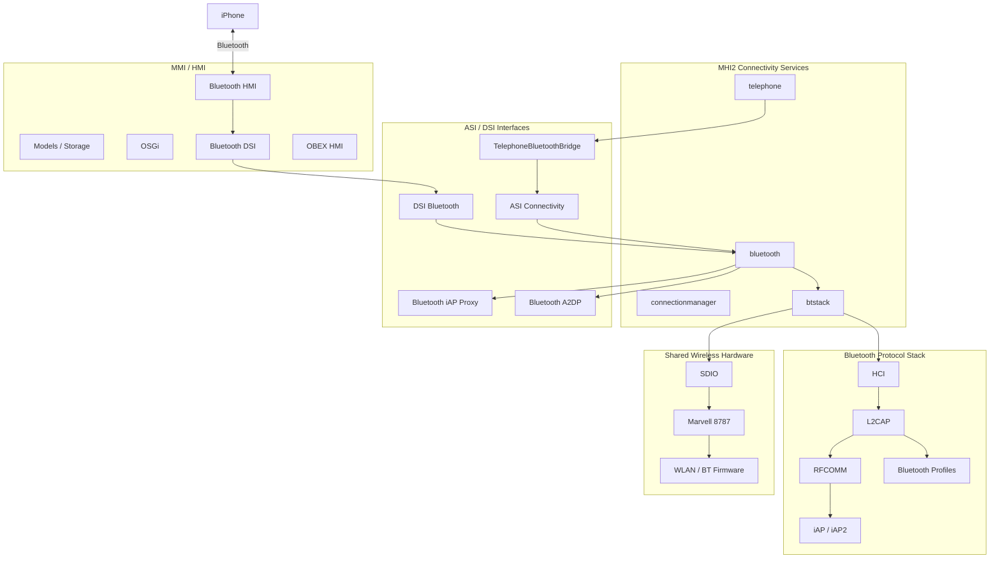

The architecture above is the current conceptual map. Not every arrow represents a directly established function call; several internal boundaries remain to be traced.

---

## 1.1 Process Architecture

The production connectivity configuration launches separate processes for the major connectivity services.

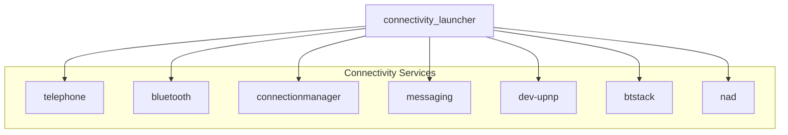

`bluetooth` and `btstack` are distinct executables:

```text
/eso/bin/apps/bluetooth
/eso/bin/apps/btstack
```

`btstack` has a startup prerequisite:

```text
/tmp/mvloaded
```

Therefore:


---

## 1.2 Shared Wireless Hardware

Bluetooth and WLAN share the Marvell 8787 controller.

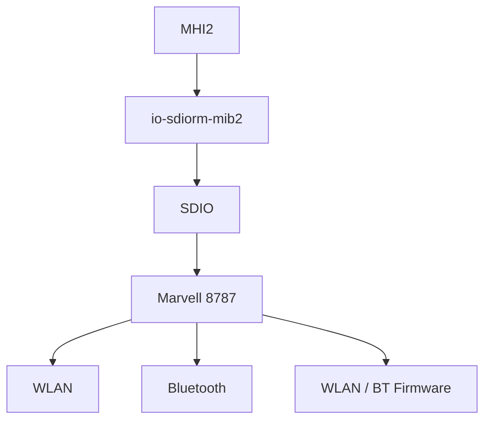

Firmware includes:

```text
sd8787_uapsta.bin
w8787_wlan_SDIO_bt_SDIO.bin
```

The wireless startup path currently established is:


---

## 1.3 Bluetooth Service Boundary

The high-level Bluetooth executable is:

```text
/eso/bin/apps/bluetooth
```

Production configuration contains:

```json
{
    "topologyLogic": 1,
    "enableIap": false
}
```

The meaning of `topologyLogic=1` has not yet been established through binary analysis.

The production configuration explicitly sets:

```text
enableIap = false
```

This establishes the production configuration value. The exact functionality controlled by
that setting remains unresolved until its parser/control-flow branch is recovered.

It does **not** establish that Bluetooth-side iAP functionality is disabled at runtime,
and it does not establish that iAP/iAP2 support is absent from the firmware.

The image contains dedicated iAP infrastructure:

```text
libasimmxconnectivity_bluetooth_iapproxy.so
```

The currently mapped relationship is:

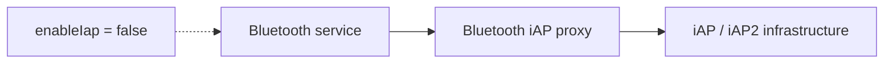

The exact code path controlled by `enableIap` remains unresolved. However, the Bluetooth iAP runtime endpoint path is now substantially recovered below.

---

## 1.4 Bluetooth Service Interfaces

The image contains:

```text
libdsibluetoothproxy.so
```

Trace configuration exposes:

```text
PROXY_dsi_bluetooth_DSIBluetooth
STUB_dsi_bluetooth_DSIBluetooth

PROXY_dsi_bluetooth_DSIObexAuthentication
STUB_dsi_bluetooth_DSIObexAuthentication
```

Connectivity-side proxies include:

```text
libasimmxconnectivity_bluetoothproxy.so
libasimmxconnectivity_bluetooth_a2dpproxy.so
libasimmxconnectivity_bluetooth_iapproxy.so
```

Current interface structure:

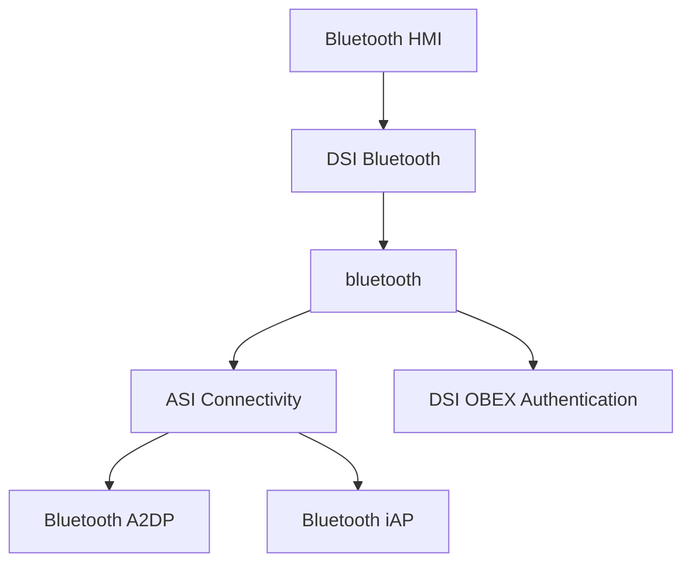

The exact ownership and method-level call graph remains unresolved.

---

## 1.5 Telephone Integration

`telephone` is a separate service from both `bluetooth` and `btstack`.

The image contains:

```text
TelephoneBluetoothBridge
```

with:

```text
PROXY_asi_connectivity_telephone_TelephoneBluetoothBridge
STUB_asi_connectivity_telephone_TelephoneBluetoothBridge
```

Current relationship:

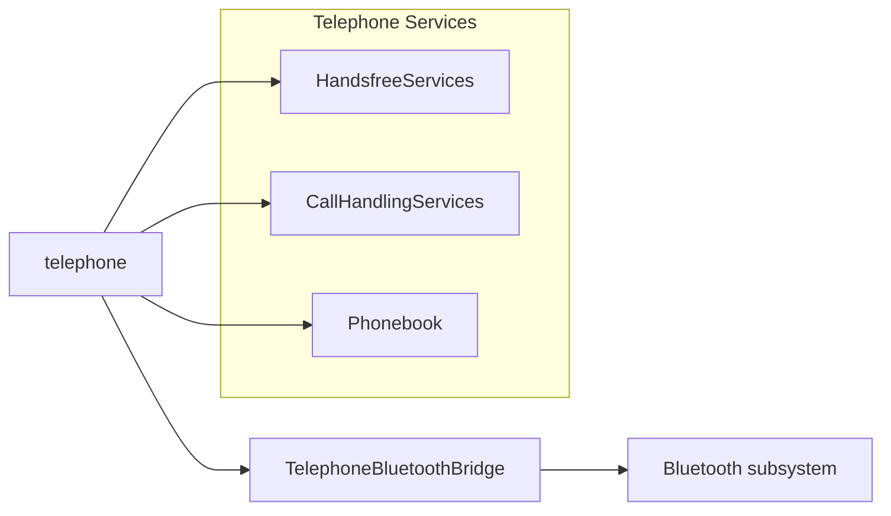

This establishes `telephone` as an application/service layer interacting with Bluetooth rather than being the Bluetooth protocol stack itself.

---

## 1.6 Bluetooth Protocol Stack

Production `btstack` configuration contains:

```text
hciStartupCapture = true
hciCaptureMaskedL2capChannels = false
stayMaster = true
wbsSupported = true
didSupported = true
clockOffsetUpdate = true
smsOnly = false

a2dpEndpointMp3Enabled = false
a2dpEndpointAacEnabled = true

AudioStreamPriority = 17

getA2dpDataFromHciTransport = true
```

Current protocol-layer model:

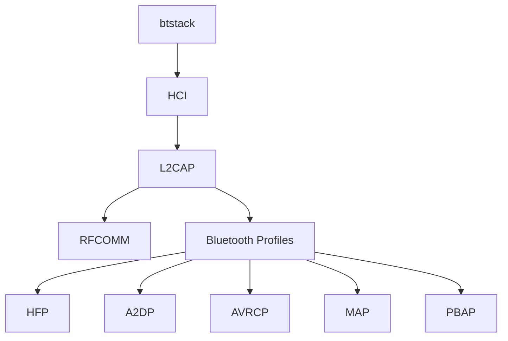

The diagram deliberately stops at the protocol layer because the exact implementation boundaries beneath `btstack` remain under investigation.

The MHI2 `btstack` executable should **not** be equated with the generic QNX `io-bluetooth` architecture without binary evidence proving that equivalence.

---

## 1.7 HCI Capture

HCI capture is explicitly enabled:

```text
hciStartupCapture = true
hciCaptureMaskedL2capChannels = false
```

Trace configuration contains:

```text
CON_BTSTACK_HCICAPTURE
```

and:

```text
enableHciCapturing
```

Additional Bluetooth tracing channels are:

```text
CON_BTSTACK
CON_BTSTACK_IA
CON_BTSTACK_IA_SAP
CON_BTSTACK_HCICAPTURE
```

Current diagnostic architecture:

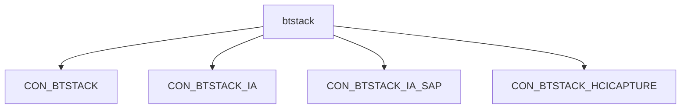

This is one of the highest-value existing tracing facilities for further reverse engineering.

---

## 1.8 Bluetooth iAP runtime endpoint

The production `/eso/bin/apps/iap` binary contains a dedicated `iap::CIapBTChannel` with:

```text
openiAPDevice()       0x109a9c
connectToiAPDevice()  0x109570
closeiAPDevice()     0x108d6c
readiAPDevice()      0x108c14
writeiAPDevice()     0x108bc8
updateiAPDevice()    0x10b434
```

The important recovered path is:

```text
Bluetooth IapDeviceServices
        |
        | active-device callback
        v
CIapDeviceServicesReplyImpl::updateActiveDevices()
        |
        v
CIapBTChannel::updateiAPDevice(...)
        |
        | runtime CIString / endpoint path
        v
CIapBTChannel::openiAPDevice()
        |
        v
open64(path)
        |
        v
Bluetooth iAP2 endpoint
```

This proves the Bluetooth channel receives its endpoint at runtime. The `iap` binary contains no `/dev/ipod0` literal, so the Bluetooth endpoint must not be equated with DIO's USB `/dev/ipod0` endpoint without recovering the actual returned value.

The same binary contains the iAP2 packet/link state machine and `IapDeviceServicesProxy` / reply infrastructure. Production configuration still sets `enableIap=false`.

**Evidence:** E-021, E-022, E-023, E-024. See TRACE-001.

## 1.9 iAP / iAP2 Infrastructure

The firmware contains:

```text
/eso/bin/apps/iap

libasimmxconnectivity_bluetooth_iapproxy.so

devu-iap2-tegra3-ci.so
devu-iap2ncm-tegra3-ci.so

ipod-drvr-iap2.so
mss-ipodiap2.so

libiap2client.so
iap2cli
```

At the same time:

```text
enableIap = false
```

The discovered component relationship is:

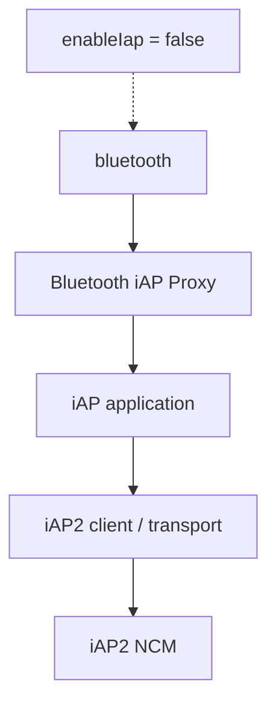

This describes the discovered component relationship, not a claim that every connection shown has been confirmed at runtime.

---

## 1.9 Direct MU0678 `bluetooth` ELF trace

The production MU0678 `/eso/bin/apps/bluetooth` executable is now directly inspectable.

It contains the policy/service strings:

```text
iapEnabled
bluetooth.enableIap
SERVICETYPE_IAP2
ERROR_CARPLAY_ACTIVE
Carplay
```

and defines the `CBluetoothApplication` and `CBluetoothSmartphoneIntegration` service/vtable objects.

A real configuration-control function is present:

```text
CBluetoothApplication::switchBluetoothAccordingToConfig()  @ 0x13df18
```

It is called from `CBluetoothApplication::diagCBCodingValues(...)` at `0x146500` and checks application-state byte fields including offsets `0x1182`, `0x1186`, and `0x118a`.

What is **not** established yet:

- those fields are not proven to be the `bluetooth.enableIap` value;
- no recovered defined `CBluetoothIap*`, concrete iAP endpoint-construction, or RFCOMM-server function symbols were found;
- no direct undefined iAP/RFCOMM endpoint API imports were recovered;
- therefore this executable cannot yet be named as the concrete endpoint publisher.

This is a useful narrowing result rather than a dead end: the endpoint-owner search should now concentrate on the service-mediated path and `btstack`, while keeping ownership of the endpoint explicitly unproven until a function-level edge is recovered.

**Evidence:** E-068, E-069. See TRACE-001 and TRACE-013.

---

## 1.9 A2DP / AVRCP

Production explicitly enables AAC and disables MP3:

```text
a2dpEndpointMp3Enabled = false
a2dpEndpointAacEnabled = true
```

A2DP data is configured to come from HCI transport:

```text
getA2dpDataFromHciTransport = true
```

Known portion of the A2DP path:

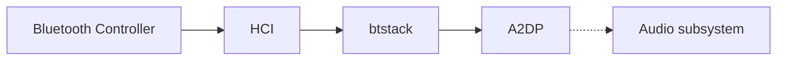

The final A2DP audio handoff remains unresolved.

AVRCP has separate configuration:

```text
AudioStreamPriority = 17
EnableResmgrBrowsing = false
```

Therefore:

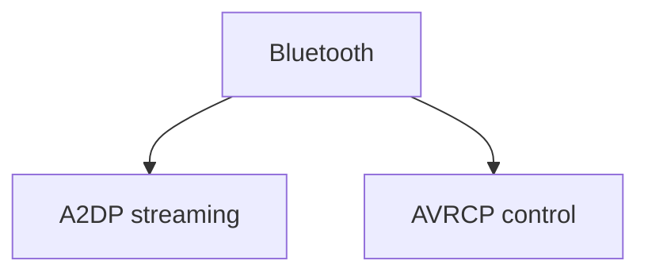

A2DP and AVRCP should not be treated as one generic Bluetooth-audio path.

---

## 1.10 HFP / Telephone Audio

Production configuration contains:

```text
wbsSupported = true
```

The image contains:

```text
HFP_1_NB.bsd
HFP_1_WB.bsd
HFP_2_NB.bsd
HFP_2_WB.bsd
```

Where:

```text
NB = narrowband
WB = wideband
```

Current architecture:


The exact selection and consumption of the four HFP resources remains unresolved.

No assumption is made about which runtime device or call corresponds to HFP `1` or `2`.

---

## 1.11 MAP / PBAP / OBEX

Production contains:

```text
smsOnly = false
```

Telephone trace configuration contains:

```text
PROXY_asi_connectivity_phonebook
STUB_asi_connectivity_phonebook
```

Explicit OBEX interfaces include:

```text
DSIObexAuthentication
hmi_App_Obex_Main
hmi_App_Obex_DSI
hmi_App_Obex_HMI
```

Current architecture:

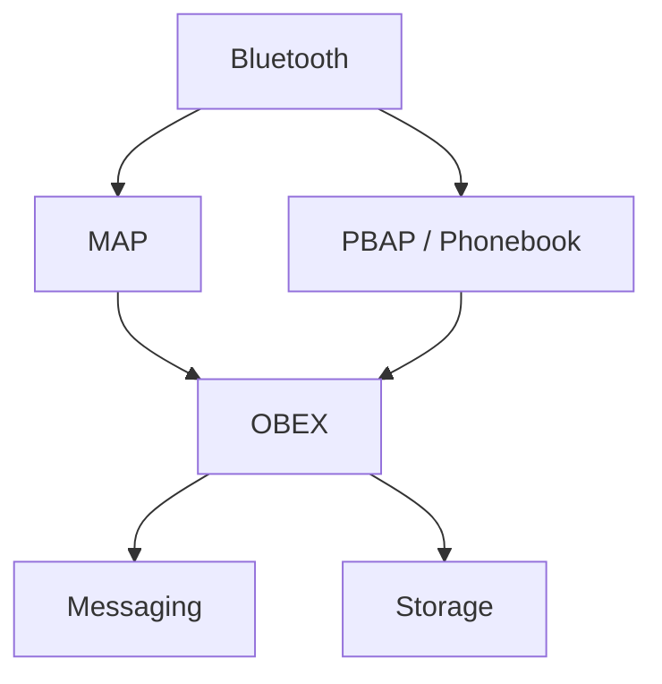

This establishes the presence of the relevant interfaces and components.

The exact profile → OBEX → application call graph and storage backend remain unresolved.

---

## 1.12 Shared Bluetooth / WLAN Recovery

`reset_bt.sh` tears down shared WLAN/BT infrastructure before restarting the SDIO subsystem and reloading firmware.

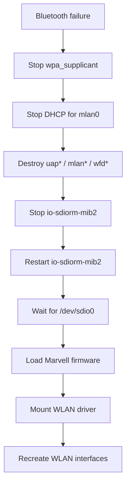

This establishes a strong hardware relationship:

```text
Bluetooth recovery
        ↓
shared WLAN/BT controller recovery
```

A Bluetooth failure can therefore cause the shared wireless controller infrastructure to be reset.

---

## 1.13 MU0678 iAP2 multi-transport capability

The MU0678 iAP2 driver contains a deeper transport model than the earlier component map showed.

ipod-drvr-iap2.so exposes transport_get_link_params, transport_send_pkt, transport_receive and transport_recv_pkt; the link layer calls these through transport-owned callback fields. This establishes a generic transport boundary inside the driver.

It also contains separate Identify handlers for ident_info_tspbt, ident_info_tspwifi, ident_info_tspusbdev, ident_info_tspusbhost and ident_info_tspserial, with an ident_info_funcs table containing both Bluetooth and Wi-Fi entries.

The Bluetooth descriptor includes TransportComponentName, TransportSupportsiAP2Connection and BluetoothTransportMediaAccessControlAddress. The Wi-Fi descriptor includes TransportComponentName, TransportSupportsiAP2Connection and TransportSupportsCarPlay.

This is direct MU0678 binary evidence that the iAP2 implementation has explicit Bluetooth and Wi-Fi transport-component representations, and that the Wi-Fi component can advertise CarPlay support.

The shipped /etc/mm/iap2.cfg still selects Lightning Connector and leaves the Bluetooth configuration section commented out. Therefore compiled capability and shipped production configuration remain separate claims.

~~~text
Bluetooth/Wi-Fi iAP2 capability in binary = Proven
Shipped wireless iAP2 execution           = Unproven
enableIap=true sufficient                 = Unproven
~~~

See TRACE-007 and evidence E-032 through E-036.

# 2. What Remains to Be Traced

The architecture above is the current map. The remaining investigation should focus on unresolved boundaries rather than repeating already-established architecture.

---

## 2.1 `bluetooth` → `btstack`

**Priority: Highest**


Determine:

- IPC mechanism
- ASI/DSI interfaces
- proxy/stub ownership
- service registration
- initialization sequence
- device-state events
- profile events

This converts the current process-level architecture into a real call/data-flow map.

---

## 2.2 Trace `enableIap`

Targets:

```text
/eso/bin/apps/bluetooth
libasimmxconnectivity_bluetooth_iapproxy.so
```

Trace:

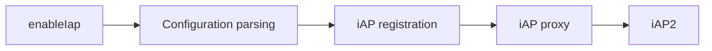

The objective is to determine exactly what production disables with:

```text
enableIap = false
```

---

## 2.3 Trace iAP2 Transport

Follow the complete transport:


The critical unresolved boundary is where Bluetooth transport becomes iAP2 transport.

---

## 2.4 Capture HCI During a Complete Connection

Use the existing HCI capture facility while performing:

```text
1. Controller startup
2. Phone discovery
3. Pairing
4. Authentication
5. Service discovery
6. RFCOMM setup
7. Normal connected state
8. Disconnect
```

Correlate simultaneously:

```text
CON_BTSTACK
CON_BTSTACK_IA
CON_BTSTACK_IA_SAP
CON_BTSTACK_HCICAPTURE
```

This should provide both packet-level and service-level evidence.

---

## 2.5 Trace Device State

Follow a phone through:


The objective is to identify where authoritative Bluetooth device state is stored and which process owns each transition.

---

## 2.6 Trace RFCOMM

Identify:

- RFCOMM implementation
- channel allocation
- registered services
- HFP channels
- iAP-related channels
- other production consumers

Target architecture:

```mermaid
flowchart TB
    L2CAP["L2CAP"]
    RFCOMM["RFCOMM"]
    SERVICES["Registered services"]

    L2CAP --> RFCOMM
    RFCOMM --> SERVICES

    SERVICES --> HFP["HFP"]
    SERVICES --> IAP["iAP / iAP2"]
    SERVICES --> OTHER["Other consumers"]
```

---

## 2.7 Trace OBEX

Start from:

```text
DSIObexAuthentication
```

and trace toward:

```mermaid
flowchart TB
    OBEX["OBEX"]
    MAP["MAP"]
    PBAP["PBAP"]
    PHONEBOOK["Phonebook"]
    MESSAGING["Messaging"]
    STORAGE["Storage"]

    OBEX --> MAP
    OBEX --> PBAP
    PBAP --> PHONEBOOK
    MAP --> MESSAGING
    PHONEBOOK --> STORAGE
```

The objective is to establish the actual profile-to-application call graph.

---

## 2.8 Trace A2DP End-to-End

Existing configuration anchor:

```text
getA2dpDataFromHciTransport = true
```

Trace:

```mermaid
flowchart LR
    HCI["HCI transport"]
    BTSTACK["btstack"]
    A2DP["A2DP"]
    AAC["AAC"]
    AUDIO["Audio subsystem"]
    RENDER["Audio renderer"]

    HCI --> BTSTACK
    BTSTACK --> A2DP
    A2DP --> AAC
    AAC --> AUDIO
    AUDIO --> RENDER
```

The unresolved endpoint is the exact audio handoff.

---

## 2.9 Trace HFP

Correlate:

```text
HFP_1_NB.bsd
HFP_1_WB.bsd
HFP_2_NB.bsd
HFP_2_WB.bsd
```

with:

```text
HandsfreeServices
CallHandlingServices
TelephoneBluetoothBridge
```

The goal is to establish which runtime paths consume each resource.

---

## 2.10 Resolve the 8787 HCI Boundary

This is the major hardware-level unknown.

Currently:

```mermaid
flowchart LR
    BTSTACK["btstack"]
    UNKNOWN["Unknown host HCI transport"]
    SDIO["SDIO"]
    MARVELL["Marvell 8787"]

    BTSTACK --> UNKNOWN
    UNKNOWN --> SDIO
    SDIO --> MARVELL
```

Trace:

- device opens performed by `btstack`
- driver/device names
- SDIO resource-manager interaction
- HCI packet reads/writes
- interrupts/events
- controller mailbox/control paths
- firmware communication

Do **not** substitute the lab `hci0` / `/dev/ttyS0` configuration for this missing production layer.

---

## 2.11 Lab HCI Configuration Boundary

The image contains a manufacturing/lab bridge referencing:

```text
hci0
/dev/ttyS0
115200
TCP
mlan0
```

This is useful as development/manufacturing evidence, but it is **not production transport evidence**.

The lab configuration also references:

```text
mrvl/usb8782.bin
```

while the production architecture uses the 8787 SDIO firmware path.

Therefore:

```mermaid
flowchart LR
    LAB["Lab / Manufacturing"]
    HCI["hci0"]
    UART["/dev/ttyS0"]
    WLAN["mlan0"]

    LAB --> HCI
    HCI --> UART
    LAB --> WLAN

    PROD["Production"]
    PROD -.->|"separate architecture"| LAB
```

Do not use the lab configuration to claim that production MHI2 Bluetooth communicates through `hci0` or `/dev/ttyS0`.

---

## 2.12 SPP

SPP is **not currently proven as an active production capability** for this MHI2 configuration.

```mermaid
flowchart LR
    SPP["SPP"]
    STATUS["Not yet proven\nfor production MHI2"]

    SPP -.-> STATUS
```

Generic QNX platform documentation is not sufficient evidence for this specific production image.

SPP should remain outside the confirmed production architecture until MHI2-specific evidence is found.

---

# 3. Component / Subsystem Breakdown

## 3.1 `connectivity_launcher`

`connectivity_launcher` is the production connectivity supervisor.

It launches:

```text
telephone
bluetooth
connectionmanager
messaging
dev-upnp
btstack
nad
```

```mermaid
flowchart TB
    LAUNCHER["connectivity_launcher"]

    LAUNCHER --> TELEPHONE["telephone"]
    LAUNCHER --> BLUETOOTH["bluetooth"]
    LAUNCHER --> CM["connectionmanager"]
    LAUNCHER --> MESSAGING["messaging"]
    LAUNCHER --> UPNP["dev-upnp"]
    LAUNCHER --> BTSTACK["btstack"]
    LAUNCHER --> NAD["nad"]
```

---

## 3.2 High-Level `bluetooth` Service

Production configuration:

```json
{
    "topologyLogic": 1,
    "enableIap": false
}
```

### `topologyLogic`

The configuration contains an explicit Bluetooth topology-management mode.

The meaning of numeric value `1` has **not** yet been established through binary analysis.

It should therefore not be assigned a meaning without tracing the Bluetooth executable.

### `enableIap`

Production explicitly specifies:

```text
enableIap = false
```

This establishes that Bluetooth-side iAP functionality is disabled in this configuration.

It does **not** establish that iAP/iAP2 support is absent from the firmware.

---

## 3.3 HMI Bluetooth Architecture

The HMI contains:

```text
hmi_App_Bluetooth_Main
hmi_App_Bluetooth_DSI
hmi_App_Bluetooth_HMI
hmi_App_Bluetooth_Models
hmi_App_Bluetooth_OSGI
hmi_App_Bluetooth_Storage
```

Separate OBEX HMI components:

```text
hmi_App_Obex_Main
hmi_App_Obex_DSI
hmi_App_Obex_HMI
```

Architecture:

```mermaid
flowchart TB
    HMI["MMI / HMI"]

    subgraph BLUETOOTH_HMI["Bluetooth HMI"]
        MAIN["Main"]
        DSI["DSI"]
        UI["HMI"]
        MODELS["Models"]
        OSGI["OSGi"]
        STORAGE["Storage"]
    end

    subgraph OBEX_HMI["OBEX HMI"]
        OBEX_MAIN["Main"]
        OBEX_DSI["DSI"]
        OBEX_UI["HMI"]
    end

    HMI --> MAIN
    HMI --> DSI
    HMI --> UI
    HMI --> MODELS
    HMI --> OSGI
    HMI --> STORAGE

    HMI --> OBEX_MAIN
    HMI --> OBEX_DSI
    HMI --> OBEX_UI
```

---

## 3.4 Telephone

Telephone services include:

```text
CON_CALLHANDLINGSERVICES
CON_HANDSFREESERVICES
CON_NADSERVICES
CON_PHONEPOWERSERVICES
CON_TEL
```

The important Bluetooth boundary is:

```text
TelephoneBluetoothBridge
```

with:

```text
PROXY_asi_connectivity_telephone_TelephoneBluetoothBridge
STUB_asi_connectivity_telephone_TelephoneBluetoothBridge
```

---

## 3.5 Bluetooth DSI / ASI Interfaces

DSI Bluetooth:

```text
libdsibluetoothproxy.so

PROXY_dsi_bluetooth_DSIBluetooth
STUB_dsi_bluetooth_DSIBluetooth
```

OBEX authentication:

```text
PROXY_dsi_bluetooth_DSIObexAuthentication
STUB_dsi_bluetooth_DSIObexAuthentication
```

Connectivity proxies:

```text
libasimmxconnectivity_bluetoothproxy.so
libasimmxconnectivity_bluetooth_a2dpproxy.so
libasimmxconnectivity_bluetooth_iapproxy.so
```

These establish the presence of dedicated interface layers, but not their complete runtime call graphs.

---

## 3.6 Bluetooth Protocol Stack

Configured protocol-related capabilities include:

```text
stayMaster = true
wbsSupported = true
didSupported = true
clockOffsetUpdate = true
smsOnly = false
```

Audio/profile configuration:

```text
a2dpEndpointMp3Enabled = false
a2dpEndpointAacEnabled = true
AudioStreamPriority = 17
getA2dpDataFromHciTransport = true
```

Current model:

```mermaid
flowchart TB
    BTSTACK["btstack"]
    HCI["HCI"]
    L2CAP["L2CAP"]
    RFCOMM["RFCOMM"]

    HFP["HFP"]
    A2DP["A2DP"]
    AVRCP["AVRCP"]
    MAP["MAP"]
    PBAP["PBAP"]

    BTSTACK --> HCI
    HCI --> L2CAP
    L2CAP --> RFCOMM

    L2CAP --> HFP
    L2CAP --> A2DP
    L2CAP --> AVRCP
    L2CAP --> MAP
    L2CAP --> PBAP
```

The exact lower-level implementation remains unresolved.

---

## 3.7 iAP / iAP2

Firmware components:

```text
/eso/bin/apps/iap

libasimmxconnectivity_bluetooth_iapproxy.so

devu-iap2-tegra3-ci.so
devu-iap2ncm-tegra3-ci.so

ipod-drvr-iap2.so
mss-ipodiap2.so

libiap2client.so
iap2cli
```

The unresolved question remains:

```text
What exact code path does enableIap gate?
```

---

## 3.8 A2DP

Production:

```text
a2dpEndpointMp3Enabled = false
a2dpEndpointAacEnabled = true
getA2dpDataFromHciTransport = true
```

Known:

```mermaid
flowchart LR
    CONTROLLER["Bluetooth Controller"]
    HCI["HCI"]
    BTSTACK["btstack"]
    A2DP["A2DP"]
    AUDIO["Audio subsystem"]

    CONTROLLER --> HCI
    HCI --> BTSTACK
    BTSTACK --> A2DP
    A2DP -.-> AUDIO
```

The final audio handoff is not yet mapped.

---

## 3.9 AVRCP

AVRCP has separate configuration:

```text
AudioStreamPriority = 17
EnableResmgrBrowsing = false
```

Therefore it must remain separate from the A2DP streaming path:

```mermaid
flowchart LR
    BLUETOOTH["Bluetooth"]
    A2DP["A2DP streaming"]
    AVRCP["AVRCP control"]

    BLUETOOTH --> A2DP
    BLUETOOTH --> AVRCP
```

---

## 3.10 HFP

Production:

```text
wbsSupported = true
```

Resources:

```text
HFP_1_NB.bsd
HFP_1_WB.bsd
HFP_2_NB.bsd
HFP_2_WB.bsd
```

These establish the presence of narrowband and wideband HFP speech-processing resources.

The exact runtime selection path remains unresolved.

---

## 3.11 MAP / PBAP / OBEX

Production:

```text
smsOnly = false
```

Phonebook interfaces:

```text
PROXY_asi_connectivity_phonebook
STUB_asi_connectivity_phonebook
```

OBEX:

```text
DSIObexAuthentication
hmi_App_Obex_Main
hmi_App_Obex_DSI
hmi_App_Obex_HMI
```

The exact profile → OBEX → application path remains unresolved.

---

## 3.12 Marvell 8787

Wireless firmware:

```text
sd8787_uapsta.bin
w8787_wlan_SDIO_bt_SDIO.bin
```

Host components:

```text
io-sdiorm-mib2
mvload
```

The production Bluetooth stack waits for:

```text
/tmp/mvloaded
```

before initialising.

---

## 3.13 Bluetooth Reset / Recovery

`reset_bt.sh` performs shared WLAN/BT recovery rather than merely restarting a Bluetooth process.

```mermaid
flowchart TB
    FAILURE["Bluetooth failure"]

    WLAN["WLAN teardown"]
    SDIO["SDIO subsystem reset"]
    FW["Firmware reload"]
    RECREATE["WLAN interface recreation"]

    FAILURE --> WLAN
    WLAN --> SDIO
    SDIO --> FW
    FW --> RECREATE
```

This is direct evidence of the shared hardware dependency between Bluetooth and WLAN.

---

## 3.14 Lab HCI Interface

Manufacturing/lab configuration references:

```text
hci0
/dev/ttyS0
115200
TCP
mlan0
```

It also references:

```text
mrvl/usb8782.bin
```

This must remain separated from the production 8787 SDIO architecture.

---

# 4. Evidence Status

## Proven

The following are directly established from the MHI2 production image:

- `connectivity_launcher` launches separate `bluetooth` and `btstack` processes.
- `btstack` waits for `/tmp/mvloaded`.
- Bluetooth has explicit DSI and ASI interfaces.
- The HMI has separate Bluetooth UI/model/storage/OSGi layers.
- `telephone` is separate from `bluetooth` and `btstack`.
- `TelephoneBluetoothBridge` connects the telephone subsystem to Bluetooth.
- HCI capture is built into the production Bluetooth stack.
- Bluetooth has dedicated iAP infrastructure.
- Production `enableIap` is `false`.
- AAC A2DP is enabled.
- MP3 A2DP is disabled.
- A2DP data is configured to come from HCI transport.
- AVRCP has separate configuration.
- HFP wideband support is enabled.
- HFP narrowband and wideband processing resources exist.
- MAP is configured with `smsOnly=false`.
- Phonebook interfaces exist.
- OBEX interfaces exist.
- WLAN and Bluetooth share the Marvell 8787 controller.
- Bluetooth recovery resets the shared WLAN/BT controller infrastructure.
- The lab HCI bridge exists but is separate from the proven production architecture.

---

## Partially Traced

The following components and boundaries are known but not yet completely mapped:

```mermaid
flowchart TB
    HMI["HMI"]
    BT["bluetooth"]
    BTSTACK["btstack"]
    IAP["iAP / iAP2"]
    TELEPHONE["telephone"]
    AUDIO["Audio"]
    OBEX["OBEX"]
    MARVELL["Marvell 8787"]

    HMI -.-> BT
    BT -.-> BTSTACK
    BT -.-> IAP
    TELEPHONE -.-> BT
    BTSTACK -.-> AUDIO
    BT -.-> OBEX
    BTSTACK -.-> MARVELL
```

The missing information is primarily:

- method-level ownership
- IPC
- runtime event flow
- hardware transport details

---

## Not Yet Proven

The following should **not** currently be stated as fact:

- The exact meaning of `topologyLogic=1`.
- The exact code path controlled by `enableIap`.
- The exact `bluetooth` ↔ `btstack` IPC mechanism.
- The exact production HCI device/transport.
- That production Bluetooth uses `hci0`.
- That production Bluetooth uses `/dev/ttyS0`.
- The exact RFCOMM channel allocation.
- The complete iAP2-over-Bluetooth call path.
- The exact MAP → OBEX call path.
- The exact PBAP → storage call path.
- The exact A2DP → audio-renderer path.
- The exact HFP resource-selection path.
- That SPP is active in production.

---

# 5. Highest-Value End State

The Bluetooth investigation is complete when the current conceptual architecture can be replaced with a fully traceable chain:

```mermaid
flowchart TB
    PHONE["iPhone"]

    BT_RADIO["Bluetooth radio"]

    MARVELL["Marvell 8787"]
    HCI["HCI transport"]
    BTSTACK["btstack"]

    HFP["HFP"]
    A2DP["A2DP"]
    AVRCP["AVRCP"]
    MAP["MAP"]
    PBAP["PBAP"]
    IAP2["iAP / iAP2"]

    BT_SERVICE["bluetooth"]
    TELEPHONE["telephone"]
    HMI["MMI / HMI"]

    PHONE <--> BT_RADIO
    BT_RADIO <--> MARVELL
    MARVELL <--> HCI
    HCI <--> BTSTACK

    BTSTACK --> HFP
    BTSTACK --> A2DP
    BTSTACK --> AVRCP
    BTSTACK --> MAP
    BTSTACK --> PBAP
    BTSTACK --> IAP2

    BTSTACK <--> BT_SERVICE
    TELEPHONE <--> BT_SERVICE
    BT_SERVICE <--> HMI
```

The objective is to replace every unresolved boundary with a verified:

- process
- library
- interface
- function
- device
- protocol transition

---

# 6. Evidence Discipline

Three evidence states are used throughout this document.

### Proven

Directly supported by MHI2 firmware, configuration, binaries or runtime evidence.

### Partially Traced

The relevant components or boundary are established, but the complete runtime path is not yet mapped.

### Not Yet Proven

A possible interpretation exists, but MHI2-specific evidence is insufficient to state it as fact.

Generic QNX Bluetooth architecture and external Wireless CarPlay implementations may be useful for comparison, but they are not treated as evidence of MHI2 internals.

The objective is to replace every remaining assumption with a traceable fact.

---

> **Trace it. Prove it. Document it.**


---

## 1.12 Wireless CarPlay-specific Bluetooth/iAP2 control plane

The MU0678 iAP2 driver is more than a static transport descriptor. Its executable feature-startup path contains Bluetooth update machinery:

~~~text
iap2_start_features()
    ├── bt_send_info()
    └── bt_start_updates()
~~~

The iAP2 packet dispatcher also directly handles Bluetooth and Wi-Fi control information:

~~~text
link_handle_iap2pkt()
    ├── bt_update_recv()
    └── wifi_acc_config_info()
~~~

The Wi-Fi side includes the accessory configuration exchange with SSID, passphrase, security type and channel fields.

DIO independently contains `BluetoothSmartphoneIntegration`, `BluetoothSmartphoneIntegrationReply` and `CBluetoothController`, with explicit CarPlay mode/state handling and connection-preparation/reporting operations.

These findings establish a compiled Bluetooth/Wi-Fi iAP2 control plane and a DIO Bluetooth-smartphone control boundary. They do **not** prove that the shipped production configuration activates the complete Wireless CarPlay path.

**Evidence:** E-039, E-040, E-041, E-042. See TRACE-008.
