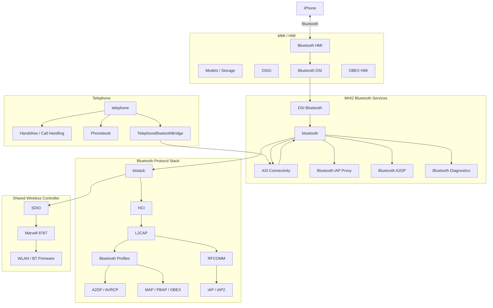

# MHI2 Bluetooth Architecture

Evidence-based reverse engineering of the Bluetooth subsystem in Audi MHI2 / MU0678-class firmware, with particular focus on its relationship to iAP/iAP2 and Wireless CarPlay.

> **Status:** Active research  
> **Evidence:** Firmware, configuration, binaries, runtime behaviour and controlled tracing  
> **Scope:** MHI2 production architecture

---

## Architecture

The MHI2 Bluetooth implementation is not a single process.

The evidence shows distinct layers for the HMI, high-level Bluetooth service, connectivity interfaces, protocol stack, and shared Marvell 8787 controller.



The diagram is intentionally architectural rather than a claim that every arrow represents a proven direct function call. Where the exact call path remains unknown, the corresponding section below identifies it as a tracing target.

---

# 1. Process Architecture

The production connectivity configuration launches separate processes for:

```text
connectivity_launcher
    ├── telephone
    ├── bluetooth
    ├── connectionmanager
    ├── messaging
    ├── dev-upnp
    ├── btstack
    └── nad
```

`bluetooth` and `btstack` are therefore distinct executables rather than two names for the same component.

`btstack` has a startup prerequisite:

```text
/tmp/mvloaded
```

so the Bluetooth protocol stack waits for the Marvell wireless firmware-loading stage before initialising.

---

# 2. Connectivity Supervisor

Bluetooth lifecycle management is tied into `connectivity_launcher`.

The production configuration defines an explicit failure path:

```text
bluetooth failure
        │
        ▼
   btstack shutdown
        │
        ▼
 /eso/bin/reset_bt.sh
        │
        ▼
   btstack init
        │
        ▼
   btstack run
```

`btstack` itself also specifies `reset_bt.sh` as its failure handler and as a customer-update leave action.

This makes the launcher and reset script part of the Bluetooth architecture, rather than merely auxiliary startup tooling.

---

# 3. High-Level Bluetooth Service

The high-level Bluetooth executable is:

```text
/eso/bin/apps/bluetooth
```

The production configuration contains:

```json
{
    "topologyLogic": 1,
    "enableIap": false
}
```

`topologyLogic` proves that an explicit Bluetooth topology-management mode exists, but the meaning of numeric value `1` has not yet been established through binary analysis.

`enableIap=false` proves that Bluetooth-side iAP functionality is disabled in the production configuration.

This does **not** mean that iAP/iAP2 support is absent from the firmware. The image contains dedicated iAP infrastructure, including:

```text
libasimmxconnectivity_bluetooth_iapproxy.so
```

Therefore:

```text
iAP interface exists
        ≠
iAP runtime integration is enabled
```

---

# 4. DSI and ASI Interfaces

The Bluetooth service is exposed through explicit service interfaces.

The image contains:

```text
libdsibluetoothproxy.so
libasimmxconnectivity_bluetoothproxy.so
libasimmxconnectivity_bluetooth_a2dpproxy.so
libasimmxconnectivity_bluetooth_iapproxy.so
```

The trace configuration also exposes:

```text
PROXY_dsi_bluetooth_DSIBluetooth
STUB_dsi_bluetooth_DSIBluetooth

PROXY_dsi_bluetooth_DSIObexAuthentication
STUB_dsi_bluetooth_DSIObexAuthentication
```

This establishes a service boundary around the Bluetooth subsystem.

The exact methods exposed by these interfaces, and which process owns each endpoint at runtime, remain tracing targets.

---

# 5. HMI Bluetooth Layer

The HMI contains separate Bluetooth components:

```text
hmi_App_Bluetooth_Main
hmi_App_Bluetooth_DSI
hmi_App_Bluetooth_HMI
hmi_App_Bluetooth_Models
hmi_App_Bluetooth_OSGI
hmi_App_Bluetooth_Storage
```

There is also a separate OBEX HMI layer:

```text
hmi_App_Obex_Main
hmi_App_Obex_DSI
hmi_App_Obex_HMI
```

Therefore Bluetooth presentation, models, storage and service communication are separated rather than implemented as one monolithic UI component.

---

# 6. Telephone Integration

`telephone` is a separate service from both `bluetooth` and `btstack`.

Its trace interfaces include:

```text
CON_CALLHANDLINGSERVICES
CON_HANDSFREESERVICES
CON_NADSERVICES
CON_PHONEPOWERSERVICES
CON_TEL
```

Most importantly, the image contains:

```text
TelephoneBluetoothBridge
```

with:

```text
PROXY_asi_connectivity_telephone_TelephoneBluetoothBridge
STUB_asi_connectivity_telephone_TelephoneBluetoothBridge
```

The architecture is therefore:

```text
telephone
    │
    └── TelephoneBluetoothBridge
              │
              ▼
        Bluetooth subsystem
```

This is stronger evidence than treating `telephone` as synonymous with Bluetooth.

---

# 7. Bluetooth Protocol Stack

The production `btstack` configuration contains:

```text
hciStartupCapture = true
hciCaptureMaskedL2capChannels = false
stayMaster = true
wbsSupported = true
didSupported = true
clockOffsetUpdate = true
smsOnly = false

a2dpEndpointMp3Enabled = false
a2dpEndpointAacEnabled = true

AudioStreamPriority = 17
getA2dpDataFromHciTransport = true
```

These are live production configuration controls rather than merely strings discovered inside a binary.

The protocol layers beneath `btstack` are therefore known conceptually to include HCI and Bluetooth profile handling, but the exact implementation boundaries still need binary-level tracing.

We should **not** equate MHI2's `btstack` executable with QNX's generic `io-bluetooth` architecture without proving that equivalence.

---

# 8. HCI Capture

HCI capture is explicitly enabled:

```text
hciStartupCapture = true
```

and:

```text
hciCaptureMaskedL2capChannels = false
```

The trace configuration exposes:

```text
CON_BTSTACK_HCICAPTURE
```

and dedicated tracing modes include:

```text
enableHciCapturing
```

There are therefore three useful diagnostic layers:

```text
btstack
   │
   ├── general stack tracing
   │
   ├── iAnywhere / IA tracing
   │
   └── HCI capture
```

This is one of the highest-value existing tracing facilities for further reverse engineering.

---

# 9. iAP / iAP2

The firmware contains a substantial iAP/iAP2 stack:

```text
/eso/bin/apps/iap
libasimmxconnectivity_bluetooth_iapproxy.so
devu-iap2-tegra3-ci.so
devu-iap2ncm-tegra3-ci.so
ipod-drvr-iap2.so
mss-ipodiap2.so
libiap2client.so
iap2cli
```

The production Bluetooth configuration nevertheless specifies:

```text
enableIap = false
```

This makes the relationship between the Bluetooth service and the existing iAP2 implementation one of the most important unresolved areas.

The current evidence proves the components exist and that the Bluetooth integration is disabled in production. It does **not** yet prove exactly what happens when that integration is enabled.

---

# 10. A2DP and AVRCP

Production configuration explicitly enables AAC and disables MP3:

```text
a2dpEndpointMp3Enabled = false
a2dpEndpointAacEnabled = true
```

A2DP data is configured to be obtained from the HCI transport:

```text
getA2dpDataFromHciTransport = true
```

AVRCP has its own configuration:

```text
AudioStreamPriority = 17
EnableResmgrBrowsing = false
```

Therefore A2DP streaming and AVRCP control should be treated as separate architectural functions.

The exact path from received Bluetooth packets to the MHI2 audio subsystem remains to be traced.

---

# 11. HFP / Telephone Audio

Production Bluetooth configuration specifies:

```text
wbsSupported = true
```

The image contains dedicated HFP speech-processing resources:

```text
HFP_1_NB.bsd
HFP_1_WB.bsd
HFP_2_NB.bsd
HFP_2_WB.bsd
```

This proves explicit narrowband and wideband HFP processing resources exist.

It does not yet establish which runtime device/channel consumes each resource.

---

# 12. MAP, PBAP and OBEX

The production configuration contains:

```text
smsOnly = false
```

The telephone subsystem exposes a phonebook interface:

```text
PROXY_asi_connectivity_phonebook
STUB_asi_connectivity_phonebook
```

The system also contains explicit OBEX authentication and HMI components.

Therefore the architecture contains distinct paths for:

```text
Bluetooth
   ├── HFP
   ├── A2DP
   ├── AVRCP
   ├── MAP
   ├── PBAP / Phonebook
   └── OBEX
```

The exact profile-to-OBEX call graph and storage backend remain unproven.

SPP is deliberately **not** listed as a production capability here because the current MHI2 evidence is insufficient to establish that it is actively exposed.

---

# 13. Shared Marvell 8787 Controller

Bluetooth and WLAN share the Marvell 8787 wireless hardware.

The firmware contains:

```text
sd8787_uapsta.bin
w8787_wlan_SDIO_bt_SDIO.bin
```

and the wireless startup path uses:

```text
io-sdiorm-mib2
mvload
```

`btstack` waits for:

```text
/tmp/mvloaded
```

before initialising.

The resulting hardware boundary is:

```text
             MHI2
               │
               ▼
       io-sdiorm-mib2
               │
              SDIO
               │
        ┌──────┴──────┐
        │             │
       WLAN           BT
        │             │
        └──────┬──────┘
               ▼
        Marvell 8787
          firmware
```

The exact host-side HCI transport implementation is not yet proven.

---

# 14. Bluetooth Reset / Recovery

`reset_bt.sh` is actually a shared WLAN/BT controller recovery mechanism.

The sequence includes:

```text
stop WLAN infrastructure
        │
        ▼
destroy uap* / mlan* / wfd*
        │
        ▼
kill io-sdiorm-mib2
        │
        ▼
restart io-sdiorm-mib2
        │
        ▼
wait for /dev/sdio0
        │
        ▼
load Marvell firmware
        │
        ▼
mount WLAN driver
        │
        ▼
recreate WLAN interfaces
```

Therefore a Bluetooth recovery event can reset the shared WLAN/BT controller rather than simply restarting a Bluetooth daemon.

This is an important part of the wireless architecture and should remain connected to the Wi-Fi documentation.

---

# 15. Lab HCI Interface

The image also contains a manufacturing/lab bridge configuration referencing:

```text
hci0
/dev/ttyS0
115200
TCP
mlan0
```

This is useful evidence of a development HCI interface, but it is **not production transport evidence**.

The same configuration references a different lab firmware path, so it must not be used to claim that production MHI2 Bluetooth communicates through:

```text
hci0
/dev/ttyS0
```

That distinction is important.

---

# What Is Still Missing

The major unresolved areas are now quite specific.

| Area | Status | What remains |
|---|---|---|
| HMI → Bluetooth DSI | Partially traced | Identify actual methods and runtime endpoints |
| Bluetooth → btstack | Not fully traced | Find exact IPC / ASI / internal interface |
| `enableIap` | Proven disabled | Determine exactly what code path it gates |
| iAP2 over Bluetooth | Not fully traced | Identify registration, transport and session creation |
| HCI host transport | Not proven | Identify driver/device and packet path |
| Pairing | Not fully traced | Follow discovery → pairing → stored device state |
| RFCOMM | Not fully traced | Identify channel allocation and consumers |
| MAP | Partially traced | Trace actual message path |
| PBAP | Partially traced | Trace phonebook request → storage → Bluetooth |
| OBEX | Partially traced | Resolve authentication and profile call graph |
| A2DP | Partially traced | Follow HCI → decode → audio renderer |
| AVRCP | Partially traced | Follow control events and resource manager |
| HFP | Partially traced | Tie HFP resources to runtime audio devices |
| 8787 HCI transport | Not proven | Resolve SDIO/controller → host stack boundary |
| Firmware startup | Strongly mapped | Tie individual runtime events to firmware loading |
| Bluetooth/WLAN recovery | Proven | Trace exact triggering failure and restart sequence |

---

# Trace Plan

The next investigations should target **interfaces and boundaries**, rather than re-establishing already-proven architecture.

## 1. Trace `bluetooth` ↔ `btstack`

**Highest priority.**

Determine:

```text
bluetooth
    │
    └── ?
          │
          ▼
       btstack
```

Specifically identify:

- IPC mechanism
- ASI/DSI interfaces
- proxy/stub ownership
- service registration
- initialization sequence
- device events crossing the boundary

This should turn the current conceptual separation into a concrete call graph.

---

## 2. Reverse `enableIap`

Target:

```text
/eso/bin/apps/bluetooth
libasimmxconnectivity_bluetooth_iapproxy.so
```

Find:

```text
enableIap
    │
    ├── configuration parsing
    ├── iAP registration
    ├── proxy creation
    └── runtime enable/disable path
```

The objective is to determine **exactly what `enableIap=false` prevents**.

Do not infer this from the configuration name alone.

---

## 3. Trace the iAP2 transport

Follow:

```text
iPhone
   │
   │ Bluetooth
   ▼
Bluetooth stack
   │
   ▼
RFCOMM / transport
   │
   ▼
iAP2
   │
   ▼
libiap2client / iAP services
```

The critical question is where the Bluetooth transport hands control to the iAP2 implementation.

---

## 4. Capture HCI during pairing

Use the existing HCI capture facility.

Capture at least:

1. controller startup
2. phone discovery
3. pairing
4. authentication
5. service discovery
6. RFCOMM setup
7. normal connected state
8. disconnect

Then correlate HCI events against:

```text
CON_BTSTACK
CON_BTSTACK_IA
CON_BTSTACK_IA_SAP
CON_BTSTACK_HCICAPTURE
```

This should provide the first hard packet-level map of the production Bluetooth connection.

---

## 5. Trace Bluetooth device state

Follow a device from:

```text
discovered
    ↓
paired
    ↓
stored
    ↓
connected
    ↓
profile registration
    ↓
disconnected
```

The HMI storage/model components are especially relevant here.

The objective is to determine where the authoritative device state actually lives.

---

## 6. Trace RFCOMM

Identify:

- RFCOMM implementation
- channel allocation
- registered services
- iAP-related channels
- HFP-related channels
- other production consumers

This will connect the Bluetooth packet layer to the higher-level services.

---

## 7. Trace OBEX

Start from:

```text
DSIObexAuthentication
```

and follow it into:

```text
MAP
PBAP
Phonebook
Messaging
Storage
```

The goal is to replace the current "OBEX exists" statement with an actual profile → OBEX → application call graph.

---

## 8. Trace A2DP end-to-end

The configuration already gives us an unusually useful anchor:

```text
getA2dpDataFromHciTransport = true
```

Trace:

```text
HCI
 ↓
btstack
 ↓
A2DP
 ↓
AAC
 ↓
audio subsystem
 ↓
renderer
```

The unresolved endpoint is the audio handoff.

---

## 9. Trace HFP end-to-end

Correlate:

```text
HFP_1_NB
HFP_1_WB
HFP_2_NB
HFP_2_WB
```

with:

```text
HandsfreeServices
CallHandlingServices
TelephoneBluetoothBridge
```

The goal is to identify exactly which resources are selected for each call/audio path.

---

## 10. Resolve the 8787 HCI boundary

This is the major hardware-level unknown.

We know:

```text
btstack
   ↓
?
   ↓
SDIO
   ↓
Marvell 8787
```

We do **not** yet have enough evidence to name the missing layer.

Trace:

- `btstack` device opens
- driver/device names
- SDIO resource manager interactions
- HCI packet reads/writes
- interrupts/events
- firmware mailbox/control paths

Do not substitute the lab `hci0`/`ttyS0` configuration for this.

---

# Highest-Value End State

The Bluetooth investigation is complete when we can produce a concrete chain like:

```text
iPhone
  │
  │ Bluetooth
  ▼
Marvell 8787
  │
  │ HCI
  ▼
btstack
  │
  ├── HFP
  ├── A2DP
  ├── AVRCP
  ├── MAP
  ├── PBAP
  └── iAP2
        │
        ▼
   Bluetooth service
        │
   ┌────┴────────┐
   │             │
telephone       DSI/ASI
   │             │
   └──────┬──────┘
          ▼
       MMI / HMI
```

with every currently unknown boundary replaced by a **verified process, library, interface, function, device or protocol transition**.

---

## Evidence Discipline

Three categories are used throughout this document:

- **Proven** — directly supported by MHI2 firmware, configuration, binary or runtime evidence.
- **Partially traced** — the relevant components or boundary are known, but the complete path is not yet established.
- **Not yet proven** — plausible from external platform knowledge or filenames, but not demonstrated on MHI2.

Generic QNX Bluetooth architecture and external Wireless CarPlay implementations are useful for comparison, but they are not treated as evidence of MHI2 internals.

The objective is to replace every remaining assumption with a traceable fact.
