# MHI2 Wireless Capability Breakdown

This document records the reverse-engineered wireless/hotspot architecture of the MHI2 system. It is intentionally evidence-driven: conclusions are based on firmware contents, configuration, binaries and runtime behaviour. Unproven areas are explicitly identified rather than inferred.

---

# 1. Current Mapped Architecture

This is the architecture currently established from the available MHI2 evidence.

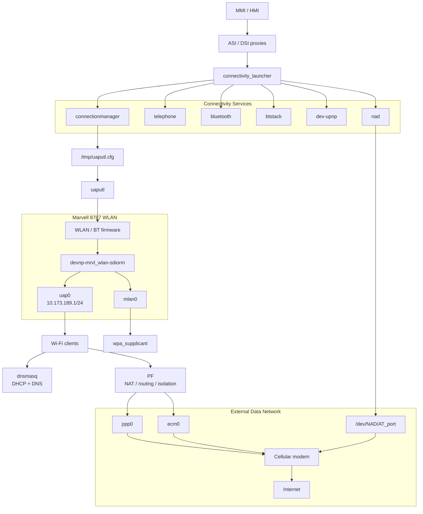

## Current Proven Hotspot Flow

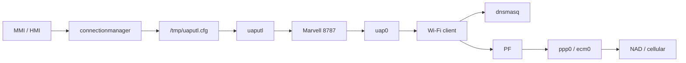

The critical distinction is:

- `uap0` is the production hotspot/AP interface.
- `mlan0` is the Wi-Fi client/station interface.
- `uaputl` controls the Marvell AP/WLAN firmware.
- `dnsmasq` provides DHCP and DNS.
- PF provides routing, NAT and isolation.
- `ppp0` / `ecm0` provide the external data path.

---

# 2. What Remains to Be Traced

The architecture above is the current map. The following are the remaining gaps.

## 2.1 Runtime Generation of `/tmp/uaputl.cfg`

We know:


Still unknown:

- who creates `/tmp/uaputl.cfg`
- which function writes it
- when it is generated
- how the SSID is generated
- how WPA credentials are generated
- which values come from persistent configuration
- which values are generated at runtime

---

## 2.2 Exact Production `uaputl` Sequence

`start-ap.sh` proves that `uaputl` performs low-level AP configuration.

The remaining task is to trace the complete production sequence:

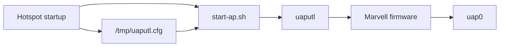

---

## 2.3 Actual Production WAN Bearer

The framework supports:

```text
ECM
PPP
RMNET
```

The remaining task is to establish which path is actually selected on the target production configuration.

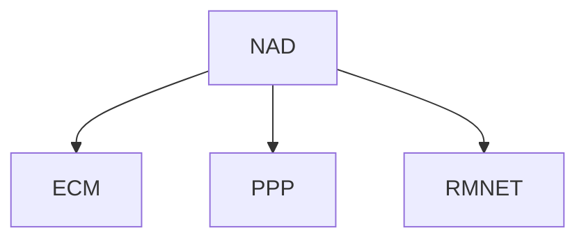

We should not infer the final bearer solely from the presence of these components.

---

## 2.4 HMI → Connectivity Runtime Path

The architecture establishes the proxy boundary:


The remaining work is method-level tracing of the actual calls and events.

---

## 2.5 WLAN Service Ownership

PF exposes numerous WLAN service ports.

The remaining work is to associate each port with its actual owning process/service.

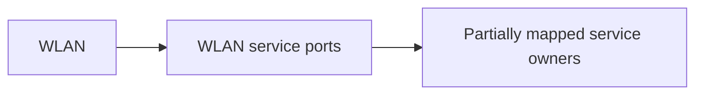

---

# 3. Component / Subsystem Breakdown

## 3.1 MMI / HMI

The HMI contains distinct WLAN and connectivity layers:

```text
hmi_App_Wlan_Main
hmi_App_Wlan_DSI
hmi_App_Wlan_HMI

hmi_App_Connectivity_Main
hmi_App_Data_Main
hmi_App_Umts_Main
```

The corresponding WLAN proxy infrastructure includes:

```text
libasimmxwlanproxy.so
libasimmxDiagWlanTypesproxy.so
```

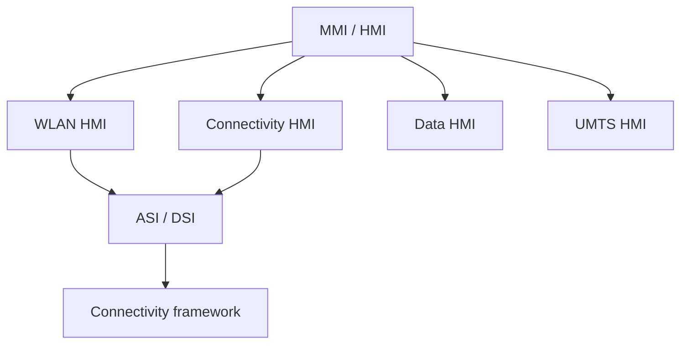

---

## 3.2 `connectivity_launcher`

`connectivity_launcher` is the production connectivity supervisor.

It launches:

```text
telephone
bluetooth
connectionmanager
messaging
dev-upnp
btstack
nad
```

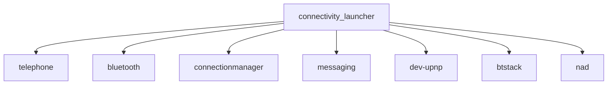

`connectionmanager` has a startup dependency on:

```text
/tmp/uap0
```

Therefore:


---

## 3.3 Marvell 8787

The MHI2 wireless controller is a Marvell 8787.

Firmware:

```text
sd8787_uapsta.bin
w8787_wlan_SDIO_bt_SDIO.bin
```

Host-side components:

```text
io-sdiorm-mib2
devnp-mrvl_wlan-sdiorm.so
mvload
uaputl
```

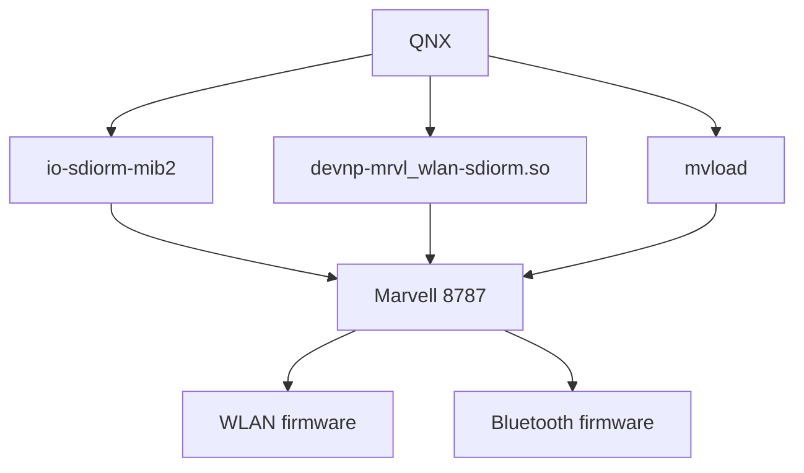

---

## 3.4 `uap0`

`uap0` is the production hotspot/AP interface.

Startup:

```text
if_up -p -r 100 uap0
ifconfig uap0 up
ifconfig uap0 mediaopt hostap
ifconfig uap0 10.173.189.1 netmask 255.255.255.0
```

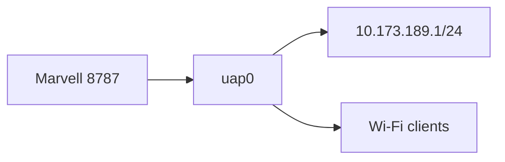

---

## 3.5 `mlan0`

`mlan0` is the station/client interface.

It is started with:

```text
wpa_supplicant -Bi mlan0
```


This is separate from the hotspot/AP path.

---

## 3.6 `connectionmanager`

Production configuration contains:

```text
autoProfilePath
customerProfilePath
uaputlCfgPath = /tmp/uaputl.cfg
onlineIdleTimeInS = 300
```

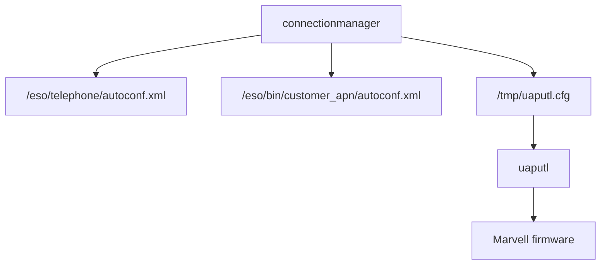

---

## 3.7 `uaputl`

`uaputl` is the low-level control interface used to configure the Marvell WLAN firmware.

`start-ap.sh` uses commands including:

```text
uaputl bss_stop
uaputl sys_config
uaputl hostcmd
uaputl deepsleep
uaputl coex_config
uaputl aggrpriotbl
```

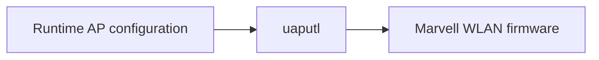

---

## 3.8 `dnsmasq`

`dnsmasq` provides both DHCP and DNS for the hotspot.

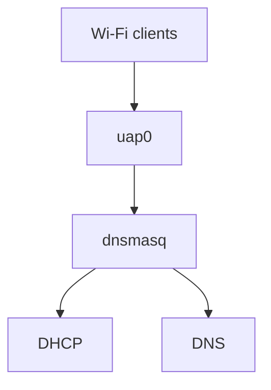

DHCP range:

```text
10.173.189.10 - 10.173.189.99
```

Leases:

```text
/ramdisk/dnsmasq.leases
```

---

## 3.9 PF

PF performs more than NAT.

Its responsibilities include:

- NAT
- routing policy
- WLAN isolation
- external-interface filtering
- service-port filtering
- DNS server state
- traffic classification

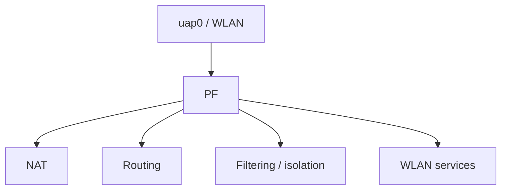

---

## 3.10 NAD / Cellular Data

The NAD abstraction sits between the connectivity framework and the modem.


Possible data mechanisms:

```text
ECM
PPP
RMNET
```

---

## 3.11 PPP

The PPP path is:

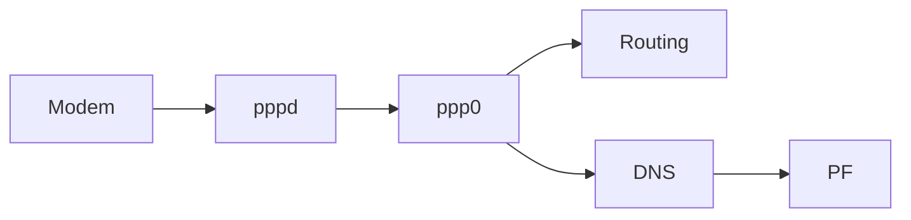

`/etc/ppp/ip-up` establishes routing, DNS and PF state when PPP becomes active.

---

## 3.12 ECM

ECM provides another external network path:

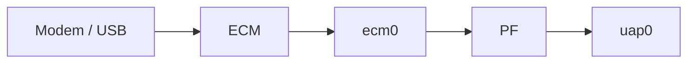

ECM state changes can trigger route, DNS, PF and `dnsmasq` reconfiguration.

---

## 3.13 UPnP

UPnP is a first-class connectivity service.

```mermaid
flowchart LR
    LAUNCHER["connectivity_launcher"]
    UPNP["dev-upnp"]
    WLAN["WLAN"]
    MULTICAST["239.255.255.0/24"]
    PORTS["49152 / 49153–49162"]

    LAUNCHER --> UPNP
    UPNP --> WLAN
    WLAN --> MULTICAST
    WLAN --> PORTS
```

---

## 3.14 WLAN Service Surface

The WLAN exposes services including:

| Port | Function |
|---:|---|
| 21001 | WLAN tracing |
| 20001 | GEMIB |
| 30001 | SWDL fallback |
| 23100 | Video |
| 23101 | Video control |
| 22222–22223 | Audio |
| 21600–21605 | SSL / control |
| 25010 | EXLAP |
| 28500 | EXLAP UDP |
| 49152 | UPnP |
| 49153–49162 | UPnP |

These should be treated as a service surface to be mapped to their owning processes.

```mermaid
flowchart TB
    WLAN["WLAN"]

    TRACE["WLAN tracing"]
    GEMIB["GEMIB"]
    SWDL["SWDL"]
    VIDEO["Video"]
    AUDIO["Audio"]
    CONTROL["Control"]
    EXLAP["EXLAP"]
    UPNP["UPnP"]

    WLAN --> TRACE
    WLAN --> GEMIB
    WLAN --> SWDL
    WLAN --> VIDEO
    WLAN --> AUDIO
    WLAN --> CONTROL
    WLAN --> EXLAP
    WLAN --> UPNP
```

---

# 4. Evidence Status

## Proven

- `uap0` is the hotspot/AP interface.
- `mlan0` is the Wi-Fi client/station interface.
- `uap0` uses `10.173.189.1/24`.
- `uap0` uses `mediaopt hostap`.
- `uaputl` controls the Marvell WLAN firmware.
- `/tmp/uaputl.cfg` is the runtime AP configuration path.
- `dnsmasq` provides DHCP and DNS.
- PF provides NAT, routing and WLAN security policy.
- `ppp0` and `ecm0` are supported external data interfaces.
- Marvell 8787 is the WLAN controller.
- `io-sdiorm-mib2` provides the SDIO hardware layer.
- `devnp-mrvl_wlan-sdiorm.so` is the QNX WLAN driver.
- `connectivity_launcher` supervises the connectivity services.
- Persistent hotspot and WLAN-client configuration are separate.
- UPnP is integrated into the connectivity architecture.

## Partially Traced

- Exact runtime generation of `/tmp/uaputl.cfg`.
- Exact production `uaputl` startup sequence.
- Exact modem/data-bearer selection.
- Exact connectivity-manager state transitions.
- Exact HMI → connectivity method-level call paths.
- Ownership of individual WLAN service ports.

## Not Yet Proven

- Exact SSID generation function.
- Exact WPA credential generation function.
- Exact production modem bearer under every MU0678 configuration.
- Complete runtime call graph from HMI to Marvell firmware.
- Exact relationship between every WLAN service port and its owning process.
