# MHI2 Wireless Capability Breakdown

This document records the reverse-engineered wireless/hotspot architecture of the MHI2 system. It is intentionally evidence-driven: conclusions are based on firmware contents and configuration traced during the investigation. Unproven areas are explicitly called out rather than inferred.

---

## 1. The Complete Proven Data Path

The proven hotspot architecture is:

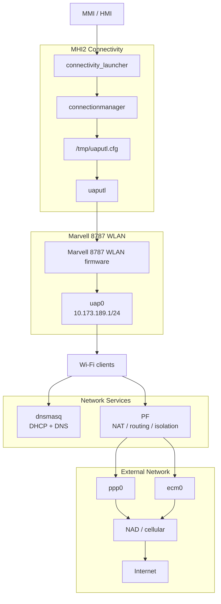

The key point is that **`uap0` is the actual hotspot/AP interface**.

`mlan0` is something completely different.

---

## 2. The Wi-Fi Hardware Stack

The hardware is a **Marvell 8787** WLAN device.

The dump contains:

```text
advanced/MU0678-appimg/var/FwImage/
    sd8787_uapsta.bin
    w8787_wlan_SDIO_bt_SDIO.bin
```

and:

```text
/armle/sbin/io-sdiorm-mib2
/armle/sbin/uaputl
/armle/sbin/mlan_region
/lib/dll/devnp-mrvl_wlan-sdiorm.so
```

Startup explicitly powers/resets the WLAN:

```text
echo 1 > /dev/nvgpio/wlan_reset
```

and starts the SDIO resource manager:

```text
/armle/sbin/io-sdiorm-mib2 \
    -p33 \
    -c45000000 \
    -h ioport=0x78000200,irq=47,inpclk=45000000 \
    -d nowlan_reset &
```

The WLAN firmware is then loaded:

```text
/usr/sbin/mvload \
    -p /mnt/app/var/FwImage \
    -a /eso/bin/PhoneCustomer
```

and the QNX network driver is mounted:

```text
mount -Tio-pkt \
    -o drv_mode=3,max_uap_bss=1,eeprom_nmacs=3,force_shutdown,scan_chan_times=150:50:50 \
    /lib/dll/devnp-mrvl_wlan-sdiorm.so
```

The hardware boundary is:

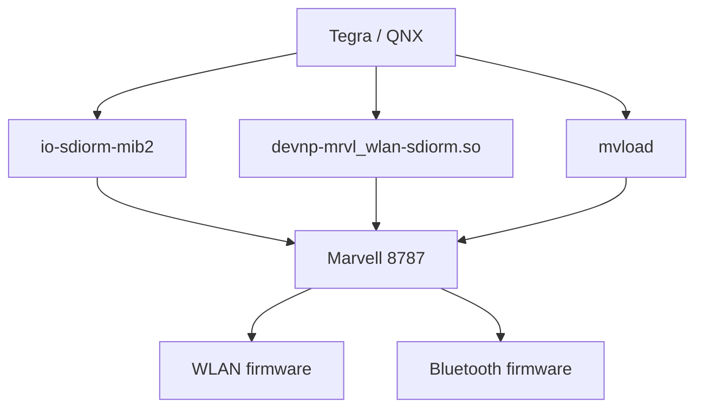

This is not Linux/mac80211. It is a QNX `io-pkt` network-driver architecture.

---

## 3. The Most Important Distinction: `uap0` vs `mlan0`

### Hotspot / AP

```text
if_up -p -r 100 uap0

ifconfig uap0 up
ifconfig uap0 mediaopt hostap
ifconfig uap0 10.173.189.1 netmask 255.255.255.0
```

Therefore:

**`uap0` = access-point interface.**

It gets:

```text
10.173.189.1/24
```

and is explicitly put into:

```text
mediaopt hostap
```

### Wi-Fi client

Separately:

```text
if_up -p -r 10 mlan0

ifconfig mlan0 up

echo "ctrl_interface=/var/run/wpa_supplicant
ap_scan=2
update_config=1

" >/ramdisk/wpa_supplicant.conf

wpa_supplicant -Bi mlan0 \
    -c /ramdisk/wpa_supplicant.conf
```

Therefore:

**`mlan0` = station/client interface.**

This is why the firmware contains `wpa_supplicant`.

It is **not evidence that wpa_supplicant implements the hotspot**.

The hotspot uses the Marvell AP/UAP interface and `uaputl`.

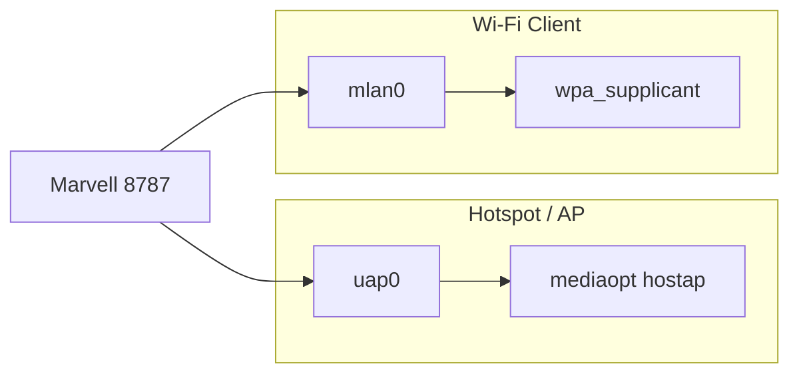

---

## 4. What Actually Creates the Hotspot

The static startup code establishes the AP interface but does **not** contain the SSID/password.

Instead, the telephone/connectivity configuration contains:

```text
"connectionmanager": {
    "autoProfilePath": "/eso/telephone/autoconf.xml",
    "customerProfilePath": "/eso/bin/customer_apn/autoconf.xml",
    "uaputlCfgPath": "/tmp/uaputl.cfg",
    "onlineIdleTimeInS": 300
}
```

The firmware therefore gives the chain:

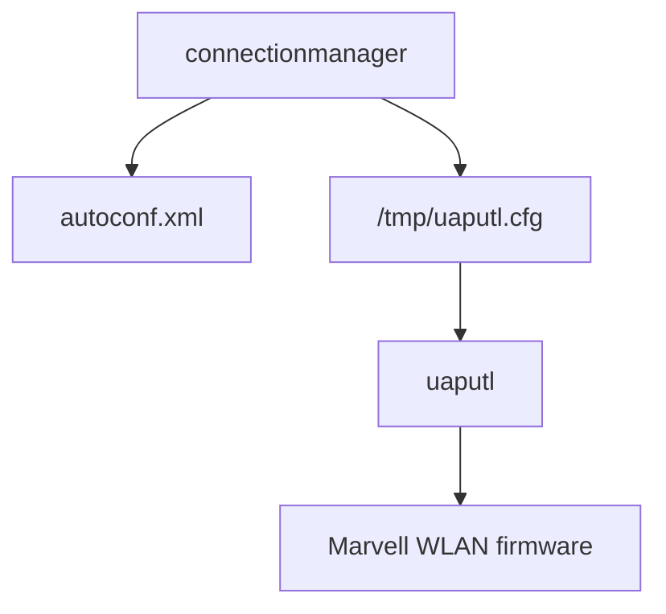

So the AP configuration is **runtime-generated/state-derived**, rather than being a simple static `hostapd.conf`.

That explains why there is no conventional:

```text
hostapd.conf
ssid=...
wpa_passphrase=...
```

architecture.

There is no hostapd here.

---

## 5. `start-ap.sh` Proves the Lower-Level Control Mechanism

The telephone subsystem contains:

```text
/eso/telephone/start-ap.sh
```

and it directly calls:

```text
uaputl bss_stop
uaputl sys_config $2
```

then:

```text
uaputl hostcmd ...
uaputl deepsleep 0
uaputl coex_config /eso/telephone/coex.cfg
uaputl aggrpriotbl ...
```

The control path is:

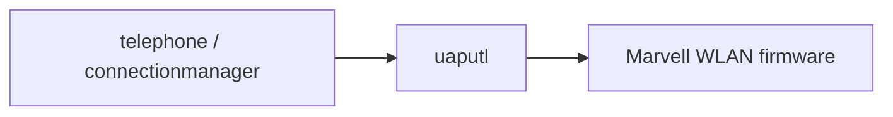

`uaputl` is consequently the firmware's **control interface to the Marvell WLAN firmware**.

---

## 6. DHCP Is Completely Mapped

The AP network is:

```text
10.173.189.0/24
```

with MMI:

```text
10.173.189.1
```

DHCP comes from:

```text
/eso/bin/apps/dnsmasq
```

The configuration is:

```text
/etc/dnsmasq.conf
```

and explicitly says:

```text
interface=lo0
interface=uap0
```

DHCP range:

```text
10.173.189.10 - 10.173.189.99
```

with:

```text
netmask 255.255.255.0
lease 3m
```

There is also:

```text
dhcp-range=10.173.189.0,static,5m
```

and:

```text
dhcp-script=/etc/dhcp/lease_changed.sh
```

Leases are persisted at:

```text
/ramdisk/dnsmasq.leases
```

The DHCP path is:

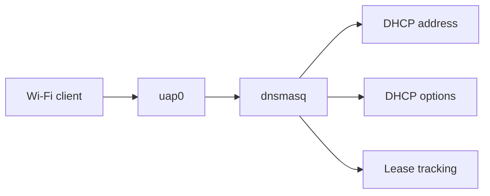

---

## 7. DNS Is Also `dnsmasq`

The same daemon provides DNS.

It reads:

```text
/etc/defaultdns.conf
/tmp/ppp0.resolv.conf
/tmp/ecm1.resolv.conf
/tmp/dhcp.resolv.conf
```

The architecture is:


The upstream DNS is dynamically supplied by the cellular connection.

There is a fallback:

```text
8.8.8.8
208.67.222.222
```

in PF's `dns_server` table.

---

## 8. The Internet Side Is Not Wi-Fi

The hotspot does not itself provide Internet.

It is a router/NAT endpoint.

The external side can be:

```text
ppp0
```

or:

```text
ecm0
```

PF explicitly defines:

```text
ppp_if = "ppp0"
ecm_if = "ecm0"
wlan_if = "uap0"
```

and the NAT rules say:

```text
nat pass on $ppp_if tagged WLAN -> ($ppp_if)
nat pass on $ecm_if tagged WLAN -> ($ecm_if)
```

The resulting path is:

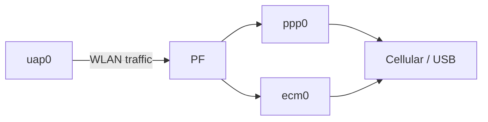

This is hard evidence that the hotspot is an actual routed/NATed network.

---

## 9. Cellular Modem Architecture

The cellular side is another separate subsystem.

Startup launches:

```text
/eso/bin/apps/TelitStarter
```

and the connectivity framework launches:

```text
/eso/bin/apps/nad
```

The NAD configuration says:

```text
"nad": {
    "path": "/dev/NAD/AT_port"
}
```

The architecture is:

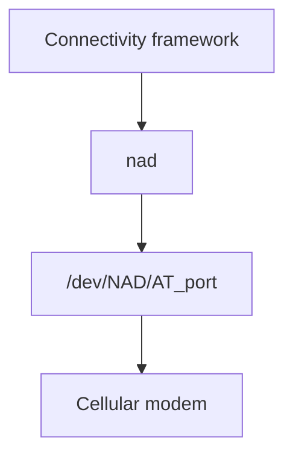

The logging configuration exposes:

```text
CON_NAD_CINTERION
CON_NAD_MODULE_CINTERIONLTE
CON_NAD_MODULE_HUAWEI
CON_NAD_MODULE_NVBRUCE
CON_NAD_MODULE_SIERRA
```

So the architecture is deliberately abstracted around a **NAD (Network Access Device)**.

For data connectivity, the framework explicitly defines:

- ECM
- PPPd
- RMNET

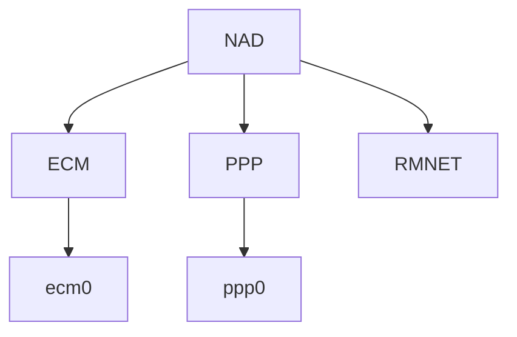

The particular production path can depend on the modem/platform configuration.

---

## 10. PPP Path

When PPP comes up:

```text
pppd
 |
 v
/etc/ppp/ip-up
```

`ip-up`:

1. deletes the existing default route
2. adds the PPP peer as the default route
3. creates the PPP local-host route
4. installs DNS
5. adds DNS servers to PF's `dns_server` table
6. creates `/tmp/ppp_connected`

The path is:

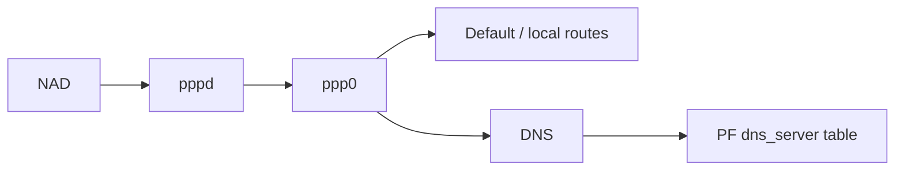

Then:


---

## 11. ECM Path

The firmware also has explicit ECM handling.

`ecm-down` tracks:

```text
ecm0
ecm1
```

and manipulates:

```text
pfctl
dnsmasq
/tmp/ecm1-setroute.sh
/tmp/ecm1-delroute.sh
/tmp/ecm1.resolv.conf
```

It also restarts/reconfigures dnsmasq when the external connection changes.

The resulting architecture is:

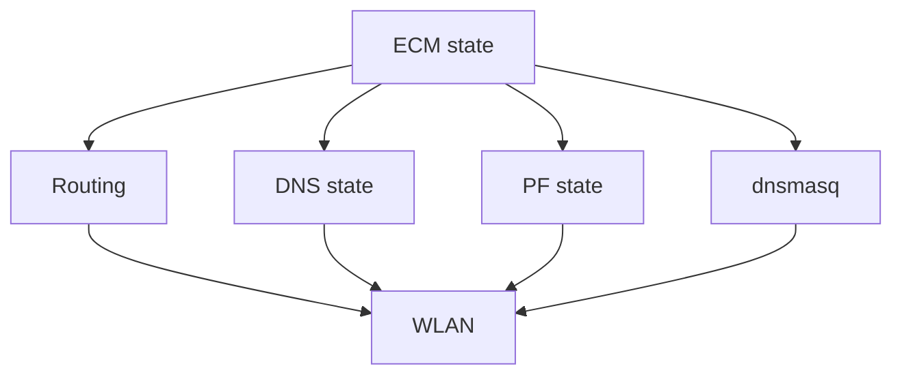

Therefore the hotspot is designed to survive external-network changes.

---

## 12. `modWLANserver.sh` Reveals Another Control Edge

This script distinguishes:

```text
0 = no internet connection available
1 = internet connection available
```

It manipulates:

```text
/tmp/dhcp.opts
```

and then:

```text
slay -fs SIGHUP dnsmasq
```

The state transition is:


This is strong evidence that DHCP is part of the connectivity state machine rather than a permanently static daemon.

---

## 13. The Hotspot Is Firewall-Isolated

PF is not simply doing NAT.

It deliberately prevents hotspot clients from directly reaching external interfaces.

The security model is:

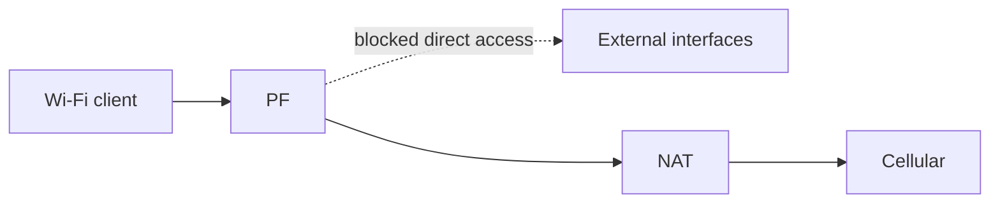

The external interfaces themselves also have filtering and outgoing-source restrictions.

---

## 14. Client Isolation Exists

PF contains explicit WLAN-to-WLAN filtering.

The conceptual policy is:


This is part of the hotspot security policy.

---

## 15. The Hotspot Supports More Than Internet Traffic

PF exposes a substantial application-specific WLAN service surface.

Examples include:

| Port | Function |
|---:|---|
| 21001 | WLAN tracing |
| 20001 | GEMIB communication |
| 30001 | SWDL fallback |
| 23100 | Video |
| 23101 | Video control |
| 22222–22223 | Audio |
| 21600–21605 | SSL / control |
| 25010 | EXLAP |
| 28500 | EXLAP UDP |
| 49152 | UPnP |
| 49153–49162 | UPnP |

The WLAN traffic classes include:

```text
video
audio
control
high
medium
default
```

with a nominal WLAN ALTQ bandwidth of:

```text
150 Mb/s
```

The WLAN is therefore a broader **vehicle connectivity transport**, not merely a cellular Internet hotspot.

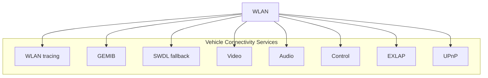

---

## 16. UPnP Is Integrated

The connectivity launcher starts:

```text
dev-upnp
```

and PF explicitly permits:

```text
239.255.255.0/24
```

and:

```text
49152
49153-49162
```

over WLAN.

The firmware also contains:

```text
upnp_file_extensions.xml
libasimmxconnectivity_upnpproxy.so
```

The architecture is:

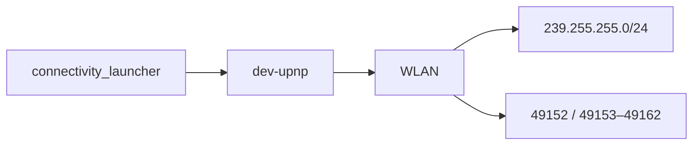

UPnP is therefore another first-class connectivity service.

---

## 17. HMI Architecture

The HMI logging configuration contains:

```text
hmi_App_Wlan_Main
hmi_App_Wlan_DSI
hmi_App_Wlan_HMI
```

alongside:

```text
hmi_App_Connectivity_Main
hmi_App_Data_Main
hmi_App_Umts_Main
```

The top-level architecture is:

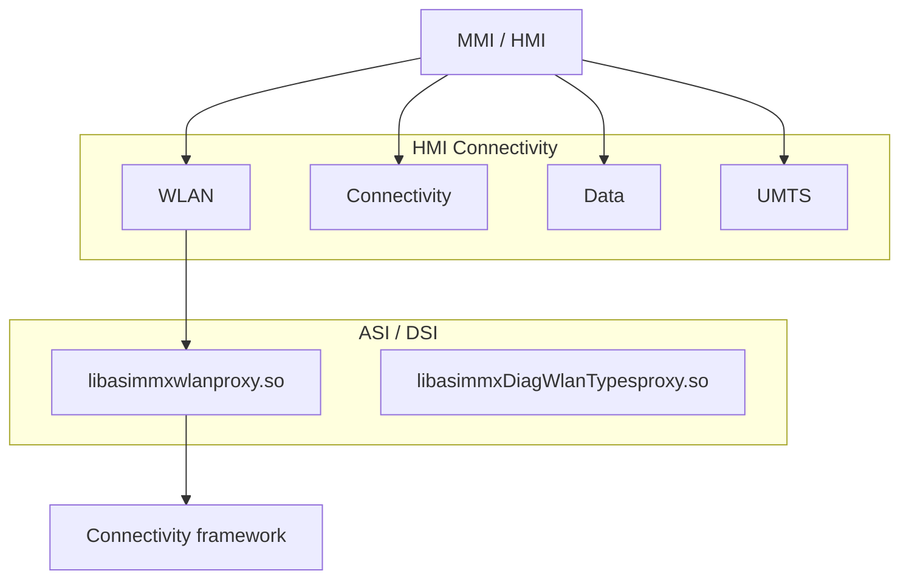

There are also corresponding proxy libraries:

```text
libasimmxwlanproxy.so
libasimmxDiagWlanTypesproxy.so
```

which establishes that the HMI communicates with the connectivity subsystem through the generated ASI/DSI interface layer.

---

## 18. `connectivity_launcher` Is the Supervisor

The production configuration identifies:

```text
connectivity_launcher
```

as the process supervisor.

It manages:

```text
telephone
bluetooth
connectionmanager
messaging
dev-upnp
btstack
nad
```

The process relationship is:

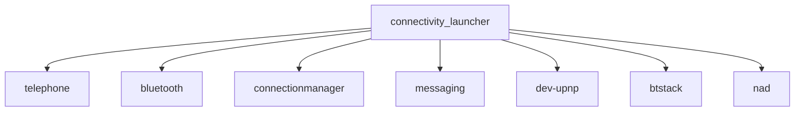

`connectionmanager` has:

```text
preCondition = /tmp/uap0
```

Therefore:

```mermaid
flowchart LR
    WLAN["WLAN initialization"]
    UAP0["/tmp/uap0"]
    CM["connectionmanager"]

    WLAN --> UAP0
    UAP0 --> CM
```

This places `connectionmanager` above the raw WLAN driver but below the HMI/service layer.

---

## 19. Telephone Is Also Above the Modem

The connectivity supervisor launches:

```text
telephone
nad
```

separately.

The telephone configuration has ASI/DSI proxies to:

```text
NADServices
CallHandlingServices
HandsfreeServices
DSINAD
DSIMobileEquipment
```

The architecture is:

```mermaid
flowchart TB
    HMI["HMI"]

    PROXY["DSI / ASI proxies"]

    TELEPHONE["telephone"]
    CONNECTION["connectionmanager"]
    NAD["nad"]

    AT["/dev/NAD/AT_port"]
    MODEM["Cellular modem"]

    HMI --> PROXY
    PROXY --> TELEPHONE
    PROXY --> CONNECTION
    PROXY --> NAD

    NAD --> AT
    AT --> MODEM
```

The modem is therefore not directly controlled by the HMI.

---

## 20. Persistence Is a Separate Layer

The hotspot enable/disable engineering scripts show separate persistent configuration bits.

### WLAN Hotspot

```text
/eso/bin/apps/pc b:0:3221356628:0.6 1
/eso/bin/apps/pc b:0:3221356628:0.6 0
```

### WLAN Client HMI

```text
/eso/bin/apps/pc b:0:3221356628:8.2 1
/eso/bin/apps/pc b:0:3221356628:8.2 0
```

The configuration layers are:

```mermaid
flowchart TB
    subgraph PERSISTENT["Persistent Configuration"]
        PC["pc"]

        HOTSPOT["WLAN Hotspot"]
        CLIENT["WLAN Client HMI"]

        RCC["RCC coding"]
        MODULE["WLAN_Module"]
        ONOFF["AK_WLAN_ONOFF"]
        CAR["AK_CAR_config"]
    end

    subgraph RUNTIME["Runtime"]
        CONNECTIVITY["Connectivity state"]
        WLAN["WLAN subsystem"]
    end

    PC --> HOTSPOT
    PC --> CLIENT

    RCC --> MODULE
    RCC --> ONOFF
    RCC --> CAR

    HOTSPOT --> CONNECTIVITY
    CLIENT --> CONNECTIVITY
    RCC --> CONNECTIVITY

    CONNECTIVITY --> WLAN
```

These are **not the same thing as simply turning the radio on**.

---

## 21. What `wpa_supplicant` Is Actually Doing

The firmware starts:

```text
wpa_supplicant -Bi mlan0
```

with:

```text
/ramdisk/wpa_supplicant.conf
```

containing:

```text
ctrl_interface=/var/run/wpa_supplicant
ap_scan=2
update_config=1
```

But `mlan0` is never assigned:

```text
10.173.189.1
```

and never gets:

```text
mediaopt hostap
```

Those operations are performed on `uap0`.

Therefore:

**`wpa_supplicant` is the Wi-Fi client-side component, not the hotspot AP security engine.**

```mermaid
flowchart LR
    MARVELL["Marvell 8787"]

    subgraph HOTSPOT["Hotspot path"]
        UAP["uap0"]
        HOSTAP["hostap"]
        UAPUTL["uaputl"]
    end

    subgraph CLIENT["Client path"]
        MLAN["mlan0"]
        WPA["wpa_supplicant"]
    end

    MARVELL --> UAP
    UAP --> HOSTAP
    UAP --> UAPUTL

    MARVELL --> MLAN
    MLAN --> WPA
```

The hotspot's AP configuration is below the connection manager, through `uaputl` → Marvell firmware.

---

## 22. Persistent vs Runtime

The architecture can now be separated into distinct layers:

```mermaid
flowchart TB
    subgraph CONFIG["Persistent Configuration"]
        PC["pc"]
        RCC["RCC coding"]
    end

    subgraph WLAN_RUNTIME["Runtime WLAN"]
        SDIO["io-sdiorm-mib2"]
        DRIVER["Marvell driver"]
        INTERFACES["uap0 / mlan0"]
    end

    subgraph AP_RUNTIME["Runtime AP Configuration"]
        CM["connectionmanager"]
        CFG["/tmp/uaputl.cfg"]
        UAPUTL["uaputl"]
        FW["Marvell firmware"]
    end

    subgraph SERVICES["Runtime Network Services"]
        DNSMASQ["dnsmasq"]
        PF["PF"]
        ROUTES["Routes / DNS state"]
    end

    subgraph WAN["Runtime WAN"]
        NAD["NAD"]
        BEARERS["ECM / PPP / RMNET"]
    end

    PC --> CM
    RCC --> CM

    SDIO --> DRIVER
    DRIVER --> INTERFACES

    CM --> CFG
    CFG --> UAPUTL
    UAPUTL --> FW
    FW --> INTERFACES

    INTERFACES --> DNSMASQ
    INTERFACES --> PF

    PF --> ROUTES
    PF --> BEARERS
    BEARERS --> NAD
```

---

## 23. What Happens When Internet Connectivity Changes

The evidence gives us this state machine:

```mermaid
flowchart TB
    NAD["NAD"]

    WAN["WAN connection"]

    subgraph BEARERS["Data Bearers"]
        ECM["ECM / ecm0"]
        PPP["PPP / ppp0"]
    end

    CM["connectivity manager"]

    subgraph STATE["Network State"]
        ROUTING["Routing"]
        DNS["DNS"]
        PF["PF"]
    end

    DNSMASQ["dnsmasq"]
    UAP["uap0"]
    CLIENTS["Wi-Fi clients"]

    NAD --> WAN

    WAN --> ECM
    WAN --> PPP

    ECM --> CM
    PPP --> CM

    CM --> ROUTING
    CM --> DNS
    CM --> PF

    ROUTING --> UAP
    DNS --> DNSMASQ
    PF --> UAP

    UAP --> CLIENTS
```

The scripts explicitly reconfigure routes, DNS, PF tables and `dnsmasq` when ECM/PPP state changes.

---

## 24. What We Have Not Proven Yet

There are a few pieces where no answer should be invented.

### A. Exact SSID/password generation

We have proven:

```text
connectionmanager
      ↓
/tmp/uaputl.cfg
      ↓
uaputl
      ↓
Marvell firmware
```

But the static dump does **not** expose the contents of `/tmp/uaputl.cfg`.

It is a runtime file.

We therefore cannot yet truthfully say which function generates the SSID or WPA key without tracing the file creation.

### B. Exact `uaputl` command sequence for production hotspot startup

`start-ap.sh` proves several commands, but it takes its actual AP configuration from:

```text
$2
```

and the production framework points to:

```text
/tmp/uaputl.cfg
```

The missing link is the exact producer/consumer sequence for that file.

### C. Exact modem selection on this particular MU0678 production configuration

The framework supports:

```text
ECM
PPP
RMNET
```

and multiple modem families.

The live configuration should therefore be used to establish the actual production data-bearer path rather than assuming it from the available modules.

---

## 25. The Architectural Map as It Stands

```mermaid
flowchart TB
    HMI["MMI / HMI"]

    PROXY["ASI / DSI proxies"]

    LAUNCHER["connectivity_launcher"]

    CM["connectionmanager"]
    TEL["telephone"]
    BT["bluetooth"]
    NAD["nad"]

    CFG["/tmp/uaputl.cfg"]
    UAPUTL["uaputl"]

    subgraph MARVELL["Marvell 8787"]
        FW["WLAN / BT firmware"]
        DRIVER["devnp-mrvl_wlan-sdiorm"]
        UAP["uap0<br/>10.173.189.1/24"]
        MLAN["mlan0"]
    end

    WPA["wpa_supplicant"]

    CLIENTS["Wi-Fi clients"]

    DNSMASQ["dnsmasq"]
    PF["PF"]

    PPP["ppp0"]
    ECM["ecm0"]

    AT["/dev/NAD/AT_port"]
    MODEM["Cellular modem"]
    INTERNET["Internet"]

    HMI --> PROXY
    PROXY --> LAUNCHER

    LAUNCHER --> CM
    LAUNCHER --> TEL
    LAUNCHER --> BT
    LAUNCHER --> NAD

    CM --> CFG
    CFG --> UAPUTL
    UAPUTL --> FW

    FW --> DRIVER
    DRIVER --> UAP
    DRIVER --> MLAN

    MLAN --> WPA

    UAP --> CLIENTS

    CLIENTS --> DNSMASQ
    CLIENTS --> PF

    PF --> PPP
    PF --> ECM

    NAD --> AT
    AT --> MODEM

    PPP --> MODEM
    ECM --> MODEM

    MODEM --> INTERNET
```

This is the current evidence-based wireless/hotspot architecture.

---

## Evidence Status

### Proven

- `uap0` is the hotspot/AP interface.
- `mlan0` is the Wi-Fi client/station interface.
- `uap0` uses `10.173.189.1/24`.
- `uap0` uses `mediaopt hostap`.
- `uaputl` controls the Marvell WLAN firmware.
- `/tmp/uaputl.cfg` is the runtime AP configuration path.
- `dnsmasq` provides DHCP and DNS.
- PF provides NAT, routing and WLAN security policy.
- `ppp0` and `ecm0` are supported external data interfaces.
- The Marvell 8787 is the WLAN controller.
- `io-sdiorm-mib2` provides the SDIO hardware layer.
- `devnp-mrvl_wlan-sdiorm.so` is the QNX WLAN driver.
- `connectivity_launcher` supervises the connectivity services.
- Persistent hotspot and WLAN-client configuration are separate.
- UPnP is integrated into the connectivity architecture.

### Partially Traced

- Exact runtime generation of `/tmp/uaputl.cfg`.
- Exact production `uaputl` startup sequence.
- Exact modem/data-bearer selection.
- Exact connectivity-manager state transitions.
- Exact HMI → connectivity method-level call paths.

### Not Yet Proven

- Exact SSID generation function.
- Exact WPA credential generation function.
- Exact production modem bearer under every MU0678 configuration.
- Complete runtime call graph from HMI to Marvell firmware.
- Exact relationship between all WLAN service ports and their owning processes.
