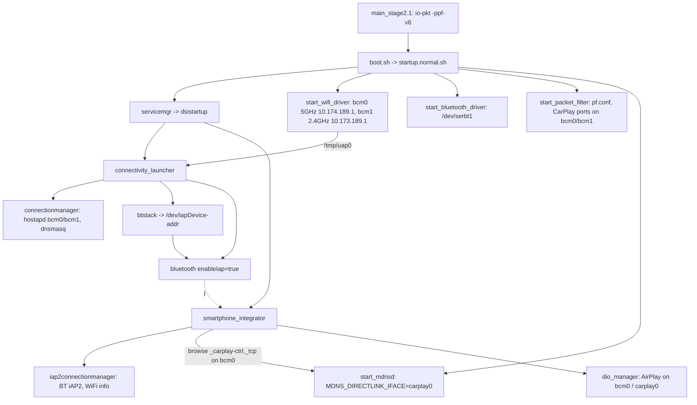

# MH2p: configuration, process orchestration and boot path for wireless CarPlay

**Scope.** How the MH2p main unit (`MH2p_ER_AUG33_P2873`, MMX2P 2201.8.0, build `CLU28_MMX2P_AU_ER_G33_004PROD`,
ALPINE, QNX 6.6.0, Tegra K1) starts and configures the processes, interfaces, firewall and discovery that
wireless CarPlay depends on. Evidence IDs **P-100..P-1xx**. Every MH2p fact is cross-platform evidence. It is
not proof of MHI2 (MU0678) or MHI2Q (MU1329) behaviour.

**Paths.** `efs-system/` = `/mnt/system`, `app/` = `/mnt/app`, `stage2_ifsN/` = boot IFS N, all under
`<MH2p>/` (see [README](README.md#paths)). `dumpifs -x` skipped 34 files at the end of `stage2_ifs4.img`,
among them `etc/boot/common.sh`, `services.sh`, `drivers.sh`, `etc/pf.conf`, `pf.ecm0.conf`, `pf.mlan0.conf`,
`etc/usblauncher.lua`, `usblauncher_otg.lua` and `usblauncher_carplay_descriptor.lua`. They were cut out of
`stage2_images/stage2_ifs4.img` at the offsets and sizes in `stage2_ifs4/_dumpifs.txt` (for example
`services.sh` @ `0x583e11`, `0x3b8a` bytes). They are plain text and start with a valid header. Line numbers
below refer to those slices. MU1329 references are `<MU1329>/...`.

**Correction to the shared brief.** The `"wireless"` block with `"regType":"_carplay-ctrl._tcp"` is in
**`smartphone_integrator.json`** (`children.carplay.wireless`), not in `dio_manager.json`. `dio_manager.json`
has a separate `"wifi"` block and the `mainAudioWireless`/`altAudioWireless` audio keys (P-101, P-110).

---

## 1. `smartphone_integrator.json` (production)

File: `efs-system/etc/eso/production/smartphone_integrator.json` (`genlastmodification 1638778357000`).
`smartphone_integrator` itself is a framework app. `stage2_ifs3/etc/eso/production/framework.json` gives it
id 353 and `exec ./bin/apps/smartphone_integrator`, with env `IPL_CONFIG_DIR_SMARTPHONE_INTEGRATOR=/etc/eso/production`,
`USB_HOST_LIB_PATH=/lib/libusbdi.so`, `USB_DEVICE_LIB_PATH=/mnt/app/armle/lib/libusbdci.so` and
`servicemgr.singleapp=true, wd_period=20000`. `dsistartup.json` `on_startup_normal` runs `init` and then `run`
on it, right after `connectivity_launcher` (P-120).

### 1.1 Children

| Child | `exec` / `path` | `envs` (abridged) | Timeouts / retries | Notes |
| --- | --- | --- | --- | --- |
| `gal` | `gal` / `/run/enforcer/eso/bin/apps` | `LD_LIBRARY_PATH=...`, `IPL_CONFIG_DIR_GAL=/etc/eso/production` | startup 18000, stop 6000, wd 60000, setup 2, runtime 2, downtime 10000, restartDelay 0, portReset 1500 | Android Auto |
| `mirrorlink` | `mirrorlink.real` | `LIBIMG_CFGFILE`, `LD_PRELOAD=/eso/lib/libsystemtime_hack.so`, ... | startup 30000, runtime 0 | |
| **`carplay`** | **`dio_manager`** / `/run/enforcer/eso/bin/apps` | `LD_LIBRARY_PATH=/mnt/app/root/lib-target:/eso/lib:...`, `IPL_CONFIG_DIR_DIO_MANAGER=/etc/eso/production`, `LIBIMG_CFGFILE=/etc/config/img.conf` | startup 10000, stop 3000, wd 60000, maxSetupRetries 2, maxRuntimeRetries 2, retriesBeforeDowntime 3, downtime 30000, restartDelay 2000, portResetTime 250, hmiReportDelay 0 | **`cleanupScript ""`**, `decoderUse true`, `selfTermination true`, `errorDump.apps ["io-usb-dcd"]`, `filesToAppend ["/dev/shmem/iap2.log"]`, **`wireless{...}`** (below) |
| `carlife` | `carlife` / `/run/enforcer/carlife` | | cleanup `/etc/scripts/carlife_cleanup.sh` | |
| `alibox` | `alinkclient` | | hmiReportDelay 23000 | |
| **`iap2connectionmanager`** | `iap2connectionmanager` / `/run/enforcer/eso/bin/apps` | `LD_LIBRARY_PATH=...` only | `watchdogTimeout 10000`, `disableWatchdog false`, `retriesBeforeDowntime 3`. No startup/stop/setup keys | New compared with MU1329 (P-103) |

The wireless subsection, verbatim:

```json
"wireless":{
    "mDNSDiscovery":{
        "regType":"_carplay-ctrl._tcp",
        ## Interface for mDNS browsing
        "wifiInterfaceName":"bcm0"
    },
    "enable5GHzCountryAdaption":true
},
```

It is the only `wireless` block in the file. `gal` has none, although the binary logs `galWireless`
(P-100).

### 1.2 Global keys that matter for wireless

| Key | Value | Meaning / consumer |
| --- | --- | --- |
| `threads.priorities.dnsServiceDiscoveryService` | `10` | `smartphone::CDNSServiceDiscoveryService`, the DNS-SD **browser** in `smartphone_integrator` (P-104) |
| `bluetooth.enableDeviceDetection` | `true` | `BLUETOOTH_ENABLEDEVICEDETECTION`: SI detects phones over Bluetooth, not only over USB (P-102) |
| `bluetooth.iap2ResetTimeout` | `7000` | `BLUETOOTH_IAP2RESETTIMEOUT`. Related SI log: "Requesting IAP2 reset to wake up device from Low Power Mode and to retrieve latest Wireless CarPlay update" |
| `dsi.sendUUIDAsDeviceAddress` | `true` | The Apple UUID is sent as `deviceAddress` to the HMI |
| `paths.cleanupPaths` | `["/mnt/misc1/carplay"]` | No `mcdMonitored` key exists (compare E-037 on MU0678) |
| `usb.stacks` | `["/dev/io-usb/io-usb:0:3:3:2:3:0:5:/ramdisk/pps/device/usb_ctrl0:/ramdisk/pps/device/usb_ctrl1"]` | One stack entry with two PPS control objects (MU1329 has two entries) |
| `usb.launcher.otgCmdStartStackDeviceModeCarPlay` | `"start_stack::device,2"` | Wired role switch, the same as MU1329 |
| `usb.otgStackCleanupScript` | `/etc/scripts/stopncm.sh` | Destroys `carplay0` |
| `usb.dedicatedIoPkt` | `flagPath /tmp/si_dedicated_iopkt`, `useForCarPlay 0` | Second io-pkt `/cplay` is compiled in but **off** (P-122) |
| `settings.forceConnectionType` | `0` | New key |

### 1.3 How a wireless session is triggered, compared with wired (from binaries plus config)

- **Wired** (unchanged in kind from MU1329). An Apple device on the OTG port triggers `usblauncher_otg.lua`.
  It starts `start_io-otg-cinemo.sh` for interface class `0xFF/0xF0/0x00`, which execs
  `io-otg-cinemo -s /dev/io-usb/otg_dev -lc 212 -v -t 8`, and `startncm.sh` for the NCM class, which mounts
  `devnp-usbdnet.so name=carplay` → `carplay0` (P-123). SI then starts the `carplay` child
  (`dio_manager`, `iap2.device = iap://ffs:///dev/otg-cinemo`).
- **Wireless.** `smartphone_integrator` has its own wireless path. Symbols and strings in `eso/bin/apps/smartphone_integrator`:
  - `CControllerInternalEvent_Iap2WirelessCarPlayUpdate`, `iap2WirelessCarPlayUpdate`: the iPhone's iAP2
    `WirelessCarPlayUpdate`, relayed by `iap2connectionmanager`.
  - "Enabled Wireless CarPlay for deviceID=%i" and "5GHz access point is not available to activate Wireless
    CarPlay for deviceID=%i." The latter is referenced by `FUN_000a7cb8` (Ghidra; P-105).
  - `iap2RequestAccessoryWiFiConfigurationInformation`, `publishWiFiAccessPointInformation`, and
    "`[CIAP2ConnectionWrapper] connectionID=%u: Successfully sent WiFi access point information for SSID '%s'`".
    So the Wi-Fi credential answer goes out through SI → iap2connectionmanager.
  - `CDNSServiceDiscoveryService::dnsServiceCarPlayBrowseReply` (`0xddfb4`, decompiled). It maps the
    reported `interfaceIndex` with `if_indextoname()`, compares the name with the configured interface
    (`m_wifiInterfaceNameCarPlay`), and otherwise logs "Ignored. DNS service reported on interface %s
    (index=%u) which is not supported for Wireless CarPlay.". Accepted services become
    `CDNSServiceDiscoveryServiceEvent_CarPlayServiceResolved` / `...AddressRetrieved` /
    `CDeviceDetectionEvent_CarPlayDNSServiceDetected` (P-104).
  - `addCarPlayWifiDevice`, `prepareWiFiDevice`, `cleanupWiFiDevice`, `CControllerInternalJob_CarPlayWifiDeviceDisconnected`,
    and "Keeping IAP2 session open since Wireless CarPlay is running for same device."
  - Coding gate: "coding is [carplay=%i|carplayWireless=%i|gal=%i|galWireless=%i|...]" and
    "carplay: usb=%i,wifi=%i".
  - GEM/test hooks: `si_toggleWifi5GHzOnOff` and `CControllerInternalJob_FakeWifi5GHzOnOff`.
- Wireless and wired both end in the **same child**: there is one `carplay` child entry. No second
  wireless-only DIO process is configured. Inside `dio_manager` the AirPlay thread selects the interface
  per session (see 2.3).

### 1.4 Diff against MU1329 `smartphone_integrator.json` (CarPlay-relevant keys)

MU1329: `<MU1329>/system/etc/eso/production/smartphone_integrator.json`, byte-identical to the
`MU1329-carplay-native` copy (`genlastmodification 1520236367000`).

| Key | MU1329 | MH2p | Significance |
| --- | --- | --- | --- |
| `children.carplay.wireless` | absent | `mDNSDiscovery{regType _carplay-ctrl._tcp, wifiInterfaceName bcm0}`, `enable5GHzCountryAdaption true` | Wireless discovery is configured **here** |
| `children.iap2connectionmanager` | absent | present (`exec iap2connectionmanager`, wd 10000) | Separate iAP2 control process (the binary is absent from MU1329's `eso/bin/apps`) |
| `bluetooth.{enableDeviceDetection,iap2ResetTimeout}` | absent | `true`, `7000` | BT device detection feeds SI |
| `threads.priorities.dnsServiceDiscoveryService` | absent | `10` | DNS-SD browser thread |
| `children.carplay.path` | `/mnt/app/eso/bin/apps` | `/run/enforcer/eso/bin/apps` | Enforcer wrapper |
| `children.carplay.envs` | 2 entries | + `LIBIMG_CFGFILE=/etc/config/img.conf` | |
| `children.carplay.cleanupScript` | `/etc/scripts/carplay_cleanup.sh` (slays `mdnsd`) | `""` | On MH2p `mdnsd` is a **boot daemon** and must not be slain per session (P-111) |
| `children.carplay.decoderUse` | `false` | `true` | |
| `children.carplay.hmiReportDelay`, `errorDump` | absent | `0`; `io-usb-dcd`, `/dev/shmem/iap2.log` | |
| `usb.stacks` | 2 entries (`io-usb`, `otg`) | 1 entry, 2 PPS objects | Different Tegra K1 USB topology |
| `usb.otgStackStartScriptHostMode`, `otgCmdStartStackHostMode` | present | absent | |
| `usb.startOtgPort{Host,Device}Mode`, `usb.dedicatedIoPkt`, `usb.mediaConnectorList` | absent | present | |
| `usb.iOSChargingCurrent` | `1000` | absent (moved to `extdevconfig.json` `iAP2.power`) | |
| `settings.customerUpdate*`, `swdlFiles`, `restartAfterUpdate` | present | absent | |
| `settings.retryDelay`, `usbReset*`, `connectedToUnknownDelay*`, `authenticationChipBlockedTimeout`, `dirLogs` | absent | present | |
| `dsi.sendUUIDAsDeviceAddress` | absent | `true` | |

---

## 2. `dio_manager.json`

### 2.1 Wireless-related keys (production)

File: `efs-system/etc/eso/production/dio_manager.json`.

| Key | Value | Notes |
| --- | --- | --- |
| `iap2.device` | `"iap://ffs:///dev/otg-cinemo"` | The **only** iAP2 device URL. No Bluetooth or wireless iAP URL anywhere in the file |
| `iap2.enableCoprocessorResetOnError` | `true` | The `auth` I2C URL moved to `extdevconfig.json` (`iAP2.authPath = i2c:///dev/i2cmfi:34?...`) |
| `iap2.codingAvailabilityTimeoutMs` | `3000` | |
| `iap2.appLaunch.launchMethod` | `1` | |
| `audio.downlinkFragSizeInMs.mainAudioWireless` | `{music 10, speech 10, telephony 16}` | Same values as `mainAudioUSB` |
| `audio.downlinkFragSizeInMs.altAudioWireless` | `10` | |
| comment above `altAudioSilencePackets` | "For CarPlay over WiFi, the ANN_M OPUS: @48kHz/16bits/mono (1920 bytes)" | USB alt audio is PCM 44.1 kHz |
| `bt.connectionTimeoutMs` / `bt.fakeMacAddr` | `2000` / `"AA:BB:CC:DD:EE:FF"` | "Waiting on BT stack for obtaining the MAC address, required for having OOB BT pairing" |
| **`wifi.force`** | `false` | Key `WIFI_FORCE` = `CDioManagerComp` key 0x59 |
| **`wifi.ifname`** | `"bcm0"` | `WIFI_IFNAME` = key 0x5a (not read by the function in 2.3) |
| **`wifi.ipaddr`** | `"10.174.189.1"` | `WIFI_IPADDR` = key 0x5b; equals the `bcm0` address set by `drivers.sh:134` |
| `screen.maxFPS` | `60` | MU1329: 30 |
| `threads.priorities.*` | `iap2Service`, `iap2ServiceEso`, `eapCinemoService`, ... | `iap2ServiceEso` = the libesoiap2 path (`CIAP2ServiceEso`, "wifi information sharing module") |

There are no `mdnsd`, `_carplay-ctrl`, interface-list or wireless timeout keys in `dio_manager.json`. Discovery
lives in SI (P-101).

`efs-system/etc/eso/presets/dio_manager.json` holds **only log-level presets** (`default`, `CarPlay_debug`,
`CarPlay_trace` for channels `*`, `Media`, `DIO`, `ChinaNoGNSS`). The same is true of
`presets/smartphone_integration.json`, `bluetooth.json`, `networking.json` and `connectivity_launcher.json`:
trace channels only, with no functional keys.

### 2.2 Diff against MU1329 `dio_manager.json`

| Key | MU1329 | MH2p |
| --- | --- | --- |
| **`mdnsd{bin,pidBasePath,pidAbsolutePath,env{directLink,probeCount,sock}}`** | present: `bin /mnt/app/armle/usr/sbin/mdnsd`, `env.directLink "MDNS_DIRECTLINK_IFACE=carplay0"`, `probeCount "mDNSPlatformDefaultProbeCountForTypeUnique=0"` | **absent**; the same two variables moved into the boot script (P-111) |
| `usb{ppsPath, asi.roleSwap, scripts}` | present | absent |
| `iap2.auth` | `i2c:///dev/i2c8:17?sclock=50000&txn=1` | absent (`extdevconfig.json`: `i2c:///dev/i2cmfi:34?...&lck=1`) |
| `iap2.accessoryIdentification` | `HARMAN / DEV_MMX2QC_AU_ER_G22_201PROD / AUDI MMI` | absent (`extdevconfig.json`: `ALPINE`, model `MIB2+`, `CLU28_MMX2P_AU_ER_G33_004PROD`) |
| `iap2.pps{...}` | large PPS map | absent |
| `iap2.exlap` | present | absent (moved to `extdevconfig.json` `iAP2.EAP.exlap`, plus a new `keepAlive` EAP `de.audi.mmiconnectdatatransfer`) |
| `iap2.MessagesSentByAccessory` | incl. `0x4C00/02/03/05` (media library) | drops the media library, adds `0xEA02` RequestAppLaunch |
| `iap2.nmea` | `0x0003` | `0x000B` |
| `hid.vendorId/productId` | `0x1A96/0x2018` (Harman) | `0x1C98/0x2002` (Alpine, Audi G33) |
| `airplay.*` | env-string thread priorities | integer priorities + `mixer`, `directDecoding` |
| `audio.audioLatency.*` | env strings `ALL_IN_LATENCY=95`, ... | integers |
| `audio.downlinkFragSizeInMs.{mainAudioWireless,altAudioWireless}`, silence packets, `subbuffering`, `timeout` | absent | present |
| `screen.nvSSOutputDevice` | `NVSS_VIDEO_OUTPUT_DEVICE=0` | absent; `latency 70`, `decoderCacheDepth`, `renderCacheDepth`, `fingers` added |
| **`bt`**, **`wifi`**, `misc`, `test.hmi`, `threads` | absent | present |

MU1329 has no `wifi` or `bt` keys at all. Its only interface-related value is `carplay0` via the `mdnsd` env.
In the MU1329 binary, the strings `uap0`/`carplay0` feed `getifaddrs` for the device ID (separate MU1329 analysis).

### 2.3 How `dio_manager` picks the AirPlay interface (disassembly, P-110)

`eso/bin/apps/dio_manager`, Ghidra `FUN_0008f8f8` (objdump `0x7f8f8`; the `CAirPlayMainThread` body that calls
`AirPlayReceiverServerCreate`, `CarPlayControlClientCreateWithServer`, `CarPlayControlClientStart` and
`CFRunLoopRun`):

```text
if (!getValueBool(WIFI_FORCE /*0x59*/) && !(session->transport != 0 && *session->transport == 2 /*WiFi*/))
    ifname = "carplay0";                                      // wired
else if (lookupIfByIPv4(getValueTxt(WIFI_IPADDR /*0x5b*/) = "10.174.189.1") found)   // FUN_000a8038: getifaddrs + getnameinfo + strcasecmp
    ifname = <name of the interface holding 10.174.189.1>;    // bcm0 on this unit
else
    ifname = exists("/tmp/brcm_wifi") ? "bcm0" : "uap0";      // Broadcom vs Marvell B-sample fallback
member+0x50 = ifname;  CFObjectSetPropertyCString(airplayServer, ..., ifname);   // logs "<interfaceName>: %s"
```

String constants resolved from the PIC literals: `carplay0` @ `0xd6154`, `bcm0` @ `0xd6100`, `uap0` @ `0xd6108`,
`/tmp/brcm_wifi` @ `0xd6144` (Ghidra addresses). The key numbers come from `CDioManagerComp::toString`
(`0x68e10`): `0x59 WIFI_FORCE`, `0x5a WIFI_IFNAME`, `0x5b WIFI_IPADDR`. The CFString property key passed to
`CFObjectSetPropertyCString` was not resolved; the adjacent log string is `<interfaceName>: %s`.

---

## 3. Other production configs

### 3.1 `iap2connectionmanager.json` (P-103)

```json
"authChip":{ "path":"/dev/i2cmfi", "resetRetriesOnError":1 },
"transport":{
  "usb":{"link":{"identifier":1,"parameter":{"maxNumberOfOutstandingPackets":5,"maxReceivedPacketLength":4096,
         "retransmissionTimeout":2000,"cumulativeAckTimeout":100,"maxNumberOfRetransmissions":30,"maxCumulativeAcknowledgements":3}}},
  "bt": {"link":{"identifier":1,"parameter":{"maxNumberOfOutstandingPackets":5,"maxReceivedPacketLength":2048,
         "retransmissionTimeout":3000,"cumulativeAckTimeout":700,"maxNumberOfRetransmissions":30,"maxCumulativeAcknowledgements":3}}}
}
```

This is an explicit **iAP2 link profile for Bluetooth**. The BT link has a longer retransmit time, a 700 ms
cumulative ACK and a 2 KB max packet. Binary strings in `eso/bin/apps/iap2connectionmanager` show:
- transports `ESO-BT-Transport`, `ESO-USB-Device-Transport` and `ESO-CoW-Transport`;
- `[CIAP2TransportBT] open of %s failed` / `serv fd: %d`, i.e. BT iAP2 is a **device path opened by fd**;
- `iap2RequestWiFiInformation`, `iap2AccessoryWiFiConfigurationInformation`, `wirelessCarPlayUpdate` and
  `bluetoothTransportIdentifier=%s`.

NEEDED libraries: `libesoiap2.so`, `libusbdi.so.2`, and no Cinemo library.

Where that path comes from: `eso/bin/apps/btstack` has `/dev/iapDevice-`, "Creating iapDevice %s", "Received
correct iAP2 handshake for 0X%012llX" and `updIapDevicePath(addr, filename)`. `eso/bin/apps/bluetooth` has
"devicePath update for 0x%012llX: %s" and `setCarplayWirelessCapable`. So btstack creates a per-phone
`/dev/iapDevice-<addr>` node after an iAP2 handshake over RFCOMM and reports it upward (P-106). The hop
bluetooth → SI → iap2connectionmanager is **inferred**. SI does host `asi.media.smartphonebluetooth.ISmartPhoneBluetooth`
(`CSmartphoneBluetoothWrapper`), which fits that hop.

### 3.2 `connectivity.json` (P-107)

- `launcher.applications`: `telephone`, `bluetooth`, `connectionmanager`, `messaging`, `srelay`, `btstack`, `nad`,
  `scon_audio`, started by `connectivity_launcher` (framework id 315).
- `launcher.connectionmanager`: `"exec":"/eso/bin/apps/connectionmanager"`, **`"preCondition":"/tmp/uap0"`**,
  `createProcessGroup true`. `/tmp/uap0` is the flag `drivers.sh:140` writes once `bcm0` is up in AP mode.
- `launcher.btstack`: `/run/enforcer/eso/bin/apps/btstack`, `"preCondition":"/dev/serbt1"`, with `reset_bt.sh`
  on failure.
- `connectionmanager.wifidriver`: `"qwdi"`, plus `defaultWlanEolFlag true`. The MU1329 key `uaputlCfgPath` is gone.
- `btstack.transport`: `uart /dev/serbt1 @ 3000000`, and `leSupported true`.
- **`bluetooth.enableIap`: `true`**. MU1329 `connectivity.json:216` has `"enableIap": false` and MU0678 has
  `false` (E-006/E-024). The `bluetooth` binary reads `bluetooth.enableIap` and logs "iAP2 not allowed.
  Disconnect from 0x%012llX" and "iAP2 should be connected for 0x%012llX bus isn't -> connecting" (sic). On a
  unit that ships wireless CarPlay, the flag is **on**.

### 3.3 `extdevconfig.json`

`iAP2.authPath i2c:///dev/i2cmfi:34?sclock=50000&txn=1&lck=1`, `power.availableCurrent 1500` (rear 2100),
`accessoryIdentification{model "MIB2+", manufacturer "ALPINE", firmwareVersion "CLU28_MMX2P_AU_ER_G33_004PROD",
name "AUDI MMI"}`, `EAP.exlap` (4 protocols) and `EAP.keepAlive{protocolID "de.audi.mmiconnectdatatransfer"}`.
It says nothing about Bluetooth or Wi-Fi transports. The identification fields shared between the BT and USB
components come from here (inferred from its consumer set; see the iAP2 area doc).

### 3.4 `smartphone-versions.json`, `smartphone_integration.json`, `bluetooth.json`, `networking.json`

- `smartphone-versions.json`: `global.versionString "CLU28_AUER_004"`; all children `"Dummy"`. Nothing about
  wireless.
- `bluetooth.json`, `networking.json`, `smartphone_integration.json`: exist **only** under `presets/` and are
  trace-level presets. The `production/` directory has no `bluetooth.json`, `networking.json` or
  `smartphone_integration.json`. Bluetooth/iAP settings are in `connectivity.json`; AP/Wi-Fi settings are in
  `connectionmanager`'s code and templates (3.5).

### 3.5 Wi-Fi AP: `connectionmanager` and the hostapd templates (P-108)

- `app/eso/bin/apps/connectionmanager` owns the APs:
  - `HostapdInstance` starts `/armle/usr/sbin/hostapd-2.5-wapi` (`-dd`), with pid files `/var/run/hostapd-bcm0.pid`
    / `hostapd-bcm1.pid`, the ctrl dir `/var/run/hostapd` and `hostapd_cli` monitoring.
  - It fills the templates **`/eso/telephone/ap0.config`** and **`ap1.config`** (`$$INTERFACE$$`, `$$DRIVER$$`,
    `$$SSID$$`, `$$CHANNEL$$`, `$$ENCRYPTION$$`, ...) into `/tmp/ap.config.bcm*`.
  - Encryption is `wpa=2 / WPA-PSK / CCMP` (or `WAPI-PSK`).
  - Strings: `WLAN 5GHz Anpassung`, "Wlan5G config: county:%s channel:%d enabled:%d", "5GHz allowed but no
    channels found or disabled -> disabling", `/mnt/misc1/connectivity/mcc_countrycode.xml`, "Default 5G channel
    %d", `Channel=36,2`.
- `ap0.config`: `hw_mode=a`, `ieee80211n=1`, `ht_capab=[GF][SHORT-GI-20][SHORT-GI-40][RX-STBC1][HT40+]`,
  **`ieee80211ac=1`**, `vht_oper_chwidth=0`, `max_num_sta=8`, WMM on, and WPS `virtual_push_button`, i.e.
  **5 GHz**.
- `ap1.config`: `hw_mode=g`, `ht_capab=[GF][SHORT-GI-20][RX-STBC1]`, i.e. **2.4 GHz**.
- `DnsmasqInstance` starts `/eso/bin/apps/dnsmasq` and writes `/tmp/dnsmasq.sdis.conf`.
  `/eso/telephone/restart_dnsmasq.sh` uses `-i bcm0 -i bcm1` if `/tmp/brcm_wifi` exists, else `-i uap0 -i uap1`.
- `switchPf` runs `/eso/telephone/switchpf.sh <pf file>`, which calls `pfctl -f`. If that fails and `uap0`
  exists, it rewrites `bcm1→uap0`, `bcm0→uap1` ("remove when B-Samples deprecated"). The pf files are
  `/etc/pf.conf`, `/etc/pf.ecm0.conf` and `/etc/pf.mlan0.conf`.
- The STA client runs on **`bcm2`**: `wpa_supplicant-2.5-wapi -ibcm2 -c/ramdisks/sys/connect/wpa_supplicant.conf`.
- The Marvell leftovers (`/eso/telephone/start-ap.sh` for `uap0` on channel 6 and `start-ap5g.sh` for `uap1` on
  channel 36) remain for B-samples.

`dnsmasq.conf` (`stage2_ifs4/etc/dnsmasq.conf`): `dhcp-range=10.173.189.128,10.173.189.247` and
`dhcp-range=10.174.189.128,10.174.189.247`, both `3d`, domain `mib2p`, `dhcp-optsfile=/ramdisks/sys/connect/dhcp-opts`,
`conf-file=/tmp/dnsmasq.sdis.conf`. `etc/hosts`: `10.173.189.1 hotspot.mib2p`, `10.174.189.1 hotspot5.mib2p`.

---

## 4. Boot path

### 4.1 IFS stage scripts

| Step | File:line | What |
| --- | --- | --- |
| io-pkt | `stage2_ifs1/usr/sbin/main_stage2.1.sh:61` | `io-pkt-v6-hc -S -ptcpip threads_max=1000,... -ppf-v6`: pf is loaded into the single io-pkt. Comment: "/mnt/app/armle/lib is needed for CarPlay". `:66` `> /tmp/io-pkt-started` |
| run mode | `stage2_ifs2/usr/sbin/main_stage2.2.sh:37-47` | `RUN_MODE` from `/dev/rmgr/runmode`; values in `stage2_ifs2/etc/boot/variables/runmode`: `normal, swup, swup-uota, test, production, ulp` |
| framework | `stage2_ifs3/usr/sbin/main_stage2.3.sh:29` | `broker` (`IPL_CONFIG_DIR=/etc/eso/production`), then displaymanager and screen |
| boot.sh | `main_stage2.4.sh:201` → `stage2_ifs4/etc/boot/boot.sh` | sources `/etc/boot/common.sh` (which sources `drivers.sh` and `services.sh`), then `startup.${RUN_MODE}.sh` |

`global.env`: `BUILD_MODE=production`, `OEM=AU`, `HMI_TYPE=G33`, `BRANCH=CLU28`. `boot.sh` refuses to boot if
`/mnt/system/etc/eso/production/framework.json` exists (an override guard). Its comment also names
`smartphone_integrator.json` and `connectivity.json` as override candidates, but only `framework` is in the
loop.

### 4.2 `startup.normal.sh` (customer run mode)

```text
start_service_manager            (servicemgrmibhigh → dsistartup: connectivity_launcher, smartphone_integrator, ...)
start_hmi & ; start_early_drivers &   (USB, SD, audio, Bluetooth driver)
sleep 3
start_late_drivers & ; start_wifi_driver & ; start_network & ; ...
start_usblauncher & ; start_esopub & ; start_mcd &
start_mediaconnector & ; start_mdnsd &
start_early_system_services & ...
```

`startup.production.sh`, the factory run mode (it runs `lsd_production.sh`), does **not** call `start_mdnsd`.
Neither do `test`, `swup` or `ulp` (P-111).

### 4.3 `mdnsd`: the answer to "how does `MDNS_DIRECTLINK_IFACE` reach mdnsd" on MH2p (P-111)

`stage2_ifs4/etc/boot/services.sh:364-368` (extracted slice):

```sh
start_mdnsd()
{
	mkdir /var/run/mdnsd
	MDNS_DIRECTLINK_IFACE=carplay0 mDNSPlatformDefaultProbeCountForTypeUnique=0 /mnt/app/armle/usr/sbin/mdnsd -U mdnsd &
}
```

- The variables reach `mdnsd` as a **shell per-command environment prefix** at boot, in normal mode only.
  Nothing uses `putenv`, and `dio_manager` plays no part.
- `mdnsd` runs as user `mdnsd` for the whole uptime and is shared by every DNS-SD client:
  - `smartphone_integrator` (NEEDED `libdns_sd.so.1`) for the `_carplay-ctrl._tcp` browse on `bcm0`;
  - `dio_manager`/`libairplay.so` for the `_airplay._tcp.` registration (P-112).
- `MDNS_DIRECTLINK_IFACE` is still `carplay0`, the USB NCM link. `bcm0` is **not** named in any mdnsd
  variable. The MH2p `mdnsd` also knows `MDNS_EXCLUSIVE_IFACE` ("Set MDNS_EXCLUSIVE_IFACE: %s"), which
  MU1329's `mdnsd` lacks. The boot script does not set it, so mdnsd serves every interface, `bcm0`/`bcm1`
  included. Wireless discovery therefore needs **no** mdnsd env change, just an mdnsd that is not restricted
  to one interface. That last point is inferred from the variable semantics; runtime is unobserved.
- There is no per-session mdnsd lifecycle: `children.carplay.cleanupScript` is `""`, and `dio_manager` has no
  `mdnsd` or `startMdnsd` strings. MU1329's `dio_manager` has `MDNSD_BIN`, `MDNSD_ENV_DIRECTLINK` and
  "<mDNSD> Stop mdnsd with pid", and `carplay_cleanup.sh` does `slay ... mdnsd`.

### 4.4 `start_wifi_driver` (`drivers.sh:94-165`) (P-109)

```sh
sysctl -w kern.sbmax=2949120 ; net.inet.ip.forwarding=1 ; net.inet.tcp.{recv,send}space=128480 ; tcp.mss_ifmtu=1
setconf RESOLVE nameserver_127.0.0.1
waitfor /tmp/io-pkt-started, /dev/pci ; wait for mmx0
mount -Tio-pkt -o qwdi_clm_path=/var/FwImage/4359b1.clm_blob,fw=/var/FwImage/fw_bcmdhd_4359.bin,nvram=/var/FwImage/nvram_4359_c_samples.txt /lib/dll/devnp-qwdi-2.5_bcm4359-wapi.so
>/tmp/brcm_wifi
bcm0: ifconfig bcm0 10.174.189.1/24 up ; wl ap 1 ; wl frameburst 1 ; wl cur_etheraddr > /tmp/brcm_wifi ; >/tmp/uap0   ### "Broadcom 5.0 GHz hotspot"
bcm1: ifconfig bcm1 10.173.189.1/24 up ; >/tmp/uap1                                                                ### "Broadcom 2.4 GHz hotspot"
bcm2: ifconfig bcm2 up                                                                                             ### STA
>/tmp/mvloaded
```

- The flag files keep their Marvell names (`/tmp/uap0`, `/tmp/uap1`, `/tmp/mvloaded`), but the interfaces are
  `bcm0` (5 GHz, 10.174.189.1), `bcm1` (2.4 GHz, 10.173.189.1) and `bcm2` (client).
- `/tmp/brcm_wifi` holds the `bcm0` MAC; `dio_manager` and `restart_dnsmasq.sh` use it to detect Broadcom.
- The script does not start hostapd: `connectionmanager` does (3.5), after its `preCondition /tmp/uap0`.
- The script does not start dnsmasq in normal mode either. `start_network` has no `start_dnsmasq`; only
  `start_network_with_dns` (swup/test/ulp) calls it. In normal mode `connectionmanager`'s `DnsmasqInstance`
  starts it (inferred from the binary; the `services.sh:100-109` function is `dnsmasq -i bcm0 -i bcm1`).
- `start_bluetooth_driver` (`drivers.sh:173-193`) waits for `/tmp/mvloaded`, i.e. for Wi-Fi to come up first
  (combo chip). It then starts `devc-sertegra-bt` and `hcdloader --patchram BCM4349B1.hcd --baudrate 3000000
  /dev/ser5`, and links `/dev/serbt1`. That link is `btstack`'s preCondition.

### 4.5 Packet filter (`services.sh:58-92`, `etc/pf.conf`) (P-113)

- `pfctl -ONRef /etc/pf.conf` loads the rules without ALTQ. Anchors `EXLAP` and `tracing` are loaded
  with `pf.data.default` (`block drop quick all`).
- The script waits for **both** `/tmp/uap0` and `/tmp/uap1`, then runs `pfctl -f /etc/pf.conf` again with ALTQ
  and creates `/tmp/pf_ready`.
- `pf.conf` macros: `wlan_if = "bcm1"`, `wla2_if = "bcm0"`, `ext_if = "ecm0"`.
- The same rule set is applied to each AP interface (`pf.conf:118-129` for bcm1 and `:158-169` for bcm0):

```pf
pass in quick on $wla2_if inet proto udp from any to 224.0.0.251 port 5353
pass in quick on $wla2_if inet6 proto udp from any to FF02::FB port 5353
# allow CarPlay wireless (and indirectly iperf)
pass in quick on $wla2_if proto tcp from any to ($wla2_if) port 6030 keep state (max 99, ... max-src-conn 98) queue(med_out, med_ack)
pass in quick on $wla2_if proto tcp from any to ($wla2_if) port { 5000:5001, 5010, 6000:6001, 6100, 6200, 7000:7001, 7100 } keep state (max 50, source-track rule, max-src-nodes 8, max-src-states 9, max-src-conn 8) queue(med_out, med_ack)
pass in quick on $wla2_if proto udp from any to ($wla2_if) port { 5001, 5020, 5353, 6000:6003, 6010:6011, 6020:6021, 7010:7011, 7070:7071 } keep state (...) queue(med_out, med_ack)
```

Further details:
- AA wireless TCP 7300 is allowed on both interfaces.
- `altq on bcm0/bcm1 priq bandwidth 300Mb` defines `video_*`, `audio_*` and `control_*` queues, but the
  CarPlay rules put everything in `med_*`.
- `pf.conf:256-260` still has the `carplay0` block for wired: TCP `5000:5001, 5010, 6000:6001, 6030, 6100,
  6200, 7000:7001, 7100`, UDP `67:68, 5001, 5020, 6000:6003, ...`, and ICMPv6.
- `pf.ecm0.conf` and `pf.mlan0.conf`, the connectionmanager alternatives for other uplinks, carry the same
  wireless CarPlay rules on bcm0 and bcm1.
- Rules that apply to inbound traffic on the AP interfaces:
  - `block in quick on $wla2_if from any to ($wla2_if)` (`:206`) comes **after** the port passes and only
    blocks what they did not open.
  - WLAN-to-WLAN traffic is limited to the interface's own subnet.

### 4.6 USB/usblauncher (wired only) (P-123)

- `services.sh:117-131`: `usblauncher -c /etc/usblauncher.lua ... -n /dev/io-usb/io-usb -S 0`.
- `usblauncher.lua` `insertedMediaCon()` starts a second instance:
  `usblauncher -w 10000 -H -r ... -c /etc/usblauncher_otg.lua -M /etc/mcd_otg.mnt ... -n /dev/io-usb/otg_dev -S 1`.
  It first sets the OTG port to host mode (old connector `0x4040`) or device mode (all others).
- `usblauncher_otg.lua`:
  - `Device_Stack{cmd /etc/scripts/start_usb_device_stack.sh, path /dev/io-usb/otg_dev, connect_poll 100,
    descriptors {usbdesc_carlife, usbdesc_carplay}}`;
  - `device(USB_VENDOR_ID, USB_PRODUCT_ID)`: `class(0xFF,0xF0,0x00)` → `start_io-otg-cinemo.sh`, and
    `class(COMMS, NCM)` → `startncm.sh <path> carplay io-pkt`. It uses `io-pkt1` only if
    `/tmp/si_dedicated_iopkt` exists; the removal handler is `stopncm.sh`.
- `usblauncher_carplay_descriptor.lua`: VID `0x1C98`, PID `0x2002`, `manufacturer 'AUDI AG'`, `product 'iAP2 NCM
  Accessory'`, interfaces `iAP Interface` (0xFF/0xF0) and CDC NCM (MAC `000022446688`). There is **no**
  wireless or USB-to-Wi-Fi descriptor.
- `start_usb_device_stack.sh`: `io-usb-dcd -U 1037:107 ... -d devu-tegra3-ci.so ioport=0x7D000000,irq=52`.

### 4.7 Framework/servicemgr JSONs (stage2_ifs3)

- `framework.json`:
  - `connectivity_launcher` (id 315, exec) and `smartphone_integrator` (id 353, exec) are started by the
    service manager.
  - `dio_manager` (id 351), `iap2connectionmanager` (id 396), `connectionmanager` (316) and
    `connectivityProc` (314) have **`"exec":null`**: they are registered for comms only and spawned by
    their launchers (SI, connectivity_launcher).
- `dsistartup.json` `on_startup_normal`: `init` for `connectivity_launcher` and `smartphone_integrator`; then
  in a fork: `run connectivity_launcher` (blocking) → `run smartphone_integrator` → `set_app_runmode
  connectivity_launcher 925184`.
- `servicemgr.json` has empty `startup`/`shutdown` arrays.

---

## 5. What starts what: a wireless CarPlay session on MH2p

Status per edge: **P** = proven from files or disassembly on MH2p; **I** = inferred (strings or
symbol names, or the obvious data flow).

| # | Edge | Evidence | Status |
| --- | --- | --- | --- |
| 1 | IFS1 starts `io-pkt-v6-hc ... -ppf-v6` → `/tmp/io-pkt-started` | `main_stage2.1.sh:61,66` | P |
| 2 | IFS3 starts `broker`; IFS4 runs `boot.sh` → `startup.normal.sh` | `main_stage2.3.sh:29`, `main_stage2.4.sh:201`, `boot.sh` | P |
| 3 | `start_service_manager` → `servicemgrmibhigh` → dsistartup: `connectivity_launcher`, then `smartphone_integrator` | `services.sh:31-37`, `dsistartup.json:37-53` | P |
| 4 | `start_early_drivers` → `start_bluetooth_driver` waits for `/tmp/mvloaded`, loads the BCM4349B1 patchram and links `/dev/serbt1` | `drivers.sh:173-193` | P |
| 5 | `start_wifi_driver` mounts qwdi BCM4359 → `bcm0` 10.174.189.1 `wl ap 1` → `/tmp/uap0`; `bcm1` 10.173.189.1 → `/tmp/uap1`; `/tmp/brcm_wifi`; `/tmp/mvloaded` | `drivers.sh:94-165` | P |
| 6 | `start_network` → `start_packet_filter` waits for `/tmp/uap0` and `/tmp/uap1`, then loads `pf.conf` with CarPlay ports open on bcm0 and bcm1 | `services.sh:58-92`, `pf.conf:118-169` | P |
| 7 | `start_mdnsd` → `mdnsd -U mdnsd` with `MDNS_DIRECTLINK_IFACE=carplay0`, `mDNSPlatformDefaultProbeCountForTypeUnique=0` | `services.sh:364-368`, `startup.normal.sh` | P |
| 8 | `connectivity_launcher` → `btstack` (preCondition `/dev/serbt1`), `bluetooth`, `connectionmanager` (preCondition `/tmp/uap0`) | `connectivity.json` launcher | P (config); spawning I |
| 9 | `connectionmanager` → `hostapd-2.5-wapi` on bcm0 (template `ap0.config`, 5 GHz, WPA2-CCMP) and bcm1 (`ap1.config`, 2.4 GHz), `dnsmasq`, `switchpf.sh` | `connectionmanager` strings, `/eso/telephone/ap{0,1}.config` | I (strings plus templates; spawn code not decompiled) |
| 10 | `smartphone_integrator` → child `iap2connectionmanager` (config), and starts its DNS-SD browse `_carplay-ctrl._tcp` restricted to `bcm0` | `smartphone_integrator.json`, `dnsServiceCarPlayBrowseReply` | P (config and filter); browse start time I |
| 11 | Phone pairs over BT; `bluetooth.enableIap=true` → `btstack` iAP2 handshake → `/dev/iapDevice-<addr>` → `updIapDevicePath` → `bluetooth` | `connectivity.json`, `btstack`/`bluetooth` strings | I (strings) |
| 12 | BT iAP2 path → `iap2connectionmanager` `CIAP2TransportBT` (opens the path, BT link parameters from `iap2connectionmanager.json`) | `iap2connectionmanager.json`, strings | I |
| 13 | iPhone `WirelessCarPlayUpdate` → SI `Iap2WirelessCarPlayUpdate` → coding `carplayWireless` and 5 GHz check → "Enabled Wireless CarPlay for deviceID" | SI strings, `FUN_000a7cb8` refs | I (gate strings P, logic not decompiled) |
| 14 | iPhone `RequestAccessoryWiFiConfigurationInformation` → SI `publishWiFiAccessPointInformation` → iap2connectionmanager `iap2AccessoryWiFiConfigurationInformation` (SSID/PSK of the bcm0 AP) | SI and iap2connectionmanager strings | I |
| 15 | iPhone joins bcm0, gets a DHCP lease from `dnsmasq` in 10.174.189.128-247 | `dnsmasq.conf` | P (config) / I (runtime) |
| 16 | iPhone advertises `_carplay-ctrl._tcp`; mdnsd → SI browse reply accepted only if `if_indextoname == bcm0` → resolve → address | `dnsServiceCarPlayBrowseReply`, SI config | P (filter) / I (rest) |
| 17 | SI starts child `carplay` = `dio_manager` (same child as wired) | `smartphone_integrator.json` | P (config); the wireless trigger is I |
| 18 | `dio_manager` AirPlay thread: session transport == 2 (WiFi) → `ifname` = interface holding `wifi.ipaddr` 10.174.189.1 (`bcm0`) → AirPlay server property; `CarPlayControlClientCreateWithServer/Start` (libairplay connects to the phone's `_carplay-ctrl` service) | `FUN_0008f8f8` | P (selection), I (meaning of "transport == 2") |
| 19 | iPhone connects to the AirPlay receiver on bcm0 (TCP 7000 etc., pf passes) | `pf.conf:168-169` | P (pf) / I (runtime) |

Edges 11-14 were later traced by disassembly in [bluetooth-iap2.md](bluetooth-iap2.md) (P-303, P-305, P-307, P-309, P-310), and the meaning of "transport == 2" in edge 18 (Wi-Fi) is confirmed in [airplay-dio.md](airplay-dio.md) (P-421). The combined sequence is in [wireless-carplay-architecture.md](wireless-carplay-architecture.md).



---

## 6. Answers for the MHI2 repo

| MHI2 item | MH2p finding | Status |
| --- | --- | --- |
| **STATUS Q4**: how does `MDNS_DIRECTLINK_IFACE=carplay0` reach `mdnsd`? | On MH2p, as a per-command env prefix in `start_mdnsd()` (`services.sh:367`), boot-started in normal mode, `-U mdnsd`. On MU1329, from `dio_manager.json` `mdnsd.env.directLink` via `dio_manager`'s own mdnsd spawn. The two production designs differ, so for MU0678 look for a **third** producer: a boot or launcher script that execs mdnsd, or DIO's `startMdnsdProcess` (E-043). E-038 (`mdnsd.sh` has no env) fits a design where the spawner, not the prep script, sets it. | P on MH2p; MU0678 still open |
| **E-031** | For MH2p the boot-time producer edge exists and is literal shell code. It does not transfer to MU0678. Treat it as the pattern to search for (`grep -r MDNS_DIRECTLINK` across **all** IFS images, including files `dumpifs -x` failed to extract; that happened here with `services.sh`). | P (MH2p) |
| **E-037** (`mcdMonitored=[/dev/ipod0]`) | MH2p SI has no `mcdMonitored`. Detection is USB (usblauncher) **plus** `bluetooth.enableDeviceDetection=true` **plus** DNS-SD browse (`wireless.mDNSDiscovery`). The wireless orchestration is config-declared in SI; MU0678/MU1329 SI configs have none of it. | P |
| **E-038** | Consistent: on MH2p the env is set where mdnsd is exec'ed, not in a prep script. | P (MH2p) |
| **Q8**: can the AirPlay/mDNS path run on the AP interface unmodified? | On MH2p mdnsd is **not** restricted to `carplay0`: DIRECTLINK marks carplay0, and `MDNS_EXCLUSIVE_IFACE` is unset. Wireless needs the SI browse filter set to `bcm0` and DIO's AirPlay interface set to `bcm0`. Both are config/runtime-selected, not recompiled. An MU0678/MU1329 port needs mdnsd running on the AP interface, pf opened, and the AirPlay receiver bound there. | P (MH2p) / I (MHI2) |
| **Q5**: where is the AirPlay `interfaceName` populated? | MH2p `dio_manager` `FUN_0008f8f8`: `carplay0` for USB; for Wi-Fi, the interface owning `wifi.ipaddr`, or the fallback `bcm0`/`uap0` via `/tmp/brcm_wifi`. It is logged as `<interfaceName>: %s` and set on the AirPlay server with `CFObjectSetPropertyCString`. It is a good pattern to look for in MU0678 DIO (a `getifaddrs` + string-compare helper next to the `carplay0` literal). | P (MH2p) |
| **Q9**: production activation branch | MH2p activation is spread over: `connectivity.json` `bluetooth.enableIap=true`; SI `bluetooth.enableDeviceDetection=true`; the iPhone's iAP2 `WirelessCarPlayUpdate` via `iap2connectionmanager`; coding `carplayWireless`; a 5 GHz AP being available (`enable5GHzCountryAdaption`); then the DNS-SD `_carplay-ctrl._tcp` browse on `bcm0` → DIO. There is no single flag. MU0678 and MU1329 lack the SI `wireless` block, the `iap2connectionmanager` child and process, and the BT `enableIap=true`. | P (config) / I (control flow) |
| **Q1**: `enableIap=false` branch | MH2p ships `true`; `bluetooth` logs "iAP2 not allowed. Disconnect ..." around it. This supports reading `enableIap` as the BT-iAP2 admission gate, but on MH2p only. | I for MHI2 |
| **Q2/Q3/Q10/Q11/Q13**: BT endpoint path | MH2p `btstack` creates **`/dev/iapDevice-<addr>`** per phone after an iAP2 handshake and reports it (`updIapDevicePath`). iAP2 over BT is consumed by `iap2connectionmanager` (libesoiap2), **not** by `dio_manager`'s Cinemo `iap2.device` (`/dev/otg-cinemo`). On MH2p the BT endpoint is **not** DIO's device. | P: since confirmed by disassembly in [bluetooth-iap2.md](bluetooth-iap2.md) (P-303, P-307) |
| **Q7**: BT/iAP2 ↔ Wi-Fi association | SI keys devices by deviceID and Apple UUID (`sendUUIDAsDeviceAddress`). "Keeping IAP2 session open since Wireless CarPlay is running for same device" and `bluetoothTransportIdentifier`/`usbTransportIdentifier` suggest correlation through iAP2 `DeviceTransportIdentifierNotification` in `iap2connectionmanager`. Superseded by disassembly: `dio_manager` accepts only the `_carplay-ctrl` controller whose device ID equals the phone's Bluetooth MAC ([airplay-dio.md](airplay-dio.md) P-422, [bluetooth-iap2.md](bluetooth-iap2.md) P-314). | P (see those) |
| MU1329 analysis: pf blocks TCP 7000 on `uap0` | MH2p's `pf.conf` explicitly **passes** TCP `5000:5001, 5010, 6000:6001, 6030, 6100, 6200, 7000:7001, 7100`, UDP `5001, 5020, 5353, 6000:6003, 6010:6011, 6020:6021, 7010:7011, 7070:7071` and mDNS multicast `224.0.0.251:5353` / `FF02::FB:5353` on **both** AP interfaces, before the `block in ... to ($if)` rule. That is the exact rule set a MU1329 port needs on `uap0`. MU1329 `pf.conf` passes only UPnP multicast `239.255.255.0/24` and no 5353 on `wlan_if`. | P |
| MU1329 analysis: `uap0` is 2.4 GHz only | MH2p runs a dedicated **5 GHz** AP for CarPlay (`bcm0`, `hw_mode=a`, `ieee80211ac=1`, `Channel=36,2` default), with the 2.4 GHz AP on `bcm1`. `smartphone_integrator` refuses wireless CarPlay without it: "5GHz access point is not available to activate Wireless CarPlay". `smartphone_integrator` and `wifiInterfaceName` both point at `bcm0`, the 5 GHz one. | P (config and string); gate logic I |

---

## 7. What this means for MHI2 / MHI2Q wireless CarPlay

1. **Configuration needed on the receiver side.** Every piece MH2p adds is config or startup, not a new
   AirPlay feature:
   - mdnsd running unrestricted, with DIRECTLINK still `carplay0`;
   - pf rules on the AP interface: copy MH2p `pf.conf:158-169` with `$wla2_if` replaced by `uap0`;
   - dnsmasq on the AP;
   - the AirPlay receiver's interface set to the AP.

   On MU1329, `dio_manager` spawns mdnsd per session and `carplay_cleanup.sh` slays it. A wireless add-on must
   either run its own mdnsd instance or keep the per-session one alive and not bound only to `carplay0`
   (inference).
2. **5 GHz is treated as a precondition by this OEM stack.** The Marvell 88W8787 on MHI2/MHI2Q is 2.4 GHz only
   as configured. MH2p proves only that *VW/Audi's* integration gates on 5 GHz, not what iOS requires. This
   raises the priority of testing iOS against a 2.4 GHz AP.
3. **The control plane is a separate process.** MH2p does not teach Cinemo in `dio_manager` to speak iAP2 over
   Bluetooth. It adds `iap2connectionmanager` (libesoiap2, BT/USB/"CoW" transports, a BT link profile in
   JSON) under SI. On MU1329 the Cinemo iAP2 in `dio_manager` stays wired, which matches the plan in
   the MU1329 analysis to run our own iAP2 over BT next to the stock stack (inference).
4. **Two-stage discovery.** SI browses the iPhone's `_carplay-ctrl._tcp` on the AP interface and then starts
   `dio_manager`, whose libairplay `CarPlayControlClient` asks the phone to start AirPlay. Our receiver-side
   design has to implement the `_carplay-ctrl` browse + control-client step; `_airplay._tcp` registration
   alone is not enough (consistent with xcertplay's wireless flow; inference for MHI2).
5. **Addresses and ranges.** MH2p uses 10.174.189.1/24 for the CarPlay AP; MU1329/MU0678 use 10.173.189.1/24
   on `uap0`. Nothing in MH2p ties CarPlay to a specific subnet except `dio_manager.json` `wifi.ipaddr`.

---

## 8. Open / not determined

- How `connectionmanager` actually spawns hostapd and dnsmasq, and which SSID/PSK/channel go to the
  iPhone. `connectionmanager` was not decompiled; the evidence is strings and templates.
- The decision logic in SI `FUN_000a7cb8` (the 5 GHz gate) and where SI calls `DNSServiceBrowse` (at startup
  or only after `WirelessCarPlayUpdate`). Only the browse reply callback was decompiled.
- The exact meaning of `session+0x328 → +0x6c == 2` in `dio_manager` (inferred: transport type WiFi), and the
  CFString property key used with the interface name.
- The runtime hop bluetooth → SI → iap2connectionmanager for `/dev/iapDevice-<addr>`, and whether
  `iap2connectionmanager` or `dio_manager` answers `RequestAccessoryWiFiConfigurationInformation` (both
  binaries have Wi-Fi info-sharing symbols: `CIAP2WiFiInformationSharing` in `dio_manager`,
  `CIAP2ModuleWiFiInformationSharing` in `iap2connectionmanager`).
- Whether `mdnsd` started before `bcm0` exists picks the interface up later. `start_mdnsd` and
  `start_wifi_driver` both run in the background; mdnsd has interface-change handling ("Unable to detect
  interface changes"), but this was not traced.
- `start_packet_filter` blocks until **both** `/tmp/uap0` and `/tmp/uap1` exist. Behaviour with one failed
  radio was not analysed.
- `eso/bin/apps/iap` exists on MH2p but is not referenced by the launcher configs read here. Its role is not
  determined.

---

## Evidence register (P-100..P-123)

| ID | Finding | Class | Status | Source |
| --- | --- | --- | --- | --- |
| P-100 | SI `children.carplay.wireless` = `mDNSDiscovery{regType "_carplay-ctrl._tcp", wifiInterfaceName "bcm0"}`, `enable5GHzCountryAdaption true`; the only wireless block | Config | Proven | `efs-system/etc/eso/production/smartphone_integrator.json` |
| P-101 | `dio_manager.json` has `wifi{force false, ifname bcm0, ipaddr 10.174.189.1}`, `bt{connectionTimeoutMs 2000, fakeMacAddr}`, `*AudioWireless` frag sizes, and an OPUS-over-WiFi comment; `iap2.device` stays `iap://ffs:///dev/otg-cinemo`; no mdnsd block | Config | Proven | `efs-system/etc/eso/production/dio_manager.json` |
| P-102 | SI `bluetooth.enableDeviceDetection true`, `iap2ResetTimeout 7000`; thread `dnsServiceDiscoveryService` | Config | Proven | `smartphone_integrator.json` |
| P-103 | SI child `iap2connectionmanager`; `iap2connectionmanager.json` defines separate `usb` and `bt` iAP2 link parameters; the binary has BT/USB/CoW transports and Wi-Fi info-sharing jobs; absent on MU1329 | Config + Static | Proven | `iap2connectionmanager.json`, `eso/bin/apps/iap2connectionmanager` |
| P-104 | SI's DNS-SD browse callback drops services not on the configured Wi-Fi interface (`if_indextoname` compare) | Disassembly | Proven | `smartphone_integrator` `dnsServiceCarPlayBrowseReply` @ Ghidra `0xddfb4` |
| P-105 | SI gates wireless CarPlay on a 5 GHz AP ("5GHz access point is not available to activate Wireless CarPlay"), and on coding `carplayWireless` | Static | Partial | SI strings; ref from `FUN_000a7cb8` |
| P-106 | `btstack` creates `/dev/iapDevice-<addr>` after an iAP2 handshake and reports it via `updIapDevicePath` to `bluetooth` | Static | Partial | `eso/bin/apps/btstack`, `bluetooth` strings |
| P-107 | `connectivity.json`: `bluetooth.enableIap true` (MU1329 `false`); `connectionmanager` preCondition `/tmp/uap0`; `btstack` preCondition `/dev/serbt1`; `wifidriver qwdi` | Config | Proven | `efs-system/etc/eso/production/connectivity.json`; MU1329 `connectivity.json:216` |
| P-108 | `connectionmanager` runs `hostapd-2.5-wapi` per AP from templates `ap0.config` (5 GHz, 11ac) and `ap1.config` (2.4 GHz), WPA2-CCMP; owns dnsmasq and pf switching | Static + Config | Partial | `connectionmanager` strings; `app/eso/telephone/ap{0,1}.config`, `restart_dnsmasq.sh`, `switchpf.sh` |
| P-109 | `start_wifi_driver`: BCM4359 qwdi; `bcm0` 10.174.189.1 AP (5 GHz, `wl ap 1`) → `/tmp/uap0`; `bcm1` 10.173.189.1 (2.4 GHz) → `/tmp/uap1`; `bcm2` STA; `/tmp/brcm_wifi` = bcm0 MAC | Static (script) | Proven | `stage2_ifs4/etc/boot/drivers.sh:94-165` (sliced) |
| P-110 | `dio_manager` selects the AirPlay interface: `carplay0` (wired) or, for WiFi transport or `wifi.force`, the interface owning `wifi.ipaddr`, else `bcm0`/`uap0` by `/tmp/brcm_wifi`; sets it on the AirPlay server | Disassembly | Proven | `dio_manager` Ghidra `FUN_0008f8f8`, `FUN_000a8038`, `CDioManagerComp::toString` |
| P-111 | mdnsd is boot-started in normal mode with `MDNS_DIRECTLINK_IFACE=carplay0 mDNSPlatformDefaultProbeCountForTypeUnique=0 ... mdnsd -U mdnsd`; not per session (SI cleanupScript `""`; no mdnsd code in MH2p `dio_manager`) | Static (script) | Proven | `stage2_ifs4/etc/boot/services.sh:364-368`, `startup.normal.sh` |
| P-112 | SI and `dio_manager` both link `libdns_sd.so.1`; MH2p mdnsd supports `MDNS_EXCLUSIVE_IFACE` (unset) as well as `MDNS_DIRECTLINK_IFACE` | Static | Proven | ELF NEEDED; `armle/usr/sbin/mdnsd` strings |
| P-113 | pf passes wireless CarPlay TCP/UDP ports and mDNS multicast on both `bcm0` and `bcm1`; loaded after `/tmp/uap0` and `/tmp/uap1`; same rules in `pf.ecm0.conf` and `pf.mlan0.conf` | Config | Proven | `stage2_ifs4/etc/pf.conf:97-211` (sliced), `services.sh:58-92` |
| P-114 | MU1329 pf passes no 5353 and no CarPlay ports on `wlan_if`; the CarPlay ports are only on `carplay0` | Config | Proven | MU1329 `system/etc/pf.conf:90-140,195-203` |
| P-115 | MU1329 `dio_manager.json` `mdnsd.env.directLink "MDNS_DIRECTLINK_IFACE=carplay0"`; MU1329 `dio_manager` spawns and stops mdnsd; `carplay_cleanup.sh` slays mdnsd | Config + Static | Proven | MU1329 `dio_manager.json:15-34`, `dio_manager` strings, `scripts/carplay_cleanup.sh` |
| P-116 | `dnsmasq.conf` serves 10.173.189.128-247 and 10.174.189.128-247; `hosts` names `hotspot5.mib2p` 10.174.189.1 | Config | Proven | `stage2_ifs4/etc/dnsmasq.conf`, `etc/hosts` |
| P-117 | `start_bluetooth_driver` waits for Wi-Fi (`/tmp/mvloaded`), patchram BCM4349B1, `/dev/serbt1` | Static (script) | Proven | `drivers.sh:173-193` |
| P-118 | `startup.production.sh` (factory mode) does not start mdnsd | Static | Proven | `stage2_ifs4/etc/boot/startup.production.sh` |
| P-119 | Presets (`dio_manager`, `smartphone_integration`, `bluetooth`, `networking`) are log-level only | Config | Proven | `efs-system/etc/eso/presets/*.json` |
| P-120 | `framework.json`: SI and connectivity_launcher have exec; dio_manager, iap2connectionmanager and connectionmanager are `exec:null` (spawned by launchers); dsistartup runs connectivity_launcher then SI | Config | Proven | `stage2_ifs3/etc/eso/production/framework.json`, `dsistartup.json` |
| P-121 | `extdevconfig.json` holds MFi auth (`/dev/i2cmfi:34`), identification (ALPINE, `MIB2+`, AUDI MMI) and EAP; moved out of `dio_manager.json` compared with MU1329 | Config | Proven | `efs-system/etc/eso/production/extdevconfig.json` |
| P-122 | The dedicated CarPlay io-pkt (`/cplay`, `io-pkt1`) is supported by scripts but disabled (`useForCarPlay 0`); only one io-pkt is started | Config + Static | Proven | SI `usb.dedicatedIoPkt`, `startncm.sh`, `main_stage2.1.sh:61` |
| P-123 | Wired path: usblauncher_otg → `io-otg-cinemo` (`/dev/otg-cinemo`) + `startncm.sh` → `carplay0`; descriptor VID/PID `0x1C98/0x2002`, "iAP2 NCM Accessory"; no wireless descriptor | Config + Static | Proven | `usblauncher_otg.lua:85-250`, `usblauncher_carplay_descriptor.lua`, `start_io-otg-cinemo.sh`, `startncm.sh` |
