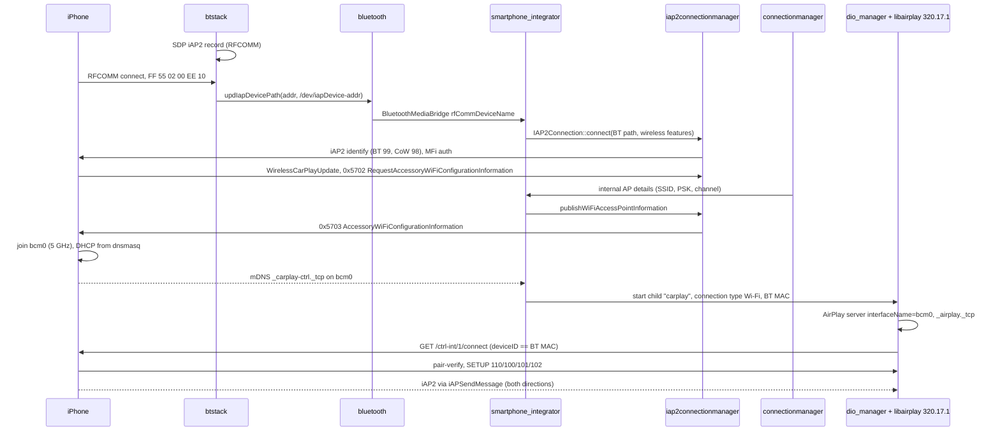

# MH2p Wireless CarPlay: End-to-End Architecture

How the MH2p (`MH2p_ER_AUG33_P2873`, [firmware.md](firmware.md)) implements wireless CarPlay, as one chain
from boot to a running session. This file only puts the pieces in order. The evidence and details are in
the subsystem documents, and each step cites their `P-` IDs.

All of it is **static** evidence (configuration, strings, symbols, disassembly). No MH2p unit was observed
running. "Proven" below means "shown in the MH2p firmware", not "observed at runtime".

## 1. Components

```text
                       iPhone
          Bluetooth │            │ 5 GHz Wi-Fi (WPA2)
                    ▼            ▼
   btstack (UART /dev/serbt1)   BCM4359 bcm0 10.174.189.1  ◄── hostapd (connectionmanager), dnsmasq, pf
     SDP: iAP2 UUID …cacaff        │
     RFCOMM ─► /dev/iapDevice-<BT addr>   mdnsd (boot, all interfaces)
                    │ updIapDevicePath        │ _carplay-ctrl._tcp (phone) / _airplay._tcp (unit)
                    ▼                         ▼
   bluetooth app ──ASI──► smartphone_integrator (SI) ──browse on bcm0──┐
     enableIap=true        │  gates: BT device, 5 GHz AP, coding      │
                           ▼                                          │
                  iap2connectionmanager (libesoiap2)                  │
                    BT iAP2: identify (BT 99, CoW 98), MFi,           │
                    0x5702 → 0x5703 (SSID, PSK, channel)              │
                                                                      ▼
                                   dio_manager (child "carplay", connection type Wi-Fi)
                                     libairplay 320.17.1: AirPlay server on bcm0
                                     CarPlayControlClient: GET /ctrl-int/1/connect (BT-MAC match)
                                     iAP2 inside AirPlay: iAPSendMessage (CIAP2ServiceEso)
```

| Role | MH2p component | Details |
| --- | --- | --- |
| Radio | Broadcom BCM4359: `bcm0` 5 GHz AP (CarPlay), `bcm1` 2.4 GHz AP (hotspot), `bcm2` station | [wifi.md](wifi.md) §2, P-200..P-203 |
| Bluetooth transport for iAP2 | `btstack` RFCOMM server → resource manager `/dev/iapDevice-<addr>` | [bluetooth-iap2.md](bluetooth-iap2.md) §2.2, P-301, P-303 |
| Bootstrap iAP2 session | `iap2connectionmanager` (ESO `libesoiap2`, not Cinemo), started by SI | [bluetooth-iap2.md](bluetooth-iap2.md) §3, P-306..P-309 |
| Orchestration and gating | `smartphone_integrator` | [configuration-and-boot.md](configuration-and-boot.md) §1, P-100..P-105; P-310 |
| Wi-Fi credentials | `connectionmanager` → SI → `iap2connectionmanager` → iAP2 0x5703 | [wifi.md](wifi.md) §4, P-215; P-309 |
| Discovery | `mdnsd` (started at boot), SI browses the phone's `_carplay-ctrl._tcp` on `bcm0` | P-111, P-104, P-313 |
| Session owner | `dio_manager` + `libairplay.so` 320.17.1 | [airplay-dio.md](airplay-dio.md) §3, P-420..P-425 |
| iAP2 during the session | AirPlay command `iAPSendMessage`, both directions | P-315, P-316, P-411 |

## 2. Sequence

| # | Step | Evidence | Status |
| --- | --- | --- | --- |
| 1 | **Boot, network.** `io-pkt` with pf; `start_wifi_driver` mounts the qwdi BCM4359 driver: `bcm0` 5 GHz AP 10.174.189.1, `bcm1` 2.4 GHz AP, marker files `/tmp/uap0`, `/tmp/uap1`, `/tmp/brcm_wifi` | P-109, P-200..P-202 | Proven |
| 2 | **Boot, firewall and mDNS.** `pf.conf` opens the CarPlay TCP/UDP ports and mDNS (v4 and v6) on both APs; `mdnsd` starts once at boot on all interfaces, with `MDNS_DIRECTLINK_IFACE=carplay0` as a shell prefix | P-111, P-113, P-219, P-220 | Proven |
| 3 | **Boot, services.** `connectivity_launcher` starts `btstack`, `bluetooth` and `connectionmanager`; `connectionmanager` runs `hostapd` for `bcm0` from `ap0.config` (`hw_mode=a`, 11n/11ac, WPA2-CCMP; channel 36 or 149 per country) and `dnsmasq`, and adds the Apple vendor IE (OUI `00:a0:40`, flags, `MIB2P`, `A8`, `Audi AG`, the head unit's BT MAC) | P-108, P-204..P-211 | Proven (config, templates, disassembly of the IE); the spawn code is not decompiled |
| 4 | **Boot, Bluetooth.** `btstack` registers an SDP record with the iAP2 accessory UUID `00000000-deca-fade-deca-deafdecacaff` on RFCOMM | P-301 | Proven |
| 5 | **Boot, SI.** SI starts child `iap2connectionmanager` and prepares the `_carplay-ctrl._tcp` browse restricted to `bcm0` | P-100, P-104, P-306 | Proven (config and filter) |
| 6 | **First pairing** (either normal SSP, or OOB over a wired session). During a wired session Cinemo in `dio_manager` also identifies Bluetooth and Wi-Fi components, relays `StartOOBBTPairing` / `OOBBTPairingLinkKeyInformation`, and learns the phone supports wireless (`WirelessCarPlayUpdate`, 0x4E0D) | P-312, P-322, P-326 | Proven (symbols and strings) |
| 7 | **BT connect.** `bluetooth` reconnects the last CarPlay phone; `btstack` accepts RFCOMM, checks the iAP2 detect bytes `FF 55 02 00 EE 10`, creates `/dev/iapDevice-<addr>` and reports it with `updIapDevicePath`; `bluetooth` publishes it as `rfCommDeviceName` in the `BluetoothMediaBridge` list | P-300, P-303, P-305 | Proven (disassembly) |
| 8 | **Gates.** SI requires: the phone known over Bluetooth; `enableIap=true` in `connectivity.json` (`bluetooth` app policy); coding `carplayWireless` (`dio_manager`: persistence key 8877, byte 0x17 bit 3); a 5 GHz AP available (else "5GHz access point is not available to activate Wireless CarPlay") | P-105, P-107, P-214, P-300, P-310, P-425 | Proven (config, strings, coding read); SI gate logic partly inferred |
| 9 | **BT iAP2 session.** SI → `IAP2Connection::connect` (Bluetooth parameters, wireless features on) → `iap2connectionmanager` `CIAP2TransportBT` opens the node (`open64(path, O_RDWR)`), uses the `bt` link parameters, authenticates, and identifies with BluetoothTransportComponent 99 (`ESO-BT-Transport`, with the BT MAC) and WirelessCarPlayTransportComponent 98 (`ESO-CoW-Transport`) | P-307, P-308, P-309 | Proven (disassembly); exact SI parameter fields inferred |
| 10 | **Wi-Fi credentials.** Phone sends `RequestAccessoryWiFiConfigurationInformation` (0x5702); SI fills `AccessoryWiFiConfigurationInformation` (0x5703) with SSID, passphrase, security type and channel of `bcm0` from `connectionmanager` | P-215, P-309 | Proven (disassembly in SI); the 0x5703 encoding inside `libesoiap2` is not traced |
| 11 | **Phone joins the AP.** DHCP lease from `dnsmasq` (10.174.189.128-247); the phone advertises `_carplay-ctrl._tcp` | P-116, P-218 | Config proven; runtime inferred |
| 12 | **Discovery.** SI's browse reply accepts only services on `bcm0`, resolves the phone, records a CarPlay Wi-Fi device, and starts child `carplay` (= `dio_manager`, the same child as wired) with connection type 2 (Wi-Fi), `wifiInfo` and `localBtMacAddress` | P-104, P-313, P-421 | Proven |
| 13 | **AirPlay server.** `dio_manager` `FUN_0008f8f8`: `AirPlayReceiverServerCreate` → `interfaceName` = the interface holding `wifi.ipaddr` 10.174.189.1 (`bcm0`), fallback `bcm0` if `/tmp/brcm_wifi` else `uap0`; `_airplay._tcp` registered with `if_nametoindex(interfaceName)` and TXT `deviceid, features, fv, flags, model, pi, srcvers=320.17.1` | P-404, P-409, P-420 | Proven (decompile) |
| 14 | **Session trigger.** `CarPlayControlClient` browses `_carplay-ctrl._tcp`; for the controller whose Bonjour device ID equals the target phone's BT MAC, `dio_manager` calls `CarPlayControlClientConnect` (retry up to 5), which sends `GET /ctrl-int/1/connect` with `AirPlay-Receiver-Device-ID` | P-314, P-406, P-407, P-422 | Proven (disassembly) |
| 15 | **AirPlay session.** The phone connects to the receiver on `bcm0`: HomeKit pair-verify (Ed25519/Curve25519, ChaCha20-Poly1305, HKDF-SHA512; pair-setup SRP-3072 the first time; keychain in `/mnt/misc1/carplay`), SETUP with streams 100/101/102/110, NTP-style timing, Opus 16/24/48 kHz mono for wireless audio | P-403, P-410..P-414 | Proven (library) |
| 16 | **iAP2 inside the session.** `dio_manager`'s second iAP2 client `CIAP2ServiceEso` sends with `AirPlayReceiverSessionSendiAPMessage` and receives the `iAPSendMessage` command; there is no stream 130 in this build | P-315, P-316, P-410, P-411 | Proven |
| 17 | **Bluetooth after the handover.** `dio_manager` sets the Bluetooth smartphone mode `CARPLAY_WIRELESS`; `handleSessionControl` handles the AirPlay request `disableBluetooth` | P-326, P-411, P-424 | Proven that the handler exists; what it does to the RFCOMM link is not traced |
| 18 | **Teardown.** Phone leaves the AP → `CarPlayControlClientSTALeft`, SI `onEvent_carPlayWifiDeviceDisconnected`; RFCOMM drop → `updIapDevicePath(addr, "")` | P-314 | Proven (symbols) |



## 3. Design points worth copying

These are what MH2p does. Whether MHI2/MHI2Q can do the same is in [requirements.md](requirements.md).

1. **The Bluetooth link is a plain byte stream.** `btstack` exposes RFCOMM as a character device, and the
   iAP2 link layer runs in the userland client that opens it. There is no iAP2-specific driver ABI
   (unlike MU0678's `ipod-drvr-iap2.so` 0x9999 message ABI) (P-303, P-307).
2. **The bootstrap is not in the session owner.** A small separate iAP2 client (`iap2connectionmanager`)
   handles Bluetooth identification and the Wi-Fi credentials. `dio_manager` is started only after the
   phone is on Wi-Fi (P-306..P-313).
3. **Wired and wireless share the same session owner.** It is the same `carplay` child and the same
   `dio_manager` binary. Only the `interfaceName` value changes (`carplay0` or the AP interface) (P-420).
4. **mDNS is global.** `mdnsd` runs at boot on all interfaces. The direct-link variable stays `carplay0`,
   and Wi-Fi is served as an ordinary multicast interface (P-111).
5. **The phone is matched by its Bluetooth MAC.** The same MAC links the iAP2-over-BT session, the Apple
   IE and the `_carplay-ctrl` controller (P-211, P-307, P-314, P-422).
6. **The session is started by the accessory, not by iAP2 0x4301.** The accessory browses
   `_carplay-ctrl._tcp` and sends `/ctrl-int/1/connect`. No 0x4300/0x4301 names appear in MH2p (P-313,
   P-407). Other receivers (e.g. the open-source xcertplay) use the 0x4301
   flow, so both exist.
7. **5 GHz is required**, with fixed non-DFS channels 36/149 (P-205, P-207, P-214, P-310).

## 4. Not determined

- Whether the Bluetooth iAP2 link in `iap2connectionmanager` stays up during the Wi-Fi session, and exactly
  what `disableBluetooth` closes.
- The byte-level 0x5703 encoding (security type, channel) inside `libesoiap2.so`.
- Whether `bcm0` is a hidden SSID, and how the SSID/passphrase are generated and persisted.
- Which coding value feeds persistence key 8877.
- How `media` and SI share the single-open `/dev/iapDevice-*` node.
- Whether iOS would use stream 130 instead of `iAPSendMessage` against a receiver that offered it; this
  build accepts only 100/101/102/110.
